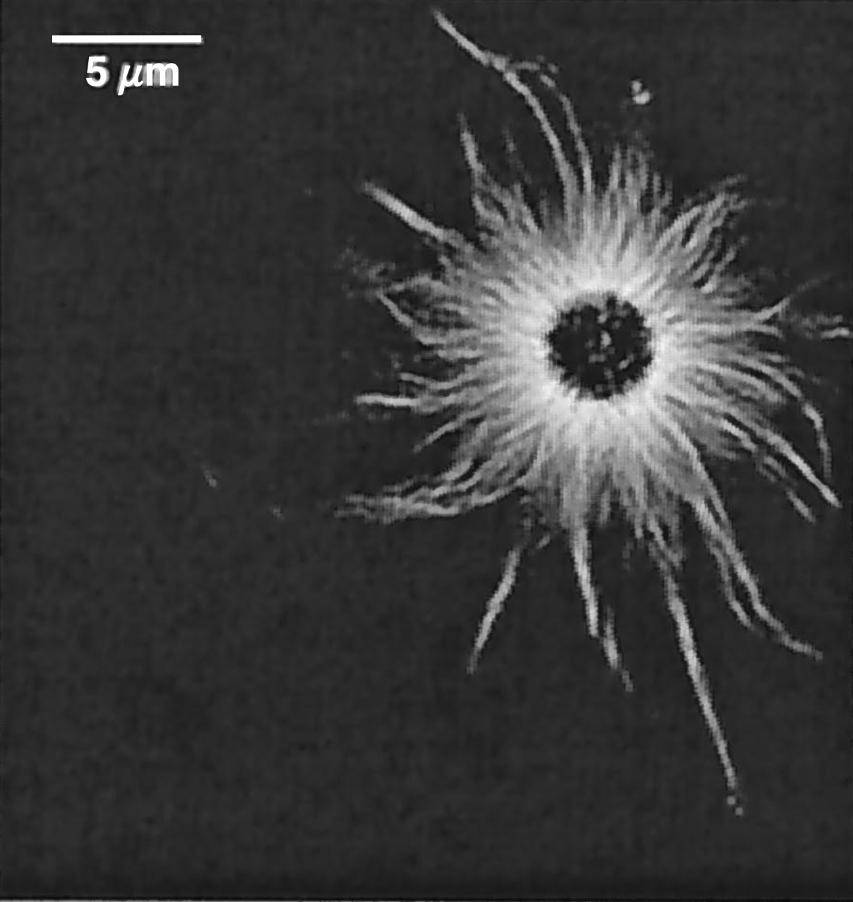
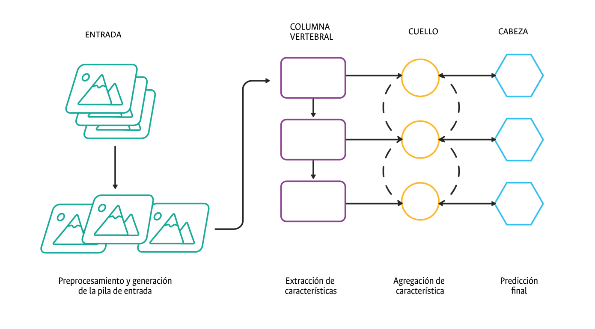

<header class="mb-3 text-left">
  <h1 class="mt-0 text-xl font-bold leading-tight tracking-tight text-unal-gray sm:text-2xl">El ovocito y el huso meiótico</h1>
  

</header>

  El ovocito es la célula femenina más grande y se caracteriza por su gran tamaño y su contenido citoplasmático. El huso meiótico es una estructura celular que se forma en la meiosis y que ayuda a separar los cromosomas homólogos.

  <figure class="m-0 min-w-0 flex flex-col">
    
    <figcaption lang="es" class="mt-2 max-w-full text-left text-[10px] leading-snug text-gray-600 sm:text-[11px]">
      Fig. 2.
      Esquema ilustrativo del proceso de maduración de un ovocito. Elaboración propia.
    </figcaption>
  </figure>
  <figure class="m-0 min-w-0 flex flex-col">
    
    <figcaption lang="es" class="mt-2 max-w-full text-left text-[10px] leading-snug text-gray-600 sm:text-[11px]">
      Fig. 3.
      Ovocito visualizado con microscopía de luz polarizada. Huso meiótico (s), zona pelúcida (zp), límite del citoplasma (c) y cuerpo polar (pb). Tomado de Rienzi et al.
      [8].
    </figcaption>
  </figure>

<!-- Logos abajo a la derecha (misma distribución que Agenda y resto del deck) -->

  
  

---
transition: slide-up
deckSection: marco
---

<header class="mb-3 text-left">
  <h1 class="mt-0 text-xl font-bold leading-tight tracking-tight text-unal-gray sm:text-2xl">Recuperación cuantitativa del retardo</h1>
  

</header>

  Retardo óptico en PLM cuantitativa: a partir de las intensidades
  las cinco intensidades I₀, I₁, I₂, I₃, I₄ se construyen los términos A y B,
  que permiten estimar el retardo Δ y el azimut φ
  para describir la birrefringencia de la muestra; en este ejemplo, un astero de microtúbulos reconstituido desde el centrosoma.

  

  
Retardo óptico

  <figure class="m-0 flex w-full min-w-0 flex-col items-stretch">
  
  <figcaption lang="es" class="plm-figcaption">
  Fig. 4.
  Mapa de magnitud de retardo (algoritmo de cinco cuadros, corrección de fondo) de un astero de microtúbulos reconstituido desde centrosoma; haces brillantes sobre centrosoma oscuro. Blanco ≈ 1,2&nbsp;nm de retardo de birrefringencia; negro, birrefringencia nula.
  Fuente: Shribak &amp; Oldenbourg (2003) [13]. En la tesis aparece como Fig.&nbsp;2-4 (cap.&nbsp;2).
  </figcaption>
  </figure>
  

  

  
Retardo y azimut

$$
\begin{aligned}
\Delta &= \arctan\!\left(\sqrt{A^2 + B^2}\right) && \text{si } I_1 + I_2 - 2I_0 \geq 0, \\[0.3em]
\Delta &= 180^\circ - \arctan\!\left(\sqrt{A^2 + B^2}\right) && \text{si } I_1 + I_2 - 2I_0 \lt 0, \\[0.3em]
\phi &= \tfrac{1}{2}\arctan\!\left(\frac{A}{B}\right). &&
\end{aligned}
$$

  
Términos auxiliares

$$
\begin{gathered}
A \equiv \frac{I_1 - I_2}{I_1 + I_2 - 2I_0}\,\tan\frac{\chi}{2} = \sin 2\phi\,\tan \Delta \\[0.35em]
B \equiv \frac{I_4 - I_3}{I_4 + I_3 - 2I_0}\,\tan\frac{\chi}{2} = \cos 2\phi\,\tan \Delta
\end{gathered}
$$
  

  

  
Ecuaciones de intensidad

$$
\begin{split}
I_0(x, y) = \tfrac{1}{2}\,\tau(x,y)\,I_{\text{max}}\bigl[1 - \cos \Delta(x,y)\bigr] + I_{\text{min}}(x,y)
\end{split}
$$

$$
\begin{split}
I_1(x, y) = \tfrac{1}{2}\,\tau(x,y)\,I_{\text{max}}\bigl[1 - \cos\chi\cos\Delta(x,y) + \sin\chi\sin 2\phi(x,y)\sin\Delta(x,y)\bigr] \\+ I_{\text{min}}(x,y)
\end{split}
$$

$$
\begin{split}
I_2(x, y) = \tfrac{1}{2}\,\tau(x,y)\,I_{\text{max}}\bigl[1 - \cos\chi\cos\Delta(x,y) - \sin\chi\sin 2\phi(x,y)\sin\Delta(x,y)\bigr] \\+ I_{\text{min}}(x,y)
\end{split}
$$

$$
\begin{split}
I_3(x, y) = \tfrac{1}{2}\,\tau(x,y)\,I_{\text{max}}\bigl[1 - \cos\chi\cos\Delta(x,y) - \sin\chi\cos 2\phi(x,y)\sin\Delta(x,y)\bigr] \\+ I_{\text{min}}(x,y)
\end{split}
$$

$$
\begin{split}
I_4(x, y) = \tfrac{1}{2}\,\tau(x,y)\,I_{\text{max}}\bigl[1 - \cos\chi\cos\Delta(x,y) + \sin\chi\cos 2\phi(x,y)\sin\Delta(x,y)\bigr] \\+ I_{\text{min}}(x,y)
\end{split}
$$
  

<!-- Logos abajo a la derecha (misma distribución que Agenda y resto del deck) -->

  
  

---
transition: slide-up
deckSection: marco
---

<header class="mb-3 text-left">
  <h1 class="mt-0 text-xl font-bold leading-tight tracking-tight text-unal-gray sm:text-2xl">Redes Neuronales para Detección de Objetos</h1>
  

</header>

  

    

      La detección de objetos integra localización,
      clasificación y
      confianza en una misma predicción.
    

    <ul class="mb-3 list-disc space-y-1.5 pl-4 text-xs leading-snug text-unal-gray marker:text-unal-blue sm:text-sm">
      <li>Paso 1 - Extracción de características: la red obtiene descriptores de la imagen.</li>
      <li>Paso 2 - Predicción de cajas: localiza cada objeto candidato.</li>
      <li>Paso 3 - Clase y confianza: asigna etiqueta y puntaje por detección.</li>
    </ul>
    
Dos etapas vs una etapa

    <ul class="list-disc space-y-1.5 pl-4 text-xs leading-snug text-unal-gray marker:text-unal-blue sm:text-sm">
      <li>Dos etapas (multi-pass): primero generan propuestas de región y luego clasifican/refinan cada caja.</li>
      <li>Una etapa (YOLO): localiza y clasifica en una sola pasada sobre la imagen completa.</li>
    </ul>
  

  <figure class="m-0 min-w-0 flex flex-col">
    
    <figcaption lang="es" class="mt-2 text-left text-[10px] leading-snug text-gray-600 sm:text-[11px]">
      Fig. 5.
      Arquitectura general de los modelos YOLO.
      Elaboración propia.
    </figcaption>
  </figure>

<!-- Logos abajo a la derecha (misma distribución que Agenda y resto del deck) -->

  
  

---
transition: slide-left
deckSection: marco
---

<header class="mb-3 text-left">
  <h1 class="mt-0 text-xl font-bold leading-tight tracking-tight text-unal-gray sm:text-2xl">Métricas de evaluación de la detección de objetos</h1>
  

</header>

IoU: solapamiento entre caja predicha y caja de referencia.

$$
IoU=\frac{\operatorname{Area}(B_{pred}\cap B_{gt})}{\operatorname{Area}(B_{pred}\cup B_{gt})}
$$

mAP: promedio de AP en todas las clases.

$$
mAP=\frac{1}{N}\sum_{i=1}^{N}AP_i
$$

mAP&#64;50: AP promedio con criterio de acierto si IoU &ge; 0.5.

$$
\mathrm{mAP}_{50}=\frac{1}{N}\sum_{i=1}^{N}AP_i(IoU\geq0.5)
$$

mAP&#64;50-95: promedio en umbrales de IoU entre 0.50 y 0.95.

$$
\mathrm{mAP}_{50:95}=\frac{1}{10}\sum_{t\in\{0.50,\ldots,0.95\}}\mathrm{mAP}_t
$$

Precisión (P): proporción de detecciones positivas que son correctas.

$$
P=\frac{TP}{TP+FP}
$$

Sensibilidad (R): proporción de positivos reales detectados.

$$
R=\frac{TP}{TP+FN}
$$

Tasa de falsos positivos (FPR): proporción de negativos clasificados como positivos.

$$
FPR=\frac{FP}{FP+TN}
$$

<!-- Logos abajo a la derecha (misma distribución que Agenda y resto del deck) -->

  
  

