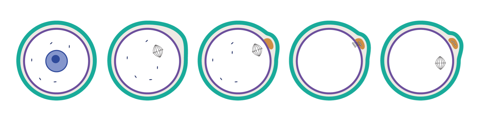
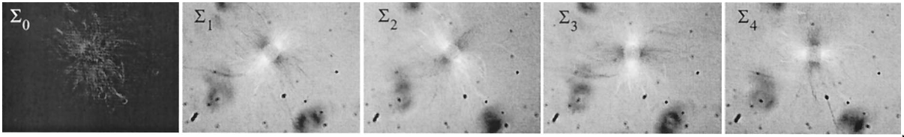
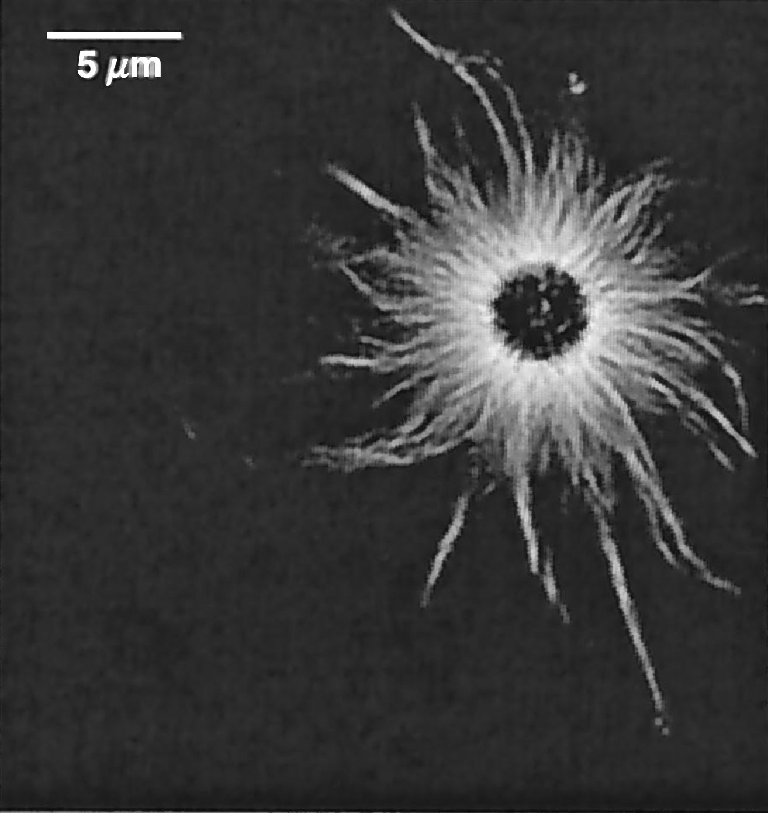
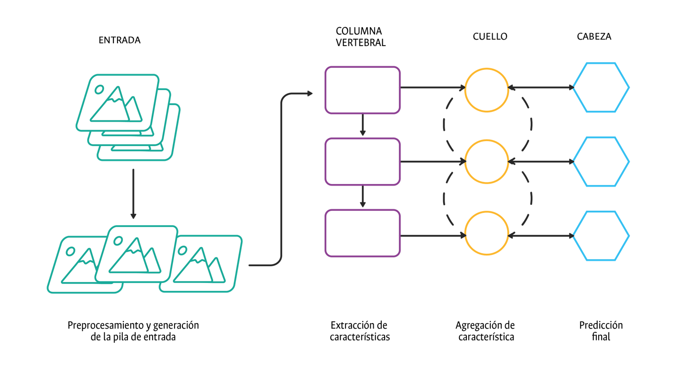

<header class="mb-1.5 text-left">
  <h1 class="mt-0 text-xl font-bold leading-tight tracking-tight text-unal-gray sm:text-2xl">Ovocito: marcadores de madurez nuclear</h1>
  

</header>

  Tres estructuras permiten evaluar la madurez del ovocito MII de forma directa:

<ul class="mt-1 list-none space-y-2 text-sm leading-snug text-unal-gray">
<li class="flex gap-1.5">
  ▸
  Huso meiótico: segrega cromosomas en MII; su presencia confirma la madurez nuclear del ovocito. Valor clínico dual: evaluación de madurez + orientación de la aguja ICSI al punto opuesto — evita daño cromosómico.
</li>
<li class="flex gap-1.5">
  ▸
  Zona pelúcida: capa glicoproteica externa; su integridad es indicador de calidad ovocitaria.
</li>
<li class="flex gap-1.5">
  ▸
  Cuerpo polar: indicador clínico habitual; aparece antes de que el huso esté completamente ensamblado — PLM permite verificar directamente si el huso ya está formado.
</li>
</ul>

<figure class="m-0 flex min-w-0 flex-col">

<figcaption lang="es" class="plm-figcaption">
  Fig. 2.
  Ovocito bajo PLM: huso meiótico (s), zona pelúcida (zp), citoplasma (c) y cuerpo polar (pb). Rienzi et al.
  [3].
</figcaption>
</figure>
<figure class="m-0 flex min-w-0 flex-col">

<figcaption lang="es" class="plm-figcaption">
  Fig. 3.
  Esquema del proceso de maduración. Elaboración propia.
</figcaption>
</figure>

<!-- Logos abajo a la derecha -->

  
  

<!--
Solo el 5–10 % de los ovocitos recuperados poseen potencial de desarrollo completo — se trabaja con márgenes muy estrechos. Tres estructuras permiten evaluar esa madurez de forma directa: el huso meiótico, la zona pelúcida y el cuerpo polar, todas visibles en la figura de la izquierda.

El huso meiótico es la estructura central de este trabajo: segrega cromosomas en metafase II y su presencia confirma la madurez nuclear del ovocito. Hay un hecho clínico crítico: el cuerpo polar —el indicador más usado en clínica— aparece antes de que el huso esté completamente ensamblado. La microscopía polarizada permite verificar directamente si el huso ya está formado, ofreciendo una evaluación más precisa del momento óptimo para ICSI.
-->

---
transition: slide-up
deckSection: marco
---

<header class="mb-2 text-left">
  <h1 class="mt-0 text-xl font-bold leading-tight tracking-tight text-unal-gray sm:text-2xl">Recuperación cuantitativa del retardo óptico</h1>
  

</header>

  La PLM cuantitativa captura cinco imágenes con distintos estados de polarización
  (I₀&nbsp;–&nbsp;I₄). De ellas se construyen los términos auxiliares A y B,
  que permiten estimar para cada píxel el retardo óptico Δ —que cuantifica la birrefringencia—
  y el azimut φ, que indica la orientación molecular.

  <!-- Columna izquierda: imagen de intensidad PLM -->
  

    
Imagen de intensidad (I₀–I₄)

    <figure class="m-0 flex w-full min-w-0 flex-col items-stretch">
      
      <figcaption lang="es" class="plm-figcaption">
        Fig. 4.
        Cinco imágenes de intensidad del astero con ajustes de polarización 0–4. Shribak &amp; Oldenbourg (2003) [4]
      </figcaption>
    </figure>
  

  <!-- Columna derecha: mapa de retardo óptico -->
  

    
Retardo óptico (Δ)

    <figure class="m-0 flex w-full min-w-0 flex-col items-stretch">
      
      <figcaption lang="es" class="plm-figcaption">
        Fig. 5.
        Mapa de magnitud de retardo de un astero de microtúbulos reconstituido desde centrosoma. Blanco ≈ 1,2&nbsp;nm; negro, birrefringencia nula. Shribak &amp; Oldenbourg (2003) [4]
      </figcaption>
    </figure>
  

<!-- Logos abajo a la derecha -->

  
  

<!--
Esta diapositiva muestra cómo la PLM cuantitativa recupera información de cada píxel de la imagen. La idea central es la siguiente: en lugar de una sola imagen, el sistema captura cinco imágenes con distintos estados de polarización — I₀ hasta I₄. La imagen de la izquierda es un ejemplo de una de esas capturas de intensidad.

Con esas cinco intensidades se construyen dos términos auxiliares, A y B, que permiten estimar para cada píxel el retardo óptico Δ — que cuantifica la birrefringencia de la estructura — y el azimut φ, que indica la orientación molecular.

A la derecha vemos el resultado práctico: un mapa de retardo de un áster de microtúbulos, donde los puntos brillantes corresponden a zonas de alta birrefringencia. Este mismo proceso es el que permite medir cuantitativamente el huso meiótico del ovocito, estructura por estructura, píxel a píxel.
-->

---
transition: slide-up
deckSection: marco
---

<header class="mb-1 text-left">
  <h1 class="mt-0 text-xl font-bold leading-tight tracking-tight text-unal-gray sm:text-2xl">Modelo matemático de PLM cuantitativa</h1>
  

</header>

Ecuaciones de intensidad

$$I_0(x, y) = \tfrac{1}{2}\,\tau\,I_{\max}\bigl[1 - \cos \Delta\bigr] + I_{\min}$$

$$I_1(x, y) = \tfrac{1}{2}\,\tau\,I_{\max}\bigl[1 - \cos\chi\cos\Delta + \sin\chi\sin 2\phi\sin\Delta\bigr] + I_{\min}$$

$$I_2(x, y) = \tfrac{1}{2}\,\tau\,I_{\max}\bigl[1 - \cos\chi\cos\Delta - \sin\chi\sin 2\phi\sin\Delta\bigr] + I_{\min}$$

$$I_3(x, y) = \tfrac{1}{2}\,\tau\,I_{\max}\bigl[1 - \cos\chi\cos\Delta - \sin\chi\cos 2\phi\sin\Delta\bigr] + I_{\min}$$

$$I_4(x, y) = \tfrac{1}{2}\,\tau\,I_{\max}\bigl[1 - \cos\chi\cos\Delta + \sin\chi\cos 2\phi\sin\Delta\bigr] + I_{\min}$$

Términos auxiliares

$$A \equiv \frac{I_1 - I_2}{I_1 + I_2 - 2I_0}\,\tan\frac{\chi}{2} = \sin 2\phi\,\tan \Delta$$

$$B \equiv \frac{I_4 - I_3}{I_4 + I_3 - 2I_0}\,\tan\frac{\chi}{2} = \cos 2\phi\,\tan \Delta$$

Retardo y azimut

$$\Delta = \begin{cases} \arctan\!\sqrt{A^2+B^2} & I_1+I_2-2I_0 \ge 0 \\ 180^\circ - \arctan\!\sqrt{A^2+B^2} & I_1+I_2-2I_0 < 0 \end{cases}$$

$$\phi = \tfrac{1}{2}\arctan\!\left(\tfrac{A}{B}\right)$$

  χ ≈ 10° — ángulo de swing del retardador del PolScope (constante del sistema, no varía por muestra). En este trabajo la síntesis construye el mapa Δ directamente a partir de las propiedades morfológicas de cada estructura, sin reproducir la cadena completa I₀–I₄.

<!-- Logos abajo a la derecha -->

  
  

<!--
Veamos ahora el modelo matemático que hace posible esa medición. Las cinco ecuaciones de intensidad, que aparecen a la izquierda, describen físicamente cómo cada píxel de la imagen reacciona en función del retardo óptico Δ y el azimut φ de la estructura birrefringente que contiene.

Para simplificar el cálculo se definen dos términos auxiliares, A y B, que separan algebraicamente la información de orientación y de amplitud de la birrefringencia. Con A y B en mano, las ecuaciones de retardo y azimut que aparecen a la derecha permiten estimar Δ y φ para cada píxel de forma directa.

Este modelo matemático es el sustento de la síntesis realista: conociendo las propiedades físicas del huso meiótico — su forma, su retardo óptico, su orientación — podemos simular con precisión las cinco imágenes de intensidad que produciría el PolScope para un ovocito dado. Eso es lo que hace posible la base de datos sintética.
-->

---
transition: slide-up
deckSection: marco
---

<header class="mb-2 text-left">
  <h1 class="mt-0 text-xl font-bold leading-tight tracking-tight text-unal-gray sm:text-2xl">Redes neuronales para detección de objetos</h1>
  

</header>

  

    

      La detección de objetos integra localización,
      clasificación y
      confianza en una misma predicción.
    

    <ul class="mb-1.5 list-disc space-y-1 pl-4 text-xs leading-snug text-unal-gray marker:text-unal-blue">
      <li>Paso 1 - Extracción de características: la red obtiene descriptores de la imagen.</li>
      <li>Paso 2 - Predicción de cajas: localiza cada objeto candidato.</li>
      <li>Paso 3 - Clase y confianza: asigna etiqueta y puntaje por detección.</li>
    </ul>
    
Dos etapas vs una etapa

    <ul class="list-disc space-y-1 pl-4 text-xs leading-snug text-unal-gray marker:text-unal-blue">
      <li>Dos etapas (multi-pass): primero generan propuestas de región y luego clasifican/refinan cada caja.</li>
      <li>Una etapa (YOLO): localiza y clasifica en una sola pasada sobre la imagen completa — inferencia en tiempo real (&lt;&thinsp;10&thinsp;ms/img), viable para integración directa en el microscopio.</li>
    </ul>
  

  <figure class="m-0 min-w-0 flex flex-col">
    
    <figcaption lang="es" class="plm-figcaption">
      Fig. 6.
      Arquitectura general de los modelos YOLO.
      Elaboración propia.
    </figcaption>
  </figure>

<!-- Logos abajo a la derecha -->

  
  

<!--
Las redes neuronales para detección de objetos resuelven tres tareas simultáneamente: extraen características de la imagen, predicen la ubicación de cada objeto mediante una caja delimitadora, y asignan a cada caja una clase y un puntaje de confianza.

Históricamente esto se hacía en dos etapas: primero generar candidatos de región y luego clasificarlos y refinarlos. Las arquitecturas de una sola etapa, como la familia YOLO — que es la que usamos en este trabajo —, hacen todo en una sola pasada sobre la imagen, lo que las hace más eficientes sin sacrificar precisión. En la figura de la derecha vemos su arquitectura general: columna vertebral para extracción de características, cuello para integración multiescala, y cabeza para las predicciones finales.
-->

---
transition: slide-left
deckSection: marco
---

<header class="mb-2 text-left">
  <h1 class="mt-0 text-xl font-bold leading-tight tracking-tight text-unal-gray sm:text-2xl">Métricas de evaluación de la detección</h1>
  

</header>

IoU: solapamiento entre caja predicha y caja de referencia.

$$IoU=\frac{\operatorname{Area}(B_{pred}\cap B_{gt})}{\operatorname{Area}(B_{pred}\cup B_{gt})}$$

mAP: promedio de AP en todas las clases.

$$mAP=\frac{1}{N}\sum_{i=1}^{N}AP_i$$

mAP&#64;50: AP promedio con criterio de acierto si IoU &ge; 0.5.

$$\mathrm{mAP}_{50}=\frac{1}{N}\sum_{i=1}^{N}AP_i(IoU\geq0.5)$$

mAP&#64;50-95: promedio en umbrales de IoU entre 0.50 y 0.95.

$$\mathrm{mAP}_{50:95}=\frac{1}{10}\sum_{t\in\{0.50,\ldots,0.95\}}\mathrm{mAP}_t$$

Precisión (P): proporción de detecciones positivas que son correctas.

$$P=\frac{TP}{TP+FP}$$

Sensibilidad (R): proporción de positivos reales detectados.

$$R=\frac{TP}{TP+FN}$$

Tasa de falsos positivos (FPR): proporción de negativos clasificados como positivos.

$$FPR=\frac{FP}{FP+TN}$$

  En diagnóstico preferimos alta sensibilidad — es preferible una falsa alarma que no detectar un huso real.

<!-- Logos abajo a la derecha -->

  
  

<!--
Para evaluar un detector usamos métricas espaciales y de clasificación. En cuanto a métricas espaciales: el IoU mide el solapamiento entre la caja predicha y la de referencia — es el criterio base para decidir si una detección fue correcta. El mAP es el promedio de las precisiones promedio sobre todas las clases; lo reportamos en dos versiones: mAP@50, con umbral de IoU de 0.5, y mAP@50-95, que promedia sobre diez umbrales y es considerablemente más exigente.

En cuanto a métricas de clasificación: la Precisión mide qué proporción de las detecciones positivas son realmente correctas; la Sensibilidad, cuántos objetos reales fueron detectados; y la Tasa de Falsos Positivos, cuántos negativos fueron clasificados erróneamente como positivos. Con estas seis métricas tenemos una evaluación completa del modelo.

En diagnóstico clínico preferimos alta sensibilidad sobre baja tasa de falsos positivos — es preferible decirle a alguien que podría tener cáncer y no tenerlo, que no detectarle uno que sí tiene. Ese principio aplica directamente aquí: preferimos no perder un huso meiótico real aunque eso implique alguna falsa alarma ocasional.
-->

