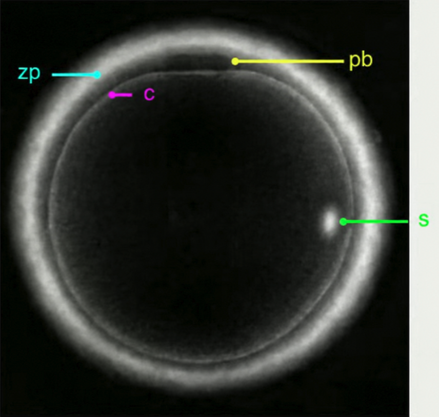
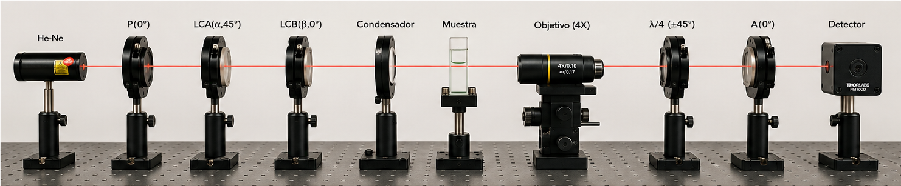

<header class="mb-2 text-left">
  <h1 class="mt-0 text-xl font-bold leading-tight tracking-tight text-unal-gray sm:text-2xl">Ovocito: marcadores de madurez nuclear</h1>
  

</header>

  

    
Tres estructuras permiten evaluar la madurez MII directamente:

    <ul class="list-none space-y-3 text-sm leading-snug text-unal-gray">
      <li class="flex gap-1.5">
        ▸
        Huso meiótico: confirma MII; su posición orienta la aguja ICSI — evita daño cromosómico.
      </li>
      <li class="flex gap-1.5">
        ▸
        Zona pelúcida: su integridad indica calidad ovocitaria.
      </li>
      <li class="flex gap-1.5">
        ▸
        Cuerpo polar: señal habitual, pero emerge antes del huso.
      </li>
    </ul>
  

  

    <figure class="m-0 flex flex-col">
      

        
        
      

      <figcaption lang="es" class="plm-figcaption">
        Ovocito bajo PLM: huso meiótico (s), zona pelúcida (zp), citoplasma (c) y cuerpo polar (pb). Rienzi et al. (2011).
      </figcaption>
    </figure>
    <figure class="m-0 flex flex-col">
      
      <figcaption lang="es" class="plm-figcaption">
        Esquema del proceso de maduración. Elaboración propia.
      </figcaption>
    </figure>
  

<!-- Logos abajo a la derecha -->

  
  

<!--
Solo el 5–10 % de los ovocitos recuperados poseen potencial de desarrollo completo — se trabaja con márgenes muy estrechos. Hay tres estructuras que permiten evaluar esa madurez de forma directa: el huso meiótico, la zona pelúcida y el cuerpo polar, todas visibles o señaladas en la figura de la izquierda.

El huso meiótico es la estructura central de este trabajo: segrega cromosomas en metafase II y su presencia confirma la madurez nuclear del ovocito. Hay un hecho clínico crítico: el cuerpo polar —el indicador más usado en clínica— aparece antes de que el huso esté completamente ensamblado. La microscopía polarizada permite verificar directamente si el huso ya está formado, ofreciendo una evaluación más precisa del momento óptimo para ICSI.
-->

---
transition: slide-up
deckSection: marco
---

<header class="mb-2 text-left">
  <h1 class="mt-0 text-xl font-bold leading-tight tracking-tight text-unal-gray sm:text-2xl">Recuperación cuantitativa del retardo óptico</h1>
  

</header>

<!-- DIAGRAMA ABSTRACTO COMENTADO — reemplazado por foto real del setup

  

    ↓ Entrada
    Salida: I₀–I₄ → Δ, φ ↓
  

  

    

      Fuente
      
⊗

    

    →
    

      

        

          P(0°)
          

        

        →
        

          LCA(α,45°)
          

        

        →
        

          LCB(β,0°)
          

        

      

      Módulo Polarizador
    

    →
    

      

        Cond.
        

      

      

        Muestra
        

      

      

        Obj.
        

      

    

    →
    

      

        

          λ/4(±45°)
          

        

        →
        

          A(0°)
          

        

      

      Módulo Analizador
    

    →
    

      Detector
      

      

        
I₀–I₄

        
↓ Δ, φ

      

    

  

-->
<figure class="my-2 m-0 flex flex-col items-center">
  
  <figcaption lang="es" class="plm-figcaption mt-1">
    Setup experimental del PolScope: He-Ne · P(0°) · LCA(α,45°) · LCB(β,0°) · Condensador · Muestra · Objetivo (4×) · λ/4(±45°) · A(0°) · Detector. Elaboración propia.
  </figcaption>
</figure>

  <!-- Columna izquierda: imagen de intensidad PLM -->
  

    
Imagen de intensidad (I₀–I₄)

    <figure class="m-0 flex w-full min-w-0 flex-col items-stretch">
      
      <figcaption lang="es" class="plm-figcaption">
        I₀–I₄: cinco estados de polarización capturados sobre un áster de microtúbulos. Shribak &amp; Oldenbourg (2003)
      </figcaption>
    </figure>
  

  <!-- Columna derecha: mapa de retardo óptico -->
  

    
Retardo óptico (Δ)

    <figure class="m-0 flex w-full min-w-0 flex-col items-stretch">
      
      <figcaption lang="es" class="plm-figcaption">
        Mapa de retardo óptico del mismo áster: blanco ≈ 1,2&nbsp;nm (alta birrefringencia); negro, nula. Shribak &amp; Oldenbourg (2003)
      </figcaption>
    </figure>
  

<!-- Logos abajo a la derecha -->

  
  

<!--
El sistema que adquiere estas imágenes es el PolScope, representado en el diagrama central. Se trata de un microscopio de luz polarizada al que se le añaden dos módulos: antes de la muestra, un polarizador elíptico — formado por un polarizador lineal P y dos celdas de cristal líquido, LCA y LCB — que interroga la muestra con distintos estados de polarización; y tras el objetivo, un analizador circular — formado por una lámina de cuarto de onda λ/4 y el analizador A — que recoge la señal.

Con esa configuración el sistema captura cinco imágenes — I₀ hasta I₄ —, cada una con un estado de polarización diferente. Las vemos aquí a la izquierda. Con esas cinco intensidades se construyen dos términos auxiliares, A y B, que permiten estimar para cada píxel el retardo óptico Δ — que cuantifica la birrefringencia — y el azimut φ, que indica la orientación molecular.

El resultado práctico lo vemos a la derecha: un mapa de retardo de un áster de microtúbulos, donde los puntos brillantes corresponden a zonas de alta birrefringencia. Este mismo proceso es el que mide el huso meiótico del ovocito, estructura por estructura, píxel a píxel.
-->

---
transition: slide-up
deckSection: marco
---

<header class="mb-1 text-left">
  <h1 class="mt-0 text-xl font-bold leading-tight tracking-tight text-unal-gray sm:text-2xl">Modelo matemático de PLM cuantitativa</h1>
  

</header>

  
Ecuaciones de intensidad

  

$$I_0(x, y) = \tfrac{1}{2}\,\tau\,I_{\max}\bigl[1 - \cos \Delta\bigr] + I_{\min}$$

$$I_1(x, y) = \tfrac{1}{2}\,\tau\,I_{\max}\bigl[1 - \cos\chi\cos\Delta + \sin\chi\sin 2\phi\sin\Delta\bigr] + I_{\min}$$

$$I_2(x, y) = \tfrac{1}{2}\,\tau\,I_{\max}\bigl[1 - \cos\chi\cos\Delta - \sin\chi\sin 2\phi\sin\Delta\bigr] + I_{\min}$$

$$I_3(x, y) = \tfrac{1}{2}\,\tau\,I_{\max}\bigl[1 - \cos\chi\cos\Delta - \sin\chi\cos 2\phi\sin\Delta\bigr] + I_{\min}$$

$$I_4(x, y) = \tfrac{1}{2}\,\tau\,I_{\max}\bigl[1 - \cos\chi\cos\Delta + \sin\chi\cos 2\phi\sin\Delta\bigr] + I_{\min}$$

Términos auxiliares

$$A \equiv \frac{I_1 - I_2}{I_1 + I_2 - 2I_0}\,\tan\frac{\chi}{2} = \sin 2\phi\,\tan \Delta$$

$$B \equiv \frac{I_4 - I_3}{I_4 + I_3 - 2I_0}\,\tan\frac{\chi}{2} = \cos 2\phi\,\tan \Delta$$

Retardo y azimut

$$\Delta = \begin{cases} \arctan\!\sqrt{A^2+B^2} & I_1+I_2-2I_0 \ge 0 \\ 180^\circ - \arctan\!\sqrt{A^2+B^2} & I_1+I_2-2I_0 < 0 \end{cases}$$

$$\phi = \tfrac{1}{2}\arctan\!\left(\tfrac{A}{B}\right)$$

  χ ≈ 10° — ángulo de swing del retardador del PolScope (constante del sistema, no varía por muestra). En este trabajo la síntesis construye el mapa Δ directamente a partir de las propiedades morfológicas de cada estructura.

<!-- Logos abajo a la derecha -->

  
  

<!--
Veamos ahora el modelo matemático que hace posible esa medición. Las cinco ecuaciones de intensidad, que aparecen a la izquierda, describen físicamente cómo cada píxel de la imagen reacciona en función del retardo óptico Δ y el azimut φ de la estructura birrefringente que contiene.

Para simplificar el cálculo se definen dos términos auxiliares, A y B, que separan algebraicamente la información de orientación y de amplitud de la birrefringencia. Con A y B en mano, las ecuaciones de retardo y azimut que aparecen a la derecha permiten estimar Δ y φ para cada píxel de forma directa.

Este modelo matemático es clave para lo que sigue: como Δ es una función directa de las propiedades físicas de la estructura — su retardo óptico, su orientación, su morfología —, podemos ir en sentido contrario: partiendo de parámetros físicos conocidos del huso meiótico, la zona pelúcida y el cuerpo polar, generar directamente mapas sintéticos de retardo Δ que replican lo que el PolScope mediría en un ovocito real. Eso es el punto de partida de la base de datos — lo veremos en metodología.
-->

---
transition: slide-up
deckSection: marco
---

<header class="mb-2 text-left">
  <h1 class="mt-0 text-xl font-bold leading-tight tracking-tight text-unal-gray sm:text-2xl">Redes neuronales para detección de objetos</h1>
  

</header>

  

    
Localización · Clasificación · Confianza — en una sola predicción.

    <ul class="list-none space-y-2 text-[15px] leading-snug text-unal-gray">
      <li class="flex gap-1.5">
        ▸
        Extracción: descriptores de la imagen.
      </li>
      <li class="flex gap-1.5">
        ▸
        Predicción: cajas por objeto candidato.
      </li>
      <li class="flex gap-1.5">
        ▸
        Clase + score: etiqueta y confianza por caja.
      </li>
    </ul>
    
Una etapa vs. dos etapas

    <ul class="list-none space-y-2 text-[15px] leading-snug text-unal-gray">
      <li class="flex gap-1.5">
        ▸
        Multi-stage: propuestas de región → refinamiento.
      </li>
      <li class="flex gap-1.5">
        ▸
        YOLO ✓ — una pasada · &lt;10 ms/img · tiempo real.
      </li>
    </ul>
  

  <figure class="m-0 flex min-h-0 flex-col">
    
    <figcaption lang="es" class="plm-figcaption">
      Arquitectura general de los modelos YOLO.
      Elaboración propia.
    </figcaption>
  </figure>

<!-- Logos abajo a la derecha -->

  
  

<!--
Las redes neuronales para detección de objetos resuelven tres tareas simultáneamente: extraen características de la imagen, predicen la ubicación de cada objeto mediante una caja delimitadora, y asignan a cada caja una clase y un puntaje de confianza.

Históricamente esto se hacía en dos etapas: primero generar candidatos de región y luego clasificarlos y refinarlos. Las arquitecturas de una sola etapa, como la familia YOLO — que es la que usamos en este trabajo —, hacen todo en una sola pasada sobre la imagen, lo que las hace más eficientes sin sacrificar precisión. En la figura de la derecha vemos su arquitectura general: columna vertebral para extracción de características, cuello para integración multiescala, y cabeza para las predicciones finales.
-->

---
transition: slide-left
deckSection: marco
---

<header class="mb-2 text-left">
  <h1 class="mt-0 text-xl font-bold leading-tight tracking-tight text-unal-gray sm:text-2xl">Métricas de evaluación de la detección</h1>
  

</header>

Espaciales

IoU · solapamiento pred/ref

mAP · AP promedio por clase

mAP@50 · umbral IoU ≥ 0.5

mAP@50-95 · 10 umbrales (0.5→0.95)

Clasificación

Precisión (P) · detecciones correctas

Sensibilidad (R) · positivos reales detectados

FPR · tasa de falsos positivos

<carbon-warning class="mr-1 inline text-unal-blue" />Alta R &gt; baja FPR — mejor falsa alarma que perder un huso real.

<!-- Logos abajo a la derecha -->

  
  

<!--
Para evaluar un detector usamos métricas espaciales y de clasificación. En cuanto a métricas espaciales: el IoU (Interseccion sobre la union) mide el solapamiento entre la caja predicha y la de referencia — es el criterio base para decidir si una detección fue correcta. El mAP (Precision media promedio) es el promedio de las precisiones promedio sobre todas las clases; lo reportamos en dos versiones: mAP@50, con umbral de IoU de 0.5, y mAP@50-95, que promedia sobre diez umbrales y es considerablemente más exigente.

En cuanto a métricas de clasificación: la Precisión mide qué proporción de las detecciones positivas son realmente correctas; la Sensibilidad, cuántos objetos reales fueron detectados; y la Tasa de Falsos Positivos, cuántos negativos fueron clasificados erróneamente como positivos. Con estas seis métricas tenemos una evaluación completa del modelo.

En diagnóstico clínico preferimos alta sensibilidad sobre baja tasa de falsos positivos — es preferible decirle a alguien que podría tener cáncer y no tenerlo, que no detectarle uno que sí tiene. Ese principio aplica directamente aquí: preferimos no perder un huso meiótico real aunque eso implique alguna falsa alarma ocasional.
-->
