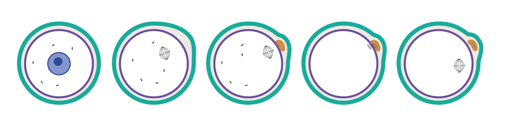
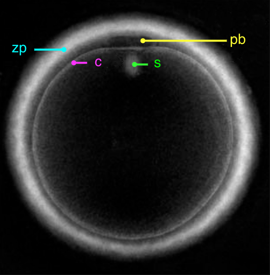
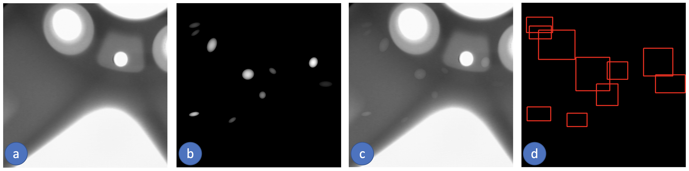
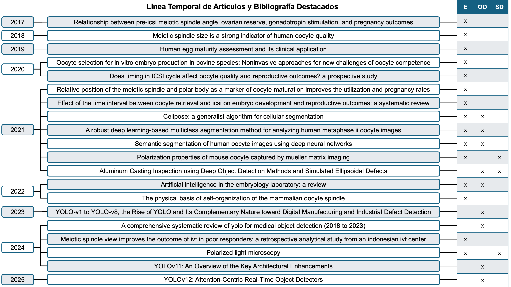
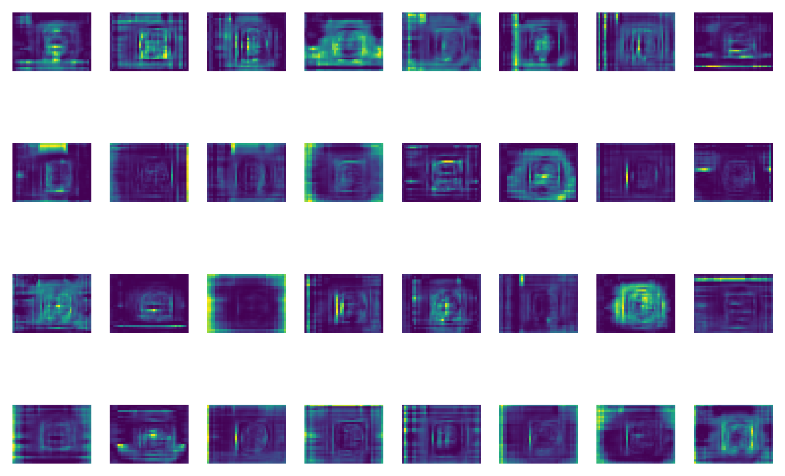

<header class="mb-3 text-left">
  <h1 class="mt-0 text-xl font-bold leading-tight tracking-tight text-[#262626] sm:text-2xl">Métodos de evaluación de madurez de ovocitos</h1>
  

</header>

  

    ▸
    Huso en MII = indicador definitivo de madurez y competencia[14]
  

  

    ▸
    Evaluación manual: subjetiva, alta variabilidad interobservador[15]
  

  

    ▸
    PLM = técnica no invasiva; visualiza huso meiótico, ZP, CP y citoplasma mediante birrefringencia
  

  

    ▸
    PolScope: retardo óptico cuantitativo por píxel[13]
  

<figure class="m-0 mb-2 min-w-0">
  
  <figcaption lang="es" class="mt-1 text-left text-[10px] leading-snug text-gray-600 sm:text-[11px]">
    Fig. 2.
    Esquema ilustrativo del proceso de maduración de un ovocito. Elaboración propia.
  </figcaption>
</figure>

  
Brecha

  

    Ningún detector de objetos ha sido entrenado sobre imágenes PLM de ovocitos[8][14][15]
  

  
  

---
transition: slide-up
deckSection: estado
---

<header class="mb-3 text-left">
  <h1 class="mt-0 text-xl font-bold leading-tight tracking-tight text-[#262626] sm:text-2xl">Estructuras Birrefringentes y PLM en embriología</h1>
  

</header>

  <figure class="m-0 min-w-0 flex flex-col justify-center">
    
    <figcaption lang="es" class="mt-1.5 text-left text-[10px] leading-snug text-gray-600 sm:text-[11px]">
      Fig. 5.
      Huso meiótico (s), ZP (zp), citoplasma (c) y cuerpo polar (pb) bajo PLM. Rienzi et al.[8].
    </figcaption>
  </figure>
  <ul class="list-none flex flex-col justify-center space-y-3 text-[0.82rem] leading-snug text-[#262626] sm:text-[0.86rem]">
    <li class="flex gap-2">
      ▸
      Huso meiótico → segrega cromosomas → presencia indica MII; su morfología y posición predicen éxito de ICSI[14]
    </li>
    <li class="flex gap-2">
      ▸
      ZP → unión espermática y protección del embrión; CP → confirma fin de la 1.ª división meiótica[6][8]
    </li>
    <li class="flex gap-2">
      ▸
      Tepla et al. 2021[6]: posición relativa huso–CP se asocia a mayores tasas de embarazo tras ICSI
    </li>
  </ul>

  
  

---
transition: slide-up
deckSection: estado
---

<header class="mb-3 text-left">
  <h1 class="mt-0 text-xl font-bold leading-tight tracking-tight text-[#262626] sm:text-2xl">El uso de bases de datos sintéticas</h1>
  

</header>

  

    <ul class="list-none space-y-2 text-[0.8rem] leading-snug text-[#262626] sm:text-[0.84rem]">
      <li class="flex gap-2">
        ▸
        Escasez de datos PLM anotados: privacidad, costo y tiempo de anotación experta[19] → no existe ninguna base pública de imágenes PLM de ovocitos
      </li>
      <li class="flex gap-2">
        ▸
        Mery 2021–22[16][17]: defectos elipsoidales simulados en fundición (GDXray+) → detector entrenado en datos sintéticos transfiere a imágenes reales de rayos X
      </li>
      <li class="flex gap-2">
        ▸
        Analogía con este trabajo: huso meiótico = estructura elipsoidal de bajo contraste en fondo homogéneo
      </li>
      <li class="flex gap-2">
        ▸
        Física del huso (retardo ~4–6&nbsp;nm) permite síntesis realista basada en modelos físicos[21]
      </li>
      <li class="flex gap-2">
        ▸
        Reto: domain shift sintético→real; estrategias de transfer learning son esenciales[20]
      </li>
    </ul>
  

  

    <figure class="m-0 min-w-0">
      
      <figcaption lang="es" class="mt-1 text-left text-[10px] leading-snug text-gray-600 sm:text-[11px]">
        Fig. 7.
        GDXray+ (Mery[16]): (a) fundición X-ray, (b) defectos simulados, (c) superposición, (d) detecciones.
      </figcaption>
    </figure>
    <figure class="m-0 min-w-0">
      
      <figcaption lang="es" class="mt-1 text-left text-[10px] leading-snug text-gray-600 sm:text-[11px]">
        Fig. 8.
        Imagen sintética generada de ovocito PLM (s = huso, pb = cuerpo polar, zp = zona pelúcida, c = citoplasma).
      </figcaption>
    </figure>
  

  
  

---
transition: slide-up
deckSection: estado
---

<header class="mb-3 text-left">
  <h1 class="mt-0 text-xl font-bold leading-tight tracking-tight text-[#262626] sm:text-2xl">Avances en redes Neuronales para detección de objetos</h1>
  

</header>

  Tras revisar más de 30 artículos, la familia YOLO se consolida como la plataforma más adoptada en detección en tiempo real[22], con aplicaciones en medicina, industria y objetos de bajo contraste. Arquitecturas revisadas:

  

    

      Faster R-CNN
      SSD
      RetinaNet
      YOLOv3
      YOLOv4
      YOLOv5
      YOLOv7
      YOLOv8
      YOLOv9
      YOLOv10
      YOLOv11
      YOLOv12
      RT-DETR
    

  

  

    

      
Backbone

      
Bloques eficientes: CSP, C3, C2f — extracción de características multi-escala

    

    

      
Cuello (Neck)

      
FPN / PANet — fusión multi-escala; mejora detección de objetos pequeños

    

    

      
Cabeza (Head)

      
Anchor-free → IoU-based losses — mejor localización espacial

    

    

      
Atención

      
SE, CBAM, ECA — recalibración espacial y de canal sin rediseñar el detector

    

  

  
  

---
transition: slide-up
deckSection: estado
---

<header class="mb-3 text-left">
  <h1 class="mt-0 text-xl font-bold leading-tight tracking-tight text-[#262626] sm:text-2xl">YOLO &amp; RT-DETR</h1>
  

</header>

  <figure class="m-0 min-w-0 flex-1">
    
    <figcaption lang="es" class="mt-1.5 text-left text-[10px] leading-snug text-gray-600 sm:text-[11px]">
      Fig. 9.
      Línea del tiempo de desarrollos relevantes en detección de objetos (OD), maduración de ovocitos (E) y bases de datos sintéticas (SD), 2017–2025.
    </figcaption>
  </figure>
  <ul class="list-none space-y-1.5 text-[0.78rem] leading-snug text-[#262626] sm:text-[0.82rem]">
    <li class="flex gap-2">
      ▸
      YOLOv9[23]: PGI — gradiente programable → mayor precisión incluso en configuraciones ligeras entrenadas desde cero
    </li>
    <li class="flex gap-2">
      ▸
      YOLOv12[25]: primer YOLO centrado en mecanismos de atención — ruptura con el paradigma puramente convolucional
    </li>
    <li class="flex gap-2">
      ▸
      RT-DETR[18]: Transformer end-to-end — elimina NMS; precisión competitiva con YOLO en tiempo real
    </li>
  </ul>

  
  

---
transition: slide-left
deckSection: estado
---

<header class="mb-3 text-left">
  <h1 class="mt-0 text-xl font-bold leading-tight tracking-tight text-[#262626] sm:text-2xl">Atención &amp; Transformers</h1>
  

</header>

  <figure class="m-0 min-w-0 flex flex-col">
    
    <figcaption lang="es" class="mt-2 text-left text-[10px] leading-snug text-gray-600 sm:text-[11px]">
      Fig. 10.
      Mapas de características del módulo RepNCSPELAN4 (stage 18) en YOLOv9m, mostrando la activación diferenciada de regiones de interés.
    </figcaption>
  </figure>
  

    <ul class="list-none space-y-2.5 text-[0.8rem] leading-snug text-[#262626] sm:text-[0.84rem]">
      <li class="flex gap-2">
        ▸
        CBAM, SE, ECA: recalibran respuesta espacial y de canal — adaptan el detector a dominios específicos sin rediseño completo
      </li>
      <li class="flex gap-2">
        ▸
        En este trabajo: CBAM integrado en YOLOv9m → mejora detección de estructuras pequeñas (huso meiótico, cuerpo polar)
      </li>
      <li class="flex gap-2">
        ▸
        RT-DETR[18]: atención cross-escala global elimina NMS y reduce dependencia de heurísticas de post-procesamiento
      </li>
      <li class="flex gap-2">
        ▸
        Imágenes PLM: la codificación de entrada (p.&nbsp;ej. vector de Stokes) afecta la capacidad discriminativa del detector
      </li>
    </ul>
  

  
  

