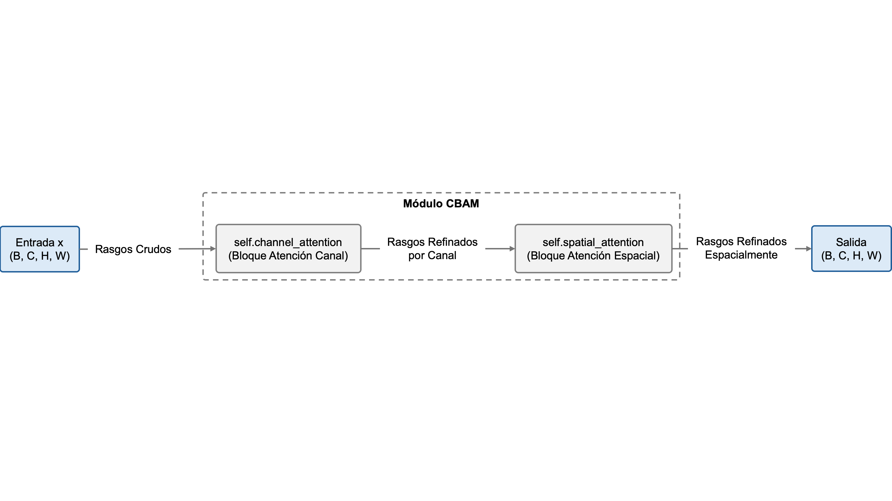

<header class="mb-3 text-left">
  <h1 class="mt-0 text-xl font-bold leading-tight tracking-tight text-unal-gray sm:text-2xl">Métodos de evaluación de madurez de ovocitos</h1>
  

</header>

  <!-- Columna izquierda: PLM detecta el huso -->
  

    <figure class="m-0 min-w-0">
      
      <figcaption lang="es" class="mt-1 text-left text-[12px] leading-snug text-gray-600 sm:text-[11px]">
        Fig. 2.
        Huso meiótico (flecha): invisible en campo claro, visible por fluorescencia y por PLM (fila inferior). Holubcová et al.[5]
      </figcaption>
    </figure>
    <ul class="list-none space-y-1.5 text-[0.78rem] leading-snug text-unal-gray sm:text-[0.82rem]">
      <li class="flex gap-2">
        ▸
        Huso meiótico → indicador clave de madurez MII y aptitud para ICSI; detección manual subjetiva e interobservador-variable[5][6]
      </li>
      <li class="flex gap-2">
        ▸
        PLM / PolScope → visualización no invasiva del huso, ZP, CP y citoplasma; retardo óptico cuantitativo por píxel[4]
      </li>
    </ul>
  

  <!-- Columna derecha: sistemas existentes sin PLM ni huso -->
  

    <figure class="m-0 min-w-0">
      
      <figcaption lang="es" class="mt-1 text-left text-[12px] leading-snug text-gray-600 sm:text-[11px]">
        Fig. 3.
        MOMA (Fjeldstad[6]): segmentación de ZP y ooplasma en campo claro — sin PLM, sin huso meiótico.
      </figcaption>
    </figure>
    <ul class="list-none space-y-1.5 text-[0.78rem] leading-snug text-unal-gray sm:text-[0.82rem]">
      <li class="flex gap-2">
        ▸
        Sistemas existentes — MOMA[6], OoCount[7], Chaput et al.[8]: segmentación o conteo en campo claro, sin aprovechar PLM ni detectar el huso
      </li>
    </ul>
  

  
  

---
transition: slide-up
deckSection: estado
---

<header class="mb-3 text-left">
  <h1 class="mt-0 text-xl font-bold leading-tight tracking-tight text-unal-gray sm:text-2xl">Estructuras birrefringentes bajo PLM</h1>
  

</header>

  <figure class="m-0 min-w-0 flex flex-col justify-center">
    
    <figcaption lang="es" class="mt-1.5 text-left text-[12px] leading-snug text-gray-600 sm:text-[11px]">
      Fig. 5.
      Huso meiótico (s), ZP (zp), citoplasma (c) y cuerpo polar (pb) bajo PLM. Rienzi et al.[3].
    </figcaption>
  </figure>
  <ul class="list-none flex flex-col justify-center space-y-3 text-[0.82rem] leading-snug text-unal-gray sm:text-[0.86rem]">
    <li class="flex gap-2">
      ▸
      Huso meiótico → birrefringente positivo solo en estadio MII; elipsoide de bajo contraste invisible en campo claro → PLM es la única técnica no invasiva que lo revela[5][9]
    </li>
    <li class="flex gap-2">
      ▸
      Zona pelúcida (ZP) → birrefringencia moderada por su organización glicoproteica; indicador de integridad estructural del ovocito[3]
    </li>
    <li class="flex gap-2">
      ▸
      Cuerpo polar (CP) → confirma fin de la 1.ª división meiótica; posición relativa al huso predice éxito en ICSI[10][3]
    </li>
  </ul>

  
  

---
transition: slide-up
deckSection: estado
---

<header class="mb-3 text-left">
  <h1 class="mt-0 text-xl font-bold leading-tight tracking-tight text-unal-gray sm:text-2xl">Retardo óptico de las estructuras birrefringentes</h1>
  

</header>

  <figure class="m-0 min-w-0 flex flex-col justify-center">
    
    <figcaption lang="es" class="mt-1.5 text-left text-[12px] leading-snug text-gray-600 sm:text-[11px]">
      Fig. 6.
      (a) Huso meiótico bajo PLM a 4×, 10× y 100×. (b) Perfiles de retardo en MI y MII. (c) Retardo máximo y relativo al fondo. Kelleher &amp; Needleman[11].
    </figcaption>
  </figure>
  

    <ul class="list-none space-y-2.5 text-[0.80rem] leading-snug text-unal-gray sm:text-[0.84rem]">
      <li class="flex gap-2">
        ▸
        Huso meiótico: retardo 1–5.6&nbsp;nm — bajo contraste, difícil de detectar automáticamente[9][11]
      </li>
      <li class="flex gap-2">
        ▸
        Zona pelúcida: retardo 0–2&nbsp;nm (~36% del máximo del huso)[3]
      </li>
      <li class="flex gap-2">
        ▸
        Fondo: retardo 0–1&nbsp;nm — referencia de calibración del sistema[11]
      </li>
    </ul>
    

      

        Esta diferencia cuantitativa es la base física que hace posible la síntesis realista de imágenes PLM
      

    

  

  
  

---
transition: slide-up
deckSection: estado
---

<header class="mb-3 text-left">
  <h1 class="mt-0 text-xl font-bold leading-tight tracking-tight text-unal-gray sm:text-2xl">El uso de bases de datos sintéticas</h1>
  

</header>

  

    <ul class="list-none space-y-3 text-[0.78rem] leading-snug text-unal-gray sm:text-[0.82rem]">
      <li class="flex gap-2">
        ▸
        Escasez de datos: no existe base PLM de ovocitos anotada y pública — barreras éticas, de privacidad y costo de adquisición[12]
      </li>
      <li class="flex gap-2">
        ▸
        Síntesis validada en otros dominios: Mery[13][14] (rayos X industriales), Eversberg &amp; Lambrecht[15] (industria), Frid-Adar et al.[16] (imágenes médicas) — datos sintéticos permiten entrenar detectores que generalizan a imágenes reales
      </li>
      <li class="flex gap-2">
        ▸
        Base física para síntesis en PLM: el huso meiótico presenta morfología elipsoidal con retardo óptico cuantificable[9][11] — su física habilita el modelado sintético realista · reto reportado: domain shift sintético→real requiere transfer learning[17]
      </li>
    </ul>
  

  

    <figure class="m-0 min-w-0">
      
      <figcaption lang="es" class="mt-1 text-left text-[12px] leading-snug text-gray-600 sm:text-[11px]">
        Fig. 7.
        GDXray+ (Mery[13]): (a) fundición X-ray, (b) defectos simulados, (c) superposición, (d) detecciones.
      </figcaption>
    </figure>
  

  
  

---
transition: slide-up
deckSection: estado
---

<header class="mb-3 text-left">
  <h1 class="mt-0 text-xl font-bold leading-tight tracking-tight text-unal-gray sm:text-2xl">Avances en redes neuronales para detección de objetos</h1>
  

</header>

  

    <!-- Fila 1: Clásicos -->
    

      Clásicos
      

        Faster R-CNN
        SSD
        RetinaNet
      

    

    <!-- Fila 2: YOLO 2018–23 -->
    

      YOLO 2018–23
      

        YOLOv3
        YOLOv4
        YOLOv5
        YOLOv7
        YOLOv8
      

    

    <!-- Fila 3: YOLO reciente + RT-DETR -->
    

      YOLO reciente
      

        ★ YOLOv9
        YOLOv10
        ★ YOLOv11
        YOLOv12
        ● RT-DETR
      

    

  

  

    

      
Backbone

      
Bloques eficientes: CSP, C3, C2f — extracción de características multi-escala

    

    

      
Cuello (Neck)

      
FPN / PANet — fusión multi-escala; mejora detección de objetos pequeños

    

    

      
Cabeza (Head)

      
Anchor-free → IoU-based losses — mejor localización espacial

    

    

      
Atención

      
SE, CBAM, ECA — recalibración espacial y de canal · YOLO-SCL[18], MA-YOLO[19]: validados en dominios de bajo contraste

    

  

  
  

---
transition: slide-up
deckSection: estado
---

<header class="mb-3 text-left">
  <h1 class="mt-0 text-xl font-bold leading-tight tracking-tight text-unal-gray sm:text-2xl">Familia YOLO: evolución y modelos evaluados</h1>
  

</header>

  <!-- Timeline block -->
  

    <!-- YOLO timeline row -->
    

      <!-- Connecting line at dot center: 20px (year label h-5) + 5px (half of h-2.5 dot) = 25px -->
      

      

        <!-- v1 -->
        

          2016
          

          v1
        

        <!-- v2 -->
        

          2017
          

          v2
        

        <!-- v3 -->
        

          2018
          

          v3
        

        <!-- v4 (2020) -->
        

          2020
          

          v4
        

        <!-- v5 (2020, skip year label) -->
        

          2020
          

          v5
        

        <!-- v6 (2022) -->
        

          2022
          

          v6
        

        <!-- v7 (2022, skip year label) -->
        

          2022
          

          v7
        

        <!-- v8 (2023) -->
        

          2023
          

          v8
        

        <!-- v9 (2024) HIGHLIGHTED -->
        

          2024
          

          v9★
        

        <!-- v10 (2024, skip year label) -->
        

          2024
          

          v10
        

        <!-- v11 (2024) HIGHLIGHTED -->
        

          2024
          

          v11★
        

        <!-- v12 (2025) -->
        

          2025
          

          v12
        

      

    

    <!-- RT-DETR row (same grid-cols-12, aligned with v8 column = col 8, index 7) -->
    

      

      <!-- Column 8: RT-DETR (aligned with v8, 2023) -->
      

        

        

        RT-DETR
      

      

    

    <!-- Legend -->
    

      

        

        ★ Evaluado en este trabajo
      

      

        

        Transformer (Baidu, 2023)
      

    

  

  <!-- Bullets -->
  <ul class="list-none space-y-1.5 text-[0.78rem] leading-snug text-unal-gray sm:text-[0.82rem]">
    <li class="flex gap-2">
      ▸
      YOLOv9[20]: PGI — gradiente programable → mayor precisión incluso en configuraciones ligeras entrenadas desde cero
    </li>
    <li class="flex gap-2">
      ▸
      YOLOv11[21]: bloques C3k2 de Ultralytics — arquitectura base para integración de módulos de atención en este trabajo
    </li>
    <li class="flex gap-2">
      ▸
      RT-DETR[22]: Transformer end-to-end — elimina NMS; precisión competitiva con YOLO en tiempo real
    </li>
  </ul>

  
  

---
transition: slide-left
deckSection: estado
---

<header class="mb-3 text-left">
  <h1 class="mt-0 text-xl font-bold leading-tight tracking-tight text-unal-gray sm:text-2xl">Atención &amp; Transformers</h1>
  

</header>

Fig. 10. Módulo CBAM: refinamiento secuencial por canal y por espacio.

$$\text{Canal:}\quad M_c(\mathbf{F}) = \sigma\!\left(\mathrm{MLP}(\mathrm{AvgPool}(\mathbf{F})) + \mathrm{MLP}(\mathrm{MaxPool}(\mathbf{F}))\right)$$

$$\text{Espacial:}\quad M_s(\mathbf{F}) = \sigma\!\left(f^{7\times7}\!\left([\mathrm{AvgPool}(\mathbf{F});\,\mathrm{MaxPool}(\mathbf{F})]\right)\right)$$

<ul class="list-none space-y-2.5 text-[0.8rem] leading-snug text-unal-gray sm:text-[0.84rem]">
<li class="flex gap-2">
▸
CBAM, SE, ECA: recalibran respuesta espacial y de canal — adaptan el detector a dominios específicos sin rediseño completo
</li>
<li class="flex gap-2">
▸
En este trabajo: CBAM integrado en YOLOv9m → mejora detección de estructuras pequeñas (huso meiótico, cuerpo polar)
</li>
<li class="flex gap-2">
▸
RT-DETR[22]: atención global elimina NMS — alternativa Transformer end-to-end a la familia convolucional
</li>
</ul>

  
  

