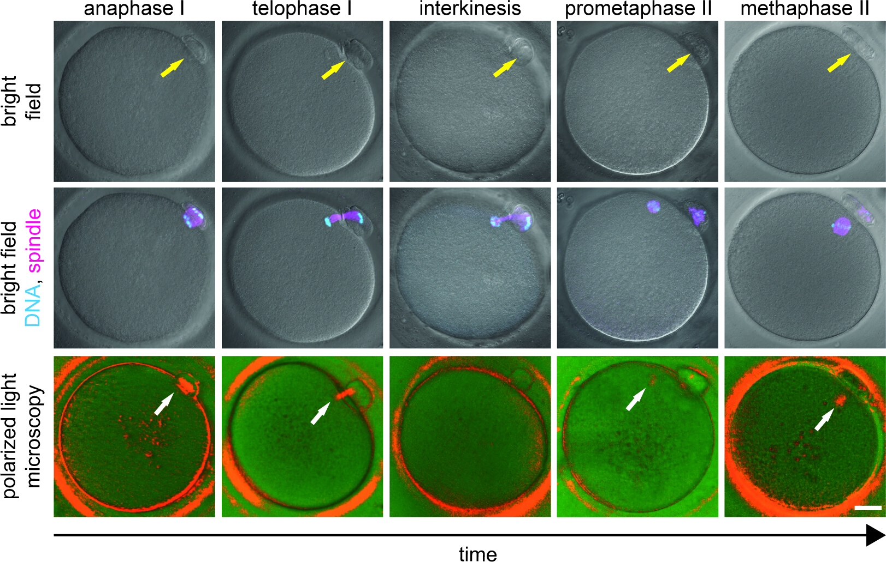
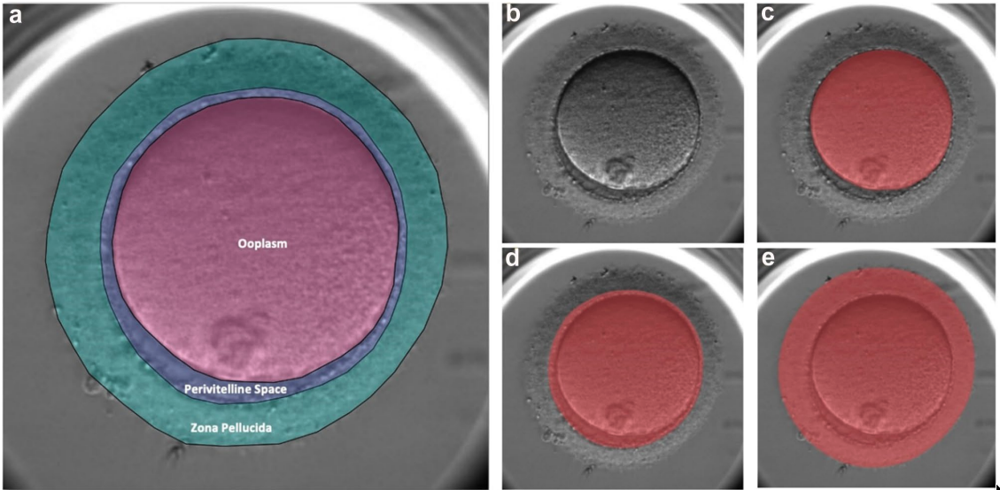
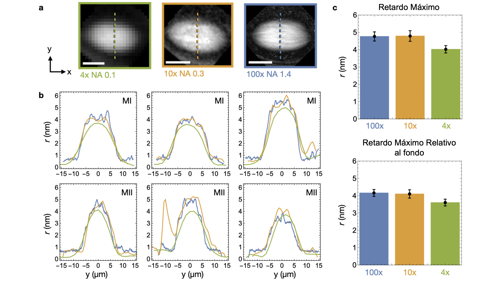
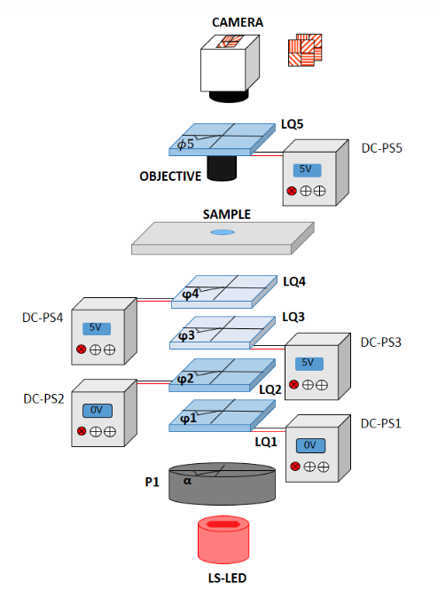
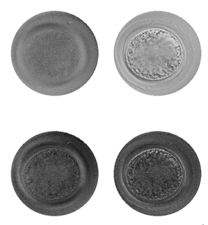

<header class="mb-3 text-left">
  <h1 class="mt-0 text-xl font-bold leading-tight tracking-tight text-unal-gray sm:text-2xl">Evaluación de madurez ovocitaria mediante PLM</h1>
  

</header>

  <!-- Columna izquierda: PLM detecta el huso -->
  

    <ul class="list-none space-y-1.5 text-[0.82rem] leading-snug text-unal-gray">
      <li class="flex gap-2">
        ▸
        Huso meiótico — indicador óptimo de madurez MII, invisible en campo claro (Holubcová et al., 2019; Fjeldstad et al., 2024)
      </li>
      <li class="flex gap-2">
        ▸
        PLM / PolScope — visualización no invasiva del huso; retardo óptico cuantitativo por píxel (Shribak &amp; Oldenbourg, 2003)
      </li>
    </ul>
    <figure class="m-0 min-w-0">
      
      <figcaption lang="es" class="plm-figcaption">
        Huso meiótico: invisible en campo claro, visible con fluorescencia y con PLM. Holubcová et al. (2019)
      </figcaption>
    </figure>
  

  <!-- Columna derecha: sistemas existentes sin PLM ni huso -->
  

    <ul class="list-none space-y-1.5 text-[0.82rem] leading-snug text-unal-gray">
      <li class="flex gap-2">
        ▸
        MOMA (Fjeldstad et al., 2024), OoCount (Folts et al., 2024), Chaput et al. (2025) — campo claro: sin PLM · sin detección del huso
      </li>
    </ul>
    <figure class="m-0 min-w-0">
      
      <figcaption lang="es" class="plm-figcaption">
        MOMA (Fjeldstad et al., 2024): segmentación de ZP y ooplasma en campo claro — sin PLM, sin huso meiótico.
      </figcaption>
    </figure>
  

  
  

<!--
Con este marco teórico claro pasamos a revisar el estado del arte, empezando por los métodos de evaluación de madurez de ovocitos.

Está claro que la detección del huso meiótico es un indicador clave de madurez MII y aptitud para ICSI. También, explicamos que se sigue realizando una evaluación manual de la madurez del ovocito, pero esta es subjetiva y depende de la experiencia del observador. Estudios indican que incluso hay variabilidad interobservador, por lo que se requiere un método más objetivo.

Recientemente se ha popularizado el uso de la microscopía polarizada para visualizar los ovocitos. Esta técnica permite visualizar la birrefringencia de la muestra y se ha descubierto que el huso meiótico tiene birrefringencia precisamente en el punto en que es apto para fecundación. La imagen de la izquierda —de Holubcová et al.— ilustra esto: en la fila superior vemos el ovocito en campo claro, donde el huso es completamente invisible y se observa el cuerpo polar; con fluorescencia se hace visible el huso pero requiere marcadores que comprometen la viabilidad de la célula; en la fila inferior, la PLM lo revela sin ninguna intervención química.

Se han desarrollado sistemas de automatización que realizan segmentación celular o conteos, pero ninguno aprovecha las ventajas que ofrece la PLM para detectar estos marcadores de madurez en la célula. La imagen de la derecha —MOMA, de Fjeldstad— es un ejemplo representativo: segmenta la zona pelúcida y el ooplasma en campo claro, sin detectar el huso meiótico ni usar PLM.
-->

---
transition: slide-up
deckSection: estado
---

<header class="mb-3 text-left">
  <h1 class="mt-0 text-xl font-bold leading-tight tracking-tight text-unal-gray sm:text-2xl">Estructuras birrefringentes del ovocito</h1>
  

</header>

  <ul class="list-none flex flex-col justify-center space-y-3 text-[0.82rem] leading-snug text-unal-gray sm:text-[0.86rem]">
    <li class="flex gap-2">
      ▸
      Huso meiótico — birrefringente solo en MII, invisible en campo claro (Holubcová et al., 2019; Kelleher &amp; Needleman, 2022)
    </li>
    <li class="flex gap-2">
      ▸
      Zona pelúcida (ZP) → birrefringencia moderada por su organización glicoproteica; indicador de integridad estructural del ovocito (Rienzi et al., 2011)
    </li>
    <li class="flex gap-2">
      ▸
      Cuerpo polar (CP) — confirma 1.ª división meiótica; visible en campo claro · en PLM: borde negro (baja birrefringencia) (Tepla et al., 2021; Rienzi et al., 2011)
    </li>
  </ul>
  <figure class="m-0 min-w-0 flex flex-col justify-center">
    
    <figcaption lang="es" class="plm-figcaption">
      Huso meiótico (s), zona pelúcida (zp), citoplasma (c) y cuerpo polar (pb). Rienzi et al. (2011)
    </figcaption>
  </figure>

  
  

<!--
En la diapositiva anterior vimos que la PLM se popularizó para visualizar ovocitos. Detengámonos ahora en cómo se visualizan algunas estructuras en PLM.

En esta imagen de Rienzi et al. vemos el ovocito maduro bajo microscopía polarizada. Dos estructuras principales presentan birrefringencia: el huso meiótico, como una estructura elipsoidal — su birrefringencia solo aparece en estadio MII, lo que lo convierte en el indicador directo de madurez. La zona pelúcida, con birrefringencia moderada producto de su organización glicoproteica. Y dos estructuras más difíciles de ver en PLM pero igualmente importantes en la evaluación de maduración: el cuerpo polar, que confirma que la primera división meiótica se completó — su posición relativa al huso predice el éxito en ICSI. Aunque es visible en campo claro, en PLM pierde contraste: su baja birrefringencia hace que su borde aparezca negro, prácticamente indistinguible del fondo, y se observa también el limite del citoplasma.

Lo que hace especialmente relevante a la PLM es que el huso meiótico es completamente invisible en campo claro: esta es la única técnica no invasiva que lo revela. Y la visualización del huso, no solo es marca de madurez sino de calidad. Un ovocito puede tener cuerpo polar pero nunca generar el huso.
-->

---
transition: slide-up
deckSection: estado
---

<header class="mb-3 text-left">
  <h1 class="mt-0 text-xl font-bold leading-tight tracking-tight text-unal-gray sm:text-2xl">Retardo óptico de estructuras birrefringentes</h1>
  

</header>

  

    <ul class="list-none space-y-2.5 text-[0.80rem] leading-snug text-unal-gray sm:text-sm">
      <li class="flex gap-2">
        ▸
        Huso meiótico: retardo 1–5.6&nbsp;nm — bajo contraste, difícil de detectar automáticamente (Kelleher &amp; Needleman, 2022; Bruguès &amp; Needleman, 2014)
      </li>
      <li class="flex gap-2">
        ▸
        Zona pelúcida: retardo 0–2&nbsp;nm (~36% del máximo del huso) (Rienzi et al., 2011)
      </li>
      <li class="flex gap-2">
        ▸
        Fondo: retardo 0–1&nbsp;nm — referencia de calibración del sistema (Bruguès &amp; Needleman, 2014)
      </li>
    </ul>
    

      

        Esta diferencia cuantitativa es la base física que hace posible la síntesis realista de imágenes PLM
      

    

  

  <figure class="m-0 min-w-0 flex flex-col justify-center">
    
    <figcaption lang="es" class="plm-figcaption">
      Huso bajo PLM (4×, 10×, 100×); perfiles de retardo en MI y MII. Kelleher &amp; Needleman (2022)
    </figcaption>
  </figure>

  
  

<!--
Se ha cuantificado la birrefringencia del huso, el fondo y de la zona pelúcida.

Bruguès y Needleman midieron el retardo óptico del huso meiótico en ovocitos de ratón a distintos objetivos. Los perfiles de la parte b de la imagen confirman que en estadio MII el huso es consistentemente detectable. Los valores de la parte b lo cuantifican: retardo entre 1 y 5.6 nanómetros. Para referencia, la zona pelúcida presenta entre 0 y 2 nanómetros, y el fondo entre 0 y 1 nanómetro.

Valores tan pequeños y tan próximos entre sí son exactamente el reto del problema: el huso no destaca visualmente con facilidad. Pero al mismo tiempo son valores físicamente bien definidos y cuantificables, lo que hace posible plantear la pregunta de la detección o la modelación de forma sintética.
-->

---
transition: slide-up
deckSection: estado
---

<header class="mb-2 text-left">
  <h1 class="mt-0 text-xl font-bold leading-tight tracking-tight text-unal-gray">Proyecto marco — Sistema PLM propuesto (GPIMA)</h1>
  

  
Desarrollo de un método para la detección automática del huso meiótico para establecer la relación con la maduración y la fertilización in vitro en ovocitos porcinos, basado en el vector de Stokes y estrategias de visión artificial

</header>

  <figure class="m-0 flex flex-col items-center justify-center gap-1">
    
    <figcaption lang="es" class="plm-figcaption text-center">
      Configuración del microscopio polarizado propuesto. LS-LED · P1 · LC · DC-PS · CÁMARA · OBJETIVO 20×. Los ángulos (α, φ) corresponden a la rotación física de cada elemento.
    </figcaption>
  </figure>
  

    <figure class="m-0 flex flex-col items-center justify-center gap-1">
      
      <figcaption lang="es" class="plm-figcaption text-center">
        Retardo y ángulo de ovocito porcino (grado 1, 24 h). Col. izq.: cambio de fase 6 pasos; col. central: 4 pasos. Fila sup.: ángulo; fila inf.: retardo.
      </figcaption>
    </figure>
    

      
Limitaciones experimentales del proyecto marco:

      <ol class="list-decimal pl-4 space-y-0">
        <li>Horas exactas de maduración de los ovocitos desconocidas</li>
        <li>Sin micromanipulador robótico para rotar el óvulo al ángulo de medición</li>
        <li>Sin cámara conectada a la incubadora — extraer el óvulo para observarlo lo daña</li>
      </ol>
    

  

  
  

<!--
Este es el sistema que el grupo GPIMA construyó y en el que se enmarca esta tesis. El montaje usa una fuente LED, un polarizador lineal, cristales líquidos como retardadores variables y una cámara polarizada — todo controlado para adquirir imágenes de retardo óptico a diferentes ángulos de fase, como se ve en la figura 7-13: esa cuadrícula de cuatro imágenes muestra el retardo y el ángulo extraídos de un ovocito porcino usando los métodos de cambio de fase de seis y cuatro pasos.

Sin embargo, en vista de las dificultades experimentales del proyecto marco, no fue posible construir una base de datos real de ovocitos humanos: no se conocían las horas exactas de maduración, no se contaba con micromanipulador robótico para posicionar el óvulo, extraer el ovocito de la incubadora para fotografiarlo lo daña, y los procedimientos de polarización requerían una mejora de contraste que aún no estaba disponible.

En vista de estas dificultades, desarrollamos la siguiente estrategia para generar los datos de entrenamiento.
-->

---
transition: slide-up
deckSection: estado
---

<header class="mb-3 text-left">
  <h1 class="mt-0 text-xl font-bold leading-tight tracking-tight text-unal-gray sm:text-2xl">Bases de datos sintéticas para aprendizaje profundo</h1>
  

</header>

  <ul class="list-none space-y-2 text-[0.82rem] leading-snug text-unal-gray">
    <li class="flex gap-2">
      ▸
      Escasez de datos: no existe base PLM de ovocitos anotada y pública — barreras éticas, de privacidad y costo de adquisición (Beduschi, 2024)
    </li>
    <li class="flex gap-2">
      ▸
      Síntesis validada en otros dominios: Mery (2021, 2022) (rayos X industriales), Eversberg &amp; Lambrecht (2024) (industria), Frid-Adar et al. (2018) (imágenes médicas) — datos sintéticos permiten entrenar detectores que generalizan a imágenes reales
    </li>
  </ul>
  <figure class="m-0 min-w-0">
    
    <figcaption lang="es" class="plm-figcaption text-center">
      GDXray+ (Mery, 2021): (a) fundición X-ray, (b) defectos simulados, (c) superposición, (d) detecciones.
    </figcaption>
  </figure>
  <ul class="list-none text-[0.82rem] leading-snug text-unal-gray">
    <li class="flex gap-2">
      ▸
      Base física: huso — elipsoidal, retardo cuantificable → síntesis realista (Kelleher &amp; Needleman, 2022; Bruguès &amp; Needleman, 2014)
    </li>
  </ul>

  
  

<!--
Para entrenar un detector de objetos se necesitan imágenes anotadas. Aquí encontramos la primera barrera práctica: no existe ninguna base pública de imágenes PLM de ovocitos.

En el marco del proyecto:
Desarrollo de un método para la detección automática del huso meiótico para establecer la relación con la maduración y la fertilización in vitro en ovocitos porcinos, basado en el vector de stokes y estrategias de visión artificial

Se intentó construir una pero debido a limitaciones de observación, material celular e infraestructura no se logró.

Además, este tipo de datos clínicos son privados, costosos y sujetos a restricciones éticas.

Así que la solución, respaldada por la literatura, es la generación de datos sintéticos. Como vemos en la figura, Mery y otros demostraron que simular defectos elipsoidales sobre imágenes de rayos X permitía entrenar un detector que transfería correctamente a imágenes reales. Eversberg y Lambrecht, y Frid-Adar et al. validan esta estrategia en industria detectando defectos en aluminio y en imágenes médicas respectivamente.

Así, con lo visto anteriormente se tiene el fundamento físico para generar nuestra base de datos sintetica: el huso meiótico tiene morfología elipsoidal y retardo óptico cuantificable, lo que habilita un modelado sintético realista. El principal reto será pasar del dominio sintético al real.
-->

---
transition: slide-up
deckSection: estado
---

<header class="mb-3 text-left">
  <h1 class="mt-0 text-xl font-bold leading-tight tracking-tight text-unal-gray sm:text-2xl">Arquitecturas para detección de objetos</h1>
  

</header>

  

    <!-- Fila 1: Clásicos -->
    

      Clásicos
      

        Faster R-CNN
        SSD
        RetinaNet
      

    

    <!-- Fila 2: YOLO 2018–23 -->
    

      YOLO 2018–23
      

        YOLOv3
        YOLOv4
        YOLOv5
        YOLOv7
        YOLOv8
      

    

    <!-- Fila 3: YOLO reciente + RT-DETR -->
    

      YOLO reciente
      

        ★ YOLOv9
        YOLOv10
        ★ YOLOv11
        YOLOv12
        ● RT-DETR
      

    

  

  

    <!-- Estructura de la red: Columna vertebral + Cuello + Cabeza -->
    

      

        
Columna vertebral

        
Bloques eficientes: CSP, C3, C2f — extracción de características multi-escala.

      

      

        
Cuello (Neck)

        
FPN / PANet — fusión multi-escala — detección de objetos de distintos tamaños.

      

      

        
Cabeza (Head)

        
Anchor-free → predicciones con pérdidas basadas en IoU.

      

    

  

  

    Variantes de YOLO han incorporado módulos de atención para adaptar la red a dominios específicos — YOLO-SCL (Lyu et al., 2023), MA-YOLO (Jiang et al., 2023).
  

  
  

<!--
Ahora, sobre las redes neuronales para detección de objetos, se han mantenido evolucionado desde arquitecturas de dos etapas — Faster R-CNN, RetinaNet — hacia detectores de una sola etapa que resuelven localización y clasificación simultáneamente. En la diapositiva vemos el panorama de arquitecturas revisadas; en azul, YOLOv9 y YOLOv11, los dos modelos centrales de este trabajo, y en verde RT-DETR como alternativa Transformer.

Esta evolución trajo mejoras sistemáticas en tres componentes, que vemos en la parte inferior: la columna vertebral extrae características multi-escala con bloques progresivamente más eficientes; el cuello integra esas características mediante Red Piramidal de Características FPN y Red de Agregación de Rutas PANet para detectar objetos de distintos tamaños; la cabeza produce predicciones con esquemas anchor-free y pérdidas basadas en IoU; 

-- esto no
y se han desarrollado modulos de atención como — SE (Atención de Compresión y Excitación), CBAM (El modulo bloque de atencion), ECA (Atencion eficiente de canal) — recalibran la respuesta de la red para adaptarla a dominios específicos como las imágenes PLM.
-->

---
transition: slide-up
deckSection: estado
---

<header class="mb-3 text-left">
  <h1 class="mt-0 text-xl font-bold leading-tight tracking-tight text-unal-gray sm:text-2xl">Familia YOLO: arquitecturas evaluadas</h1>
  

</header>

  <!-- Timeline block -->
  

    <!-- YOLO timeline row -->
    

      <!-- Connecting line at dot center: 20px (year label h-5) + 5px (half of h-2.5 dot) = 25px -->
      

      

        <!-- v1 -->
        

          2016
          

          v1
        

        <!-- v2 -->
        

          2017
          

          v2
        

        <!-- v3 -->
        

          2018
          

          v3
        

        <!-- v4 (2020) -->
        

          2020
          

          v4
        

        <!-- v5 (2020, skip year label) -->
        

          2020
          

          v5
        

        <!-- v6 (2022) -->
        

          2022
          

          v6
        

        <!-- v7 (2022, skip year label) -->
        

          2022
          

          v7
        

        <!-- v8 (2023) -->
        

          2023
          

          v8
        

        <!-- v9 (2024) HIGHLIGHTED -->
        

          2024
          

          v9★
        

        <!-- v10 (2024, skip year label) -->
        

          2024
          

          v10
        

        <!-- v11 (2024) HIGHLIGHTED -->
        

          2024
          

          v11★
        

        <!-- v12 (2025) -->
        

          2025
          

          v12
        

      

    

    <!-- RT-DETR row (same grid-cols-12, aligned with v8 column = col 8, index 7) -->
    

      

      <!-- Column 8: RT-DETR (aligned with v8, 2023) -->
      

        

        

        RT-DETR
      

      

    

    <!-- Legend -->
    

      

        

        ★ Evaluado en este trabajo
      

      

        

        Transformer (Baidu, 2023)
      

    

  

  <!-- Bullets -->
  <ul class="list-none space-y-1.5 text-[0.88rem] leading-snug text-unal-gray sm:text-[0.88rem]">
    <li class="flex gap-2">
      ▸
      YOLOv9 (Wang et al., 2024): PGI — preserva información de gradiente → mayor precisión en modelos ligeros.
    </li>
    <li class="flex gap-2">
      ▸
      YOLOv11 (Khanam &amp; Hussain, 2024): bloques C3k2 — arquitectura base para integrar módulos de atención.
    </li>
    <li class="flex gap-2">
      ▸
      RT-DETR (Zhao et al., 2024): Transformer end-to-end — elimina NMS — alternativa estructural a YOLO.
    </li>
  </ul>

  
  

<!--
Esta línea del tiempo muestra la evolución de YOLO desde la versión 1 en 2016 hasta la versión 12 en 2025 — nueve años de desarrollo continuo. Tres modelos son centrales en este trabajo, marcados en azul y verde.

YOLOv9, de 2024, introdujo la planificación de rutas de gradiente — un mecanismo que preserva la información a lo largo de la red y mejora la precisión incluso en configuraciones ligeras entrenadas desde cero. YOLOv11, también de 2024 y desarrollado por Ultralytics, introduce bloques de convolucion llamados C3k2 de mayor eficiencia y fue la arquitectura base sobre la cual integramos módulos de atención en este trabajo. Y RT-DETR, de Baidu en 2023, propone detección Transformer end-to-end: elimina el post-procesamiento de supresión de no-máximos y ofrece una alternativa estructuralmente distinta a la familia YOLO.
-->

---
transition: slide-left
deckSection: estado
---

<header class="mb-3 text-left">
  <h1 class="mt-0 text-xl font-bold leading-tight tracking-tight text-unal-gray sm:text-2xl">Mecanismos de atención y arquitecturas Transformer</h1>
  

</header>

<!-- Bullets -->
<ul class="list-none space-y-1.5 text-[0.88rem] leading-snug text-unal-gray">
<li class="flex gap-2">
▸
SE, ECA — recalibran canales; CBAM añade atención espacial — sin rediseñar el detector.
</li>
<li class="flex gap-2">
▸
En este trabajo: CBAM integrado en YOLOv9m → mejora detección de estructuras pequeñas (huso meiótico, cuerpo polar).
</li>
<li class="flex gap-2">
▸
RT-DETR (Zhao et al., 2024): atención global entre posiciones — decodificador Transformer elimina NMS.
</li>
</ul>

<!-- Ecuaciones -->

$$\text{Canal:}\quad M_c(\mathbf{F}) = \sigma\!\left(\mathrm{MLP}(\mathrm{AvgPool}(\mathbf{F})) + \mathrm{MLP}(\mathrm{MaxPool}(\mathbf{F}))\right)$$

$$\text{Espacial:}\quad M_s(\mathbf{F}) = \sigma\!\left(f^{7\times7}\!\left([\mathrm{AvgPool}(\mathbf{F});\,\mathrm{MaxPool}(\mathbf{F})]\right)\right)$$

<!-- Diagrama CBAM ancho completo -->

  

    x
    (B, C, H, W)
  

  

    Rasgos
    crudos
    →
  

  

    
Módulo CBAM

    

      

        Atención Canal
        Mc(F)
      

      

        Rasgos
        por canal
        →
      

      

        Atención Espacial
        Ms(F)
      

    

  

  

    Rasgos
    refinados
    →
  

  

    F'
    (B, C, H, W)
  

 Módulo CBAM: refinamiento secuencial canal → espacio.

  
  

<!--
En la diapositiva anterior vimos que RT-DETR y las variantes más recientes de YOLO incorporan mecanismos de atención. Vale la pena detenerse en qué significa eso.

Existen varios módulos de atención ligeros que se integran en detectores existentes sin rediseñarlos. SE — Squeeze-and-Excitation — fue el pionero: comprime cada canal a un escalar y aprende un peso por canal. ECA (Atencion eficiente de canal) lo hace de forma más eficiente con una convolución 1D. Ambos responden solo a la pregunta de qué canales activar.

CBAM (El modulo bloque de atencion) va un paso más allá. Como vemos en el diagrama y las dos ecuaciones, aplica primero atención de canal — M_c pondera cada canal combinando pooling promedio y máximo — y luego atención espacial — M_s hace lo mismo pero por posición en la imagen. Añade así la pregunta de dónde enfocar. Eso lo hace especialmente valioso en imágenes PLM, donde el huso meiótico y el cuerpo polar son estructuras pequeñas o de muy bajo contraste. En este trabajo integramos CBAM en YOLOv9m precisamente por eso.

RT-DETR lleva el principio más lejos. Un Transformer no recalibra canales ni posiciones locales — aplica atención entre todas las posiciones de la imagen simultáneamente: cada región puede "consultar" cualquier otra, sin importar la distancia. Esto captura relaciones globales que una convolución local nunca vería. En RT-DETR, un decodificador Transformer produce directamente las detecciones finales mediante consultas aprendidas, eliminando la necesidad del la supresion de no-maximos como paso de post-procesamiento.
-->
