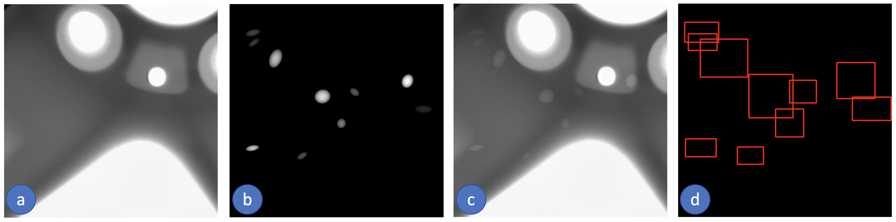
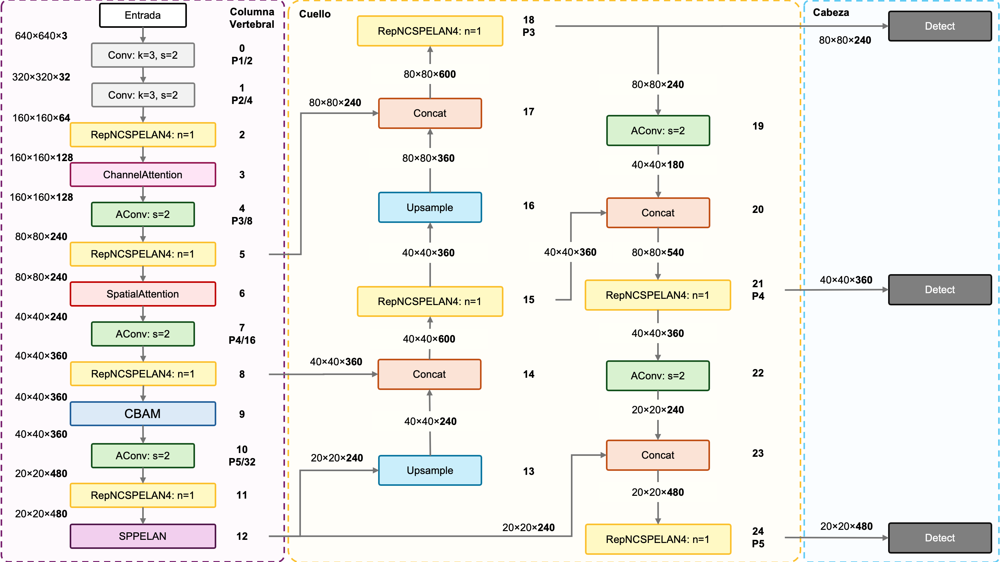

<header class="mb-3 text-left">
  <h1 class="mt-0 text-xl font-bold leading-tight tracking-tight text-unal-gray sm:text-2xl">Diseño experimental: tres fases</h1>
  

</header>

  

    <!-- Fase 1 -->
    

      

        Fase 1
        Bases de datos
      

      <ul class="list-none space-y-1.5 text-[0.82rem] leading-snug text-unal-gray">
        <li class="flex gap-1.5">▸Síntesis de imágenes PLM</li>
        <li class="flex gap-1.5">▸Búsqueda y curaduría de datos reales</li>
        <li class="flex gap-1.5">▸Caracterización de los conjuntos</li>
      </ul>
    

    <!-- Arrow 1 -->
    

      →
    

    <!-- Fase 2 -->
    

      

        Fase 2
        Evaluación comparativa de redes estándar
      

      <ul class="list-none space-y-1.5 text-[0.82rem] leading-snug text-unal-gray">
        <li class="flex gap-1.5">▸Selección de arquitecturas</li>
        <li class="flex gap-1.5">▸Protocolos: control y transferencia de aprendizaje</li>
      </ul>
    

    <!-- Arrow 2 -->
    

      →
    

    <!-- Fase 3 — APORTE -->
    

      

        

          Fase 3
          ★ Aporte
        

        Redes desarrolladas
      

      <ul class="list-none space-y-1.5 text-[0.82rem] leading-snug text-unal-gray">
        <li class="flex gap-1.5">▸Módulos de atención (CBAM / Transformer)</li>
        <li class="flex gap-1.5">▸Protocolo comparativo</li>
        <li class="flex gap-1.5">▸Evaluación en video</li>
      </ul>
    

  

  
  

<!--
Con los objetivos planteados, la metodología se organiza en tres fases. La primera construye las bases de datos: generamos imágenes PLM sintéticas a partir del modelo físico, recopilamos datos reales de publicaciones científicas y video, y caracterizamos los conjuntos resultantes.

La segunda es la evaluación comparativa de redes estándar: seleccionamos las arquitecturas más prometedoras usando un dominio análogo, y evaluamos dos protocolos — un experimento de control sin transferencia de aprendizaje, y el flujo completo de dos etapas con adaptación al dominio real.

La tercera — y el aporte central del trabajo — es el desarrollo de redes personalizadas: modificamos las arquitecturas seleccionadas con módulos de atención, repetimos el mismo protocolo comparativo y evaluamos en video. Este orden define también la estructura de la sección de resultados.
-->

---
transition: slide-up
deckSection: metodologia
---

<header class="mb-2 text-left">
  <h1 class="mt-0 text-xl font-bold leading-tight tracking-tight text-unal-gray">Generación de la base de datos sintética</h1>
  

</header>

  

    

      

        Paso 1
        Modelación Física
      

      <ul class="list-none space-y-1 text-[0.76rem] leading-snug text-unal-gray">
        <li class="flex gap-1.5">▸<b>Huso meiótico:</b> Gaussiana anisotrópica 2D (Retardo ~5,6 nm) (Kelleher et al., 2024)</li>
        <li class="flex gap-1.5">▸<b>Zona Pelúcida:</b> Banda elíptica + Filtro Gaussiano (Retardo 0–2 nm) (Rienzi et al., 2011)</li>
        <li class="flex gap-1.5">▸<b>Estructuras base:</b> Cuerpo polar y límite citoplasmático</li>
      </ul>
    

    

      →
    

    

      

        Paso 2
        Síntesis Combinatoria
      

      <ul class="list-none space-y-1 text-[0.76rem] leading-snug text-unal-gray">
        <li class="flex gap-1.5">▸<b>Calibración espacial:</b> 1 px = 0,129 µm (Ovocito de 120 µm) (Kelleher et al., 2024; Rienzi et al., 2012)</li>
        <li class="flex gap-1.5">▸<b>Normalización:</b> 0 nm (fondo) → 5,6 nm (máx.) → imagen 8-bit [0, 255]</li>
        <li class="flex gap-1.5">▸Iteración de posiciones (18 husos, 12 ZP) + Ruido de fondo</li>
        <li class="flex gap-1.5">▸<b>Volumen generado:</b> 526 392 imágenes sintéticas</li>
      </ul>
    

    

      →
    

    

      

        

          Paso 3
          ★ Dataset Final
        

        Etiquetado y Organización
      

      <ul class="list-none space-y-1 text-[0.76rem] leading-snug text-unal-gray">
        <li class="flex gap-1.5">▸<b>Selección curada:</b> Subconjunto de 21 600 imágenes</li>
        <li class="flex gap-1.5">▸<b>Etiquetado 100% automático</b> por definición paramétrica</li>
      </ul>
    

  

  
  

<!--
Para entrenar los modelos nos enfrentamos a una barrera crítica: los datos clínicos de imágenes PLM de ovocitos son privados, costosos y sujetos a restricciones éticas. Al no existir bases de datos públicas, la solución fue generar los datos sintéticamente.

Paso 1: Modelamos cuatro estructuras. El huso meiótico es una Gaussiana anisotrópica 2D con un retardo máximo. La zona pelúcida es una banda elíptica con filtro Gaussiano. Y también incluimos el límite citoplasmático y el cuerpo polar.

Paso 2: Calibramos el sistema a 1 píxel igual a 0,129 micrómetros — correspondiente a un zoom 400× con un ovocito de 120 µm. 
Iteramos las 18 configuraciones de huso y las 12 zonas pelúcidas en múltiples posiciones, sumando ruido de fondo como el reportado en la literatura para simular la realidad clínica, el pipeline generó más de 526 mil imágenes.
Convertimos cada una de estas imagenes de 8 bits y normalizamos entre 0 y 255. 

Antes de continuar: el retardo óptico varía entre 0 nanómetros en el fondo y 5,6 nanómetros en el máximo modelado para el huso meiótico. Esa señal en nanómetros se escala linealmente a una imagen de 8 bits entre 0 y 255, lo que la hace compatible con los modelos pre-entrenados en COCO. 

Paso 3: Extrajimos un subconjunto curado de 21 600 imágenes y se etiqueta. La ventaja metodológica clave: el etiquetado es 100% automático por definición paramétrica.
-->

---
transition: slide-up
deckSection: metodologia
---

<header class="mb-3 text-left">
  <h1 class="mt-0 text-xl font-bold leading-tight tracking-tight text-unal-gray sm:text-2xl">Datos reales: imágenes y video PLM</h1>
  

</header>

  <!-- Imágenes PLM -->
  

    
<carbon-camera class="mr-1 inline text-[1rem] text-unal-blue" />Imágenes PLM — OocytePaperImages

    <ul class="list-none space-y-2 text-[0.80rem] leading-snug text-unal-gray">
      <li class="flex gap-2">
        <carbon-book class="mt-0.5 shrink-0 text-[0.95rem] text-unal-blue" />
        Fuente: publicaciones científicas y libros de texto sobre ovocitos, microscopía polarizada e ICSI
      </li>
      <li class="flex gap-2">
        <carbon-filter class="mt-0.5 shrink-0 text-[0.95rem] text-unal-blue" />
        Criterio de inclusión: imágenes PLM de ovocito MII con al menos una de las cuatro estructuras objetivo visibles
      </li>
      <li class="flex gap-2">
        <carbon-cut-out class="mt-0.5 shrink-0 text-[0.95rem] text-unal-blue" />
        Curaduría: eliminación de texto, barras de escala y gráficos superpuestos
      </li>
      <li class="flex gap-2">
        <carbon-label class="mt-0.5 shrink-0 text-[0.95rem] text-unal-blue" />
        Etiquetado: manual con cajas delimitadoras — mismo esquema de clases que el conjunto sintético
      </li>
    </ul>
  

  <!-- Videos PLM -->
  

    
<carbon-video class="mr-1 inline text-[1rem] text-[#3a6a18]" />Secuencias de video — 5 secuencias PLM

    <ul class="list-none space-y-1.5 text-[0.80rem] leading-snug text-unal-gray">
      <li class="flex gap-2">
        <carbon-play-filled class="mt-0.5 shrink-0 text-[0.95rem] text-unal-green" />
        Sec. 1: time-lapse meiosis I (109 fotogramas) — galería pública OpenPolScope (OpenPolScope, 2024)
      </li>
      <li class="flex gap-2">
        <carbon-play-filled class="mt-0.5 shrink-0 text-[0.95rem] text-unal-green" />
        Sec. 2: ICSI con sistema OOSIGHT-Spindle View (deformación del ovocito por aguja) (Hamilton Thorne, 2024)
      </li>
      <li class="flex gap-2">
        <carbon-play-filled class="mt-0.5 shrink-0 text-[0.95rem] text-unal-green" />
        Sec. 3: extrusión del primer cuerpo polar — Prague IVF OptimFert (Prague Fertility Centre, 2024)
      </li>
      <li class="flex gap-2">
        <carbon-play-filled class="mt-0.5 shrink-0 text-[0.95rem] text-unal-green" />
        Sec. 4–5: imágenes TIF de retardo (Zenodo) → convertidas a video PNG a 5 FPS (Zenodo, 2024)
      </li>
    </ul>
    

      Sin anotaciones por fotograma — uso exclusivo para evaluación cualitativa práctica
    

  

  
  

<!--
También se buscaron imagenes en literatura y bases de datos.

Se construyó un conjunto de datos de imagenes de papers donde recopilamos 200 imágenes de publicaciones científicas y libros de texto sobre ovocitos, microscopía polarizada e ICSI. El criterio de inclusión fue que cada imagen contuviera al menos una de las cuatro estructuras objetivo visibles. Las imágenes de publicaciones llegaban con texto, barras de escala y gráficos superpuestos — cada una requirió curaduría manual para limpiarla. Luego se anotaron manualmente con cajas delimitadoras, usando el mismo esquema de clases del conjunto sintético.

Y se usan cinco secuencias de videos para evaluar cualitativamente escenarios distintos, algunos donde el huso es bastante dificil de ver, morfologia variable y se encontro un dataset de imagenes que se combinaron para formar un video.
-->

---
transition: slide-up
deckSection: metodologia
---

<header class="mb-3 text-left">
  <h1 class="mt-0 text-xl font-bold leading-tight tracking-tight text-unal-gray sm:text-2xl">Caracterización de los conjuntos de datos</h1>
  

</header>

    <!-- Conjunto 1: Sintético -->
    

      

        Preentrenamiento
      

      
<carbon-data-base class="shrink-0 text-[1rem]" />Oocyte_synthetic_2025b

      <ul class="list-none space-y-1 text-[0.82rem] leading-snug text-unal-gray">
        <li>Tipo: Sintético</li>
        <li>Usadas: 21 600 de 526 392</li>
        <li>Partición: 15 120 / 3 240 / 3 240</li>
        <li>Etiquetado: automático-paramétrico</li>
        <li>Clases: huso, ZP, citoplasma, CP</li>
      </ul>
      

        ¿Por qué 21 600? Cómputo: algunos entrenamientos superaron las 22 h en GPU L4; y para evitar sobreajuste al dominio sintético antes de la transferencia.
      

    

    <!-- Conjunto 2: Real PLM -->
    

      

        Transf. de aprendizaje
      

      
<carbon-camera class="shrink-0 text-[1rem]" />OocytePaperImages

      <ul class="list-none space-y-1 text-[0.82rem] leading-snug text-unal-gray">
        <li>Tipo: Real PLM — publicaciones científicas</li>
        <li>Total: 200 imágenes</li>
        <li>Partición: 160 entrenamiento / 40 prueba</li>
        <li>Instancias prueba: 146 anotadas</li>
        <li>Etiquetado: manual (curaduría)</li>
        <li>Preprocesado: eliminación de texto y barras de escala</li>
      </ul>
    

    <!-- Conjunto 3: Video -->
    

      

        Evaluación
      

      
<carbon-video class="shrink-0 text-[1rem]" />5 secuencias de video

      <ul class="list-none space-y-1 text-[0.82rem] leading-snug text-unal-gray">
        <li>Tipo: Real PLM — video</li>
        <li>Seq. 1: 109 fotogramas · time-lapse meiosis I (OpenPolScope)</li>
        <li>Seq. 2–3: videos PLM publicados (ICSI, extrusión CP)</li>
        <li>Sec. 4–5: conjunto Zenodo (imágenes TIF → video)</li>
        <li>Uso: evaluación cualitativa práctica</li>
      </ul>
    

  
  

<!--
El resultado entonces son tres conjuntos de datos con roles completamente distintos.

Oocyte_synthetic_2025b tiene 21 600 imágenes de las 526 mil generadas. Se tomó ese subconjunto por dos razones: límites de cómputo — tiempo de entrenamiento, GPU y almacenamiento — y para evitar sobreajustar el modelo al dominio sintético antes de la transferencia de aprendizaje. Las 21 600 se dividen en 15 120 de entrenamiento, 3 240 de validación y 3 240 de prueba. Etiquetado 100% automático.

OocytePaperImages tiene 200 imágenes PLM reales: 160 para entrenamiento y 40 para prueba. Esas 40 imágenes de prueba contienen 146 instancias anotadas — ese es el conjunto sobre el que se calculan todas las métricas cuantitativas.

Las cinco secuencias de video no tienen anotaciones por fotograma y se usan solo para evaluación cualitativa práctica. Estos tres conjuntos suman datos a tres escalas diferentes: síntesis para escala, literatura para dominio real, video para validación en condiciones dinámicas.
-->

---
transition: slide-up
deckSection: metodologia
---

<header class="mb-3 text-left">
  <h1 class="mt-0 text-xl font-bold leading-tight tracking-tight text-unal-gray sm:text-2xl">Selección de arquitecturas base</h1>
  

</header>

  

    

      Prueba en dominio análogo: GDXray+ (Mery, U. Católica de Chile) — imágenes de rayos X de fundición metálica con defectos elipsoidales de bajo contraste. Mismo patrón visual que el huso meiótico en PLM.
    

    <figure class="m-0 min-w-0">
      
      <figcaption lang="es" class="plm-figcaption">
         GDXray+: rayos X industriales de fundición metálica — defectos elípticos simulados (b), superposición de bajo contraste (c) y detecciones del modelo (d). Mery (2021)
      </figcaption>
    </figure>
    

      Todas las configuraciones superaron mAP50 ≥ 0,989 en GDXray+ → cualquier arquitectura es técnicamente viable → selección por balance rendimiento-eficiencia.
    

  

  

    
13 configuraciones para el protocolo PLM:

    

      YOLOv8s
      YOLOv8m
      YOLOv9s
      YOLOv9m
      YOLOv10s
      YOLOv10m
      YOLOv11s
      YOLOv11m
      YOLOv11l
      YOLOv12s
      RT-DETR-R50
      RT-DETR-L
      RT-DETR-R101
    

    

      → Las de mayor rendimiento en Fase 2 serán candidatas para recibir módulos de atención en Fase 3
    

  

  
  

<!--
Antes de comprometer semanas de cómputo sobre datos PLM, y a la vez que modelabamos el dataset sintetico, necesitábamos una forma de comparar arquitecturas rápidamente. Para eso usamos el conjunto GDXray+ del profesor Mery, de la Universidad Católica de Chile: imágenes de rayos X de piezas fundidas con defectos elipsoidales superpuestos de bajo contraste. Como vemos en la figura, el problema es análogo al nuestro — elipses poco visibles sobre fondo uniforme en escala de grises. Una prueba en seco antes del dominio PLM.

Evaluamos versiones de YOLOv8 hasta v12 en variantes pequeña y mediana, más tres configuraciones de RT-DETR. Todos superaron mAP50 de 0,989 en GDXray+, lo que confirmó que cualquiera era técnicamente viable. A partir de ahí seleccionamos las versiones más recientes a partir de la 8— YOLOv5 y v6 quedaron fuera porque las versiones nuevas las igualan o superan con mejor soporte — totalizando 13 configuraciones para el protocolo completo sobre datos PLM. Las de mayor rendimiento en Fase 2 serán las candidatas a recibir módulos de atención en Fase 3.
-->

---
transition: slide-up
deckSection: metodologia
---

<header class="mb-1 text-left">
  <h1 class="mt-0 text-xl font-bold leading-tight tracking-tight text-unal-gray sm:text-2xl">Transferencia de aprendizaje sintético-a-real</h1>
  

</header>

  <!-- Diagrama TL -->
  

    
Protocolo con transferencia de aprendizaje

    

      

        Inicio
        Pesos COCO
      

      
→

      

        Etapa 1
        Preentrenamiento sintético
        SGD · 21 600 imgs
      

      
→

      

        Etapa 2
        Transferencia de aprendizaje
        AdamW · 200 imgs reales · OocytePaperImages
      

      
→

      

        Evaluación
        40 imgs · 146 inst.
      

    

  

  <!-- Diagrama Control -->
  

    
Experimento de control — sin transferencia de aprendizaje

    

      

        Inicio
        Pesos COCO
      

      
→

      

        Etapa 1
        Preentrenamiento sintético
        SGD · 21 600 imgs
      

      
→

      

        Etapa 2
        Transferencia de aprendizaje
        omitida
      

      
→

      

        Evaluación
        40 imgs · 146 inst.
      

    

  

  <!-- Franja protocolo -->
  

    

    Mismo protocolo: 13 configuraciones estándar y 4 redes desarrolladas
    

  

  <!-- Hiperparámetros y métricas -->
  

    

      <carbon-settings class="mr-1 inline text-[0.85rem]" />Hiperparámetros clave
      <ul class="list-none space-y-0.5 text-[0.68rem] leading-tight text-unal-gray">
        <li>Etapa 1: SGD · 100 épocas YOLO / 150 RT-DETR · early stopping</li>
        <li>Etapa 2: AdamW · 200 épocas YOLO / 300 RT-DETR · early stopping</li>
        <li>Aumentación: HSV · traslación · escalado · flip-H · mosaico + Albumentations (Blur, CLAHE, ToGray…) — sin rotación ni flip-V</li>
      </ul>
    

    

      <carbon-chart-line class="mr-1 inline text-[0.85rem]" />Métricas de evaluación
      <ul class="list-none space-y-0.5 text-[0.68rem] leading-tight text-unal-gray">
        <li>mAP50 — umbral estándar (IoU = 0,5)</li>
        <li>mAP50-95 — promedio sobre 10 umbrales, más exigente</li>
        <li>Precisión · Recall · Tiempo de inferencia (ms/img)</li>
      </ul>
    

  

  
  

<!--
El protocolo tiene dos caminos que se comparan entre sí. En el camino principal partimos de pesos COCO, preentrenamos en datos sintéticos con SGD — 100 épocas para YOLO y 150 para RT-DETR — y aplicamos transferencia de aprendizaje sobre las 200 imágenes reales con AdamW, cuyas tasas de aprendizaje adaptativas son más eficientes para el salto de dominio sintético a real — 200 épocas para YOLO y 300 para RT-DETR.

El camino paralelo es el experimento de control: tomamos los pesos del preentrenamiento sintético y los evaluamos directamente sobre el conjunto real, sin pasar por la segunda etapa. Esa comparación nos permite cuantificar exactamente cuánto aporta la transferencia de aprendizaje y medir la brecha entre dominios.

La evaluación cuantitativa usa el conjunto de prueba — 40 imágenes con 146 instancias anotadas — midiendo mAP50, mAP50-95, precisión, recall y tiempo de inferencia. El mismo protocolo se aplica a todas las 13 configuraciones estándar y, en Fase 3, a las 4 redes personalizadas.
-->

---
transition: slide-up
deckSection: metodologia
---

<header class="mb-2 text-left">
  

    <h1 class="mt-0 text-xl font-bold leading-tight tracking-tight text-unal-gray sm:text-2xl">Desarrollo de redes con atención</h1>
    ★ Aporte
  

  

</header>

  <!-- Motivación como caja .co.bl -->
  

    Arquitecturas base: YOLOv9m y YOLO11m fueron seleccionadas en Fase 2 como las de mayor rendimiento → se desarrollaron 4 variantes con módulos de atención para mejorar la sensibilidad al huso meiótico y al límite citoplasmático sin rediseñar la arquitectura completa
  

  

    

      <carbon-layers class="mr-1 inline text-[0.95rem]" />YOLOv9m-CBAM
      CBAM en columna vertebral · bloque P2/4 (128 ch) · después del primer RepNCSPELAN4 · atención canal + espacial secuencial
      Woo et al., 2018 [43]; Hu et al., 2018 [44]
    

    

      <carbon-chart-multitype class="mr-1 inline text-[0.95rem]" />YOLOv9m-Triple Attention
      Atención progresiva en 3 niveles: Channel Att. (P2/4) · Spatial Att. (P3/8) · CBAM (P4/16) — recalibración multi-escala
      Woo et al., 2018 [43]; Hu et al., 2018 [44]
    

    

      <carbon-settings-adjust class="mr-1 inline text-[0.95rem]" />YOLO11m-Conservative Attention
      Channel Att. después del 1.er C3k2 (P2/4, 256 ch) · CBAM después del 2.° C3k2 (P3/8, 512 ch) — enfoque conservador
      Woo et al., 2018 [43]; Hu et al., 2018 [44]
    

    

      <carbon-machine-learning class="mr-1 inline text-[0.95rem]" />YOLO11m-Transformer Enhanced
      Módulos C3TR + Atención en columna vertebral — captura de relaciones globales en la imagen para complementar la convolución local
      Vaswani et al., 2017 [45]
    

  

  
  

<!--
Con la evaluación comparativa de redes estándar establecida, pasamos al aporte central del trabajo: modificar las arquitecturas seleccionadas para mejorar la sensibilidad a estructuras de bajo contraste — el huso meiótico y el límite citoplasmático — sin rediseñar la red completa. La estrategia fue añadir módulos de atención en posiciones estratégicas de la columna vertebral, recalibrando la respuesta donde el modelo base falla.

Desarrollamos cuatro variantes. Dos sobre YOLOv9m: CBAM insertado en la columna vertebral en el nivel P2, que aplica atención de canal y espacial en secuencia; y Triple Attention, que aplica los tres mecanismos de forma progresiva en P2, P3 y P4. Dos sobre YOLO11m: Conservative Attention, con módulos en puntos estratégicos; y Transformer Enhanced, que incorpora bloques C3TR para capturar relaciones globales en la imagen.

El criterio fue consistente: no rediseñar sino añadir atención selectiva. La sobrecarga computacional es menor al 0,5% en todos los casos.
-->

---
transition: slide-up
deckSection: metodologia
---

<header class="mb-2 text-left">
  

    <h1 class="mt-0 text-xl font-bold leading-tight tracking-tight text-unal-gray sm:text-2xl">Arquitectura YOLOv9m-Triple Attention</h1>
    ★ Aporte
  

  

</header>

  <figure class="m-0 min-h-0 flex-1 flex flex-col items-center justify-center pt-16">
    
    <figcaption lang="es" class="plm-figcaption mt-1 text-center">
      Arquitectura YOLOv9m-Triple Attention: ChannelAttention en P2/4 (128 ch), SpatialAttention en P3/8 (240 ch) y CBAM en P4/16 (360 ch).
    </figcaption>
  </figure>

  
  

<!--
Este diagrama muestra exactamente dónde interviene CBAM en YOLOv9m. En la columna vertebral, después del primer bloque RepNCSPELAN4 — en el nivel P2, que procesa características a un cuarto de la resolución de entrada con 128 canales — se inserta el módulo completo de atención.

Esa posición es deliberada por dos razones. Primera, en P2 la resolución espacial es suficiente para discriminar el huso meiótico, cuyo diámetro proyectado oscila entre 10 y 20 píxeles; en P3 ya sería demasiado pequeño para ser recalibrado con precisión. Segunda, es el nivel donde la información de bajo contraste — el retardo de 2 a 5 nanómetros del huso y el límite citoplasmático — todavía no ha sido suprimida por los bloques de reducción de P3 y P4.

CBAM actúa aquí como un filtro en dos pasos: recalibra canales y luego concentra la respuesta espacial. Después de ese módulo, la información fluye normalmente hacia el cuello y la cabeza de detección.
-->

---
transition: slide-up
deckSection: metodologia
---

<header class="mb-2 text-left">
  

    <h1 class="mt-0 text-xl font-bold leading-tight tracking-tight text-unal-gray sm:text-2xl">Arquitectura YOLOv9m-Triple Attention</h1>
    ★ Aporte
  

  

</header>

  

    

      Columna vertebral
      backbone · extracción de características multi-escala
    

    
→

    

      Cuello
      neck · FPN + PAN
    

    
→

    

      Cabeza
      3× Detect
    

  

  

    

    ⌕ Zoom — Columna vertebral
    

  

  

    

      ···
      →
      
RepNCSP

      →
      

        
ChannelAttention

        P2/4 · 128 ch
      

      →
      
AConv

      →
      
RepNCSP

      →
      

        
SpatialAttention

        P3/8 · 240 ch
      

      →
      
AConv

      →
      
RepNCSP

      →
      

        
CBAM

        P4/16 · 360 ch
      

      →
      ···
    

    

      

        

        Atención de canal
      

      

        

        Atención espacial
      

      

        

        CBAM (canal + espacial)
      

      

        

        Bloque estándar
      

    

  

  
  

<!--
Este diagrama simplificado muestra cómo se organiza YOLOv9m-Triple Attention. En la parte superior vemos las tres secciones de cualquier arquitectura YOLO: la columna vertebral extrae características a múltiples escalas, el cuello las fusiona con FPN y PAN, y la cabeza produce las detecciones finales en tres resoluciones.

El zoom a la columna vertebral revela la estrategia progresiva: en P2/4, con 128 canales y la resolución más alta, insertamos ChannelAttention para recalibrar qué canales son más relevantes — útil para detectar el huso meiótico de bajo contraste. En P3/8, con 240 canales, SpatialAttention refina la respuesta espacial. En P4/16, con 360 canales y mayor abstracción, CBAM combina ambos tipos de atención para las estructuras de mayor tamaño como la zona pelúcida.

Esta progresión garantiza que cada escala recibe el tipo de atención más adecuado para las estructuras que procesa.
-->

---
transition: slide-left
deckSection: metodologia
---

<header class="mb-1 text-left">
  <h1 class="mt-0 text-xl font-bold leading-tight tracking-tight text-unal-gray sm:text-2xl">Protocolo comparativo — Fase 3</h1>
  

  
Mismo protocolo de Fase 2 — las diferencias en resultados se deben exclusivamente a los módulos de atención.

</header>

  <!-- Diagrama TL -->
  

    
Protocolo con transferencia de aprendizaje

    

      

        Inicio
        Pesos COCO
      

      
→

      

        Etapa 1
        Preentrenamiento sintético
        SGD · 21 600 imgs
      

      
→

      

        Etapa 2
        Transferencia de aprendizaje
        AdamW · 200 imgs reales · OocytePaperImages
      

      
→

      

        Evaluación
        40 imgs · 146 inst.
      

    

  

  <!-- Diagrama Control -->
  

    
Experimento de control — sin transferencia de aprendizaje

    

      

        Inicio
        Pesos COCO
      

      
→

      

        Etapa 1
        Preentrenamiento sintético
        SGD · 21 600 imgs
      

      
→

      

        Etapa 2
        Transferencia de aprendizaje
        omitida
      

      
→

      

        Evaluación
        40 imgs · 146 inst.
      

    

  

  <!-- Nota Fase 3 -->
  

    Fase 3 — único diferencial: las 4 redes con módulos de atención siguen este mismo protocolo + evaluación en 5 secuencias PLM de video — las diferencias en resultados se atribuyen exclusivamente a los módulos de atención.
  

  
  

<!--
Las redes personalizadas se evalúan con exactamente el mismo protocolo de Fase 2: mismo flujo de entrenamiento de dos etapas, mismo experimento de control, mismo conjunto de prueba de 40 imágenes y las mismas métricas. Esa equivalencia es deliberada — garantiza que cualquier diferencia en los resultados se deba exclusivamente a los módulos de atención, y no a variaciones en el entrenamiento o la evaluación.

La diferencia de Fase 3 es la evaluación en video: las cinco secuencias PLM se aplican únicamente a las redes personalizadas y a sus equivalentes estándar, permitiendo una comparación directa en condiciones dinámicas reales. Con esto, pasemos a los resultados.
-->
