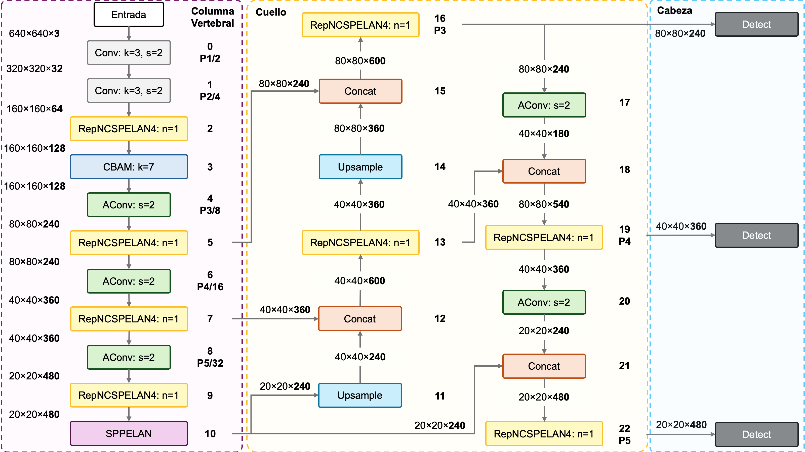

<header class="mb-3 text-left">
  <h1 class="mt-0 text-xl font-bold leading-tight tracking-tight text-unal-gray sm:text-2xl">Flujo metodológico</h1>
  

</header>

  

    <!-- Fase 1 -->
    

      

        Fase 1
        Bases de datos
      

      <ul class="list-none space-y-1.5 text-[0.72rem] leading-snug text-unal-gray">
        <li class="flex gap-1.5">▸Síntesis de imágenes PLM</li>
        <li class="flex gap-1.5">▸Búsqueda y curaduría de datos reales</li>
        <li class="flex gap-1.5">▸Caracterización de los conjuntos</li>
      </ul>
    

    <!-- Arrow 1 -->
    

      →
    

    <!-- Fase 2 -->
    

      

        Fase 2
        Evaluación comparativa de redes estándar
      

      <ul class="list-none space-y-1.5 text-[0.72rem] leading-snug text-unal-gray">
        <li class="flex gap-1.5">▸Selección de arquitecturas</li>
        <li class="flex gap-1.5">▸Protocolo control + transferencia de aprendizaje</li>
      </ul>
    

    <!-- Arrow 2 -->
    

      →
    

    <!-- Fase 3 — APORTE -->
    

      

        

          Fase 3
          ★ Aporte
        

        Redes personalizadas
      

      <ul class="list-none space-y-1.5 text-[0.72rem] leading-snug text-unal-gray">
        <li class="flex gap-1.5">▸Módulos de atención (CBAM / Transformer)</li>
        <li class="flex gap-1.5">▸Protocolo comparativo</li>
        <li class="flex gap-1.5">▸Evaluación en video</li>
      </ul>
    

  

  
  

<!--
Con los objetivos planteados, la metodología se organiza en tres fases. La primera construye las bases de datos: generamos imágenes PLM sintéticas a partir del modelo físico, recopilamos datos reales de publicaciones científicas y video, y caracterizamos los conjuntos resultantes.

La segunda es la evaluación comparativa de redes estándar: seleccionamos las arquitecturas más prometedoras usando un dominio análogo, y evaluamos dos protocolos — un experimento de control sin transferencia de aprendizaje, y el flujo completo de dos etapas con adaptación al dominio real.

La tercera — y el aporte central del trabajo — es el desarrollo de redes personalizadas: modificamos las arquitecturas seleccionadas con módulos de atención, repetimos el mismo protocolo comparativo y evaluamos en video. Este orden define también la estructura de la sección de resultados.
-->

---
transition: slide-up
deckSection: metodologia
---

<header class="mb-3 text-left">
  <h1 class="mt-0 text-xl font-bold leading-tight tracking-tight text-unal-gray sm:text-2xl">Síntesis de imágenes PLM</h1>
  

</header>

Ante la ausencia de bases de datos públicas de imágenes PLM de ovocitos, este trabajo propone generar los datos de entrenamiento sintéticamente a partir de un modelo físico fundamentado en la birrefringencia óptica.

  

    

      

        Paso 1
        Modelación Física
      

      <ul class="list-none space-y-1.5 text-[0.72rem] leading-snug text-unal-gray">
        <li class="flex gap-1.5">▸<b>Huso meiótico:</b> Gaussiana anisotrópica 2D (Retardo ~5,6 nm)</li>
        <li class="flex gap-1.5">▸<b>Zona Pelúcida:</b> Banda elíptica + Filtro Gaussiano</li>
        <li class="flex gap-1.5">▸<b>Estructuras base:</b> Cuerpo polar y límite citoplasmático</li>
      </ul>
    

    

      →
    

    

      

        Paso 2
        Síntesis Combinatoria
      

      <ul class="list-none space-y-1.5 text-[0.72rem] leading-snug text-unal-gray">
        <li class="flex gap-1.5">▸<b>Calibración espacial:</b> 1 px = 0,129 µm (Ovocito de 120 µm)</li>
        <li class="flex gap-1.5">▸<b>Normalización:</b> 0 nm (fondo) → 5,6 nm (máx.) → imagen 8-bit [0, 255]</li>
        <li class="flex gap-1.5">▸Iteración de posiciones (18 husos, 12 ZP) + Ruido de fondo</li>
        <li class="flex gap-1.5">▸<b>Volumen generado:</b> 526 392 imágenes sintéticas</li>
      </ul>
    

    

      →
    

    

      

        

          Paso 3
          ★ Dataset Final
        

        Etiquetado y Organización
      

      <ul class="list-none space-y-1.5 text-[0.72rem] leading-snug text-unal-gray">
        <li class="flex gap-1.5">▸<b>Selección curada:</b> Subconjunto de 21 600 imágenes</li>
        <li class="flex gap-1.5">▸<b>Etiquetado 100% automático</b> por definición paramétrica</li>
        <li class="flex gap-1.5">▸Cero intervención manual: eliminación del sesgo humano</li>
      </ul>
    

  

  
  

<!--
Para entrenar los modelos nos enfrentamos a una barrera crítica: los datos clínicos de imágenes PLM de ovocitos son privados, costosos y sujetos a restricciones éticas. Al no existir bases de datos públicas, la solución fue generar los datos sintéticamente a partir del modelo físico en MATLAB — conectando directamente el marco teórico con la programación.

Paso 1: Modelamos cuatro estructuras. El huso meiótico es una Gaussiana anisotrópica 2D con retardo de 5,6 nanómetros — exactamente el valor reportado por la literatura para ovocitos humanos. La zona pelúcida es una banda elíptica con filtro Gaussiano. También incluimos el límite citoplasmático y el cuerpo polar.

Paso 2: Calibramos el sistema a 1 píxel igual a 0,129 micrómetros — correspondiente a 400× con un ovocito de 120 µm. Antes de continuar: el retardo óptico varía entre 0 nanómetros en el fondo y 5,6 nanómetros en el máximo modelado para el huso meiótico. Esa señal en nanómetros se escala linealmente a una imagen de 8 bits entre 0 y 255, lo que la hace compatible con los modelos pre-entrenados en COCO. Al iterar las 18 configuraciones de huso y las 12 zonas pelúcidas en múltiples posiciones, sumando ruido de fondo para simular la realidad clínica, el pipeline generó más de 526 mil imágenes.

Paso 3: Extrajimos un subconjunto curado de 21 600 imágenes. La ventaja metodológica clave: el etiquetado es 100% automático por definición paramétrica — cero intervención manual, lo que elimina por completo el sesgo humano en las anotaciones. El impacto visual de este modelo es lo que evaluaremos en la sección de resultados.
-->

---
transition: slide-up
deckSection: metodologia
---

<header class="mb-3 text-left">
  <h1 class="mt-0 text-xl font-bold leading-tight tracking-tight text-unal-gray sm:text-2xl">Búsqueda y curaduría de datos reales</h1>
  

</header>

  <!-- Imágenes PLM -->
  

    
Imágenes PLM — OocytePaperImages

    <ul class="list-none space-y-2 text-[0.75rem] leading-snug text-unal-gray">
      <li class="flex gap-2">
        ▸
        Fuente: publicaciones científicas y libros de texto sobre ovocitos, microscopía polarizada e ICSI
      </li>
      <li class="flex gap-2">
        ▸
        Criterio de inclusión: imágenes PLM de ovocito MII con al menos una de las cuatro estructuras objetivo visibles
      </li>
      <li class="flex gap-2">
        ▸
        Curaduría: eliminación de texto, barras de escala y gráficos superpuestos · estandarización a 640 × 640 px
      </li>
      <li class="flex gap-2">
        ▸
        Etiquetado: manual con cajas delimitadoras — mismo esquema de clases que el conjunto sintético
      </li>
    </ul>
  

  <!-- Videos PLM -->
  

    
Secuencias de video — 5 secuencias PLM

    <ul class="list-none space-y-1.5 text-[0.75rem] leading-snug text-unal-gray">
      <li class="flex gap-2">
        ▸
        Sec. 1: time-lapse meiosis I (109 fotogramas) — galería pública OpenPolScope
      </li>
      <li class="flex gap-2">
        ▸
        Sec. 2: ICSI con sistema OOSIGHT-Spindle View (deformación del ovocito por aguja)
      </li>
      <li class="flex gap-2">
        ▸
        Sec. 3: extrusión del primer cuerpo polar — Prague IVF OptimFert
      </li>
      <li class="flex gap-2">
        ▸
        Sec. 4–5: imágenes TIF de retardo (Zenodo) → convertidas a video PNG a 5 FPS
      </li>
    </ul>
    

      Sin anotaciones por fotograma — uso exclusivo para evaluación cualitativa práctica
    

  

  
  

<!--
Los datos reales provienen de dos fuentes con metodologías distintas.

Para las imágenes PLM, recopilamos 200 imágenes de publicaciones científicas y libros de texto sobre ovocitos, microscopía polarizada e ICSI. El criterio de inclusión fue que cada imagen contuviera al menos una de las cuatro estructuras objetivo visibles. Las imágenes de publicaciones llegaban con texto, barras de escala y gráficos superpuestos — cada una requirió curaduría manual para limpiarla. Luego se anotaron manualmente con cajas delimitadoras, usando el mismo esquema de clases del conjunto sintético.

Para los videos, usamos cinco secuencias de escenarios distintos: la primera es un time-lapse de meiosis I del sistema OpenPolScope, con 109 fotogramas que incluyen un tramo donde el huso es casi invisible — ideal para probar robustez. Las secuencias dos y tres son videos publicados de procedimientos ICSI y de extrusión del primer cuerpo polar. Las secuencias cuatro y cinco son imágenes TIF del repositorio público Zenodo, convertidas a video. Ninguna de las cinco secuencias tiene anotaciones por fotograma — se usan exclusivamente para evaluación cualitativa.
-->

---
transition: slide-up
deckSection: metodologia
---

<header class="mb-3 text-left">
  <h1 class="mt-0 text-xl font-bold leading-tight tracking-tight text-unal-gray sm:text-2xl">Caracterización de los conjuntos de datos</h1>
  

</header>

    <!-- Conjunto 1: Sintético -->
    

      

        Preentrenamiento
      

      
Oocyte_synthetic_2025b

      <ul class="list-none space-y-1 text-[0.72rem] leading-snug text-unal-gray">
        <li>Tipo: Sintético (MATLAB)</li>
        <li>Usadas: 21 600 de 526 392</li>
        <li>Partición: 15 120 / 3 240 / 3 240</li>
        <li>Etiquetado: automático-paramétrico</li>
        <li>Clases: huso, ZP, citoplasma, CP</li>
      </ul>
      

        ¿Por qué 21 600? Límites de cómputo y para evitar sobreajuste al dominio sintético antes de la transferencia.
      

    

    <!-- Conjunto 2: Real PLM -->
    

      

        Transf. de aprendizaje
      

      
OocytePaperImages

      <ul class="list-none space-y-1 text-[0.72rem] leading-snug text-unal-gray">
        <li>Tipo: Real PLM — publicaciones científicas</li>
        <li>Total: 200 imágenes</li>
        <li>Partición: 160 entrenamiento / 40 prueba</li>
        <li>Instancias prueba: 146 anotadas</li>
        <li>Etiquetado: manual (curaduría)</li>
        <li>Preprocesado: eliminación de texto y barras de escala</li>
      </ul>
    

    <!-- Conjunto 3: Video -->
    

      

        Evaluación
      

      
5 secuencias de video

      <ul class="list-none space-y-1 text-[0.72rem] leading-snug text-unal-gray">
        <li>Tipo: Real PLM — video</li>
        <li>Seq. 1: 109 fotogramas · time-lapse meiosis I (OpenPolScope)</li>
        <li>Seq. 2–3: videos PLM publicados (ICSI, extrusión CP)</li>
        <li>Sec. 4–5: conjunto Zenodo (imágenes TIF → video)</li>
        <li>Uso: evaluación cualitativa práctica</li>
      </ul>
    

  
  

<!--
El resultado de la Fase 1 son tres conjuntos con roles completamente distintos.

Oocyte_synthetic_2025b tiene 21 600 imágenes de las 526 mil generadas. Se tomó ese subconjunto por dos razones: límites de cómputo — tiempo de entrenamiento, GPU y almacenamiento — y para evitar sobreajustar el modelo al dominio sintético antes de la transferencia de aprendizaje. Las 21 600 se dividen en 15 120 de entrenamiento, 3 240 de validación y 3 240 de prueba. Etiquetado 100% automático.

OocytePaperImages tiene 200 imágenes PLM reales: 160 para entrenamiento y 40 para prueba. Esas 40 imágenes de prueba contienen 146 instancias anotadas — ese es el conjunto sobre el que se calculan todas las métricas cuantitativas.

Las cinco secuencias de video no tienen anotaciones por fotograma y se usan solo para evaluación cualitativa práctica. Estos tres conjuntos suman datos a tres escalas diferentes: síntesis para escala, literatura para dominio real, video para validación en condiciones dinámicas.
-->

---
transition: slide-up
deckSection: metodologia
---

<header class="mb-3 text-left">
  <h1 class="mt-0 text-xl font-bold leading-tight tracking-tight text-unal-gray sm:text-2xl">Selección de arquitecturas — de GDXray a PLM</h1>
  

</header>

  

    

      Prueba en dominio análogo: GDXray+ (Mery, U. Católica de Chile) — defectos elipsoidales de bajo contraste sobre fondo uniforme en escala de grises. Mismo patrón que el huso meiótico en PLM.
    

    <figure class="m-0 min-w-0">
      
      <figcaption lang="es" class="plm-figcaption">
        Fig. 11. GDXray+: rayos X industriales de fundición metálica — defectos elípticos simulados (b), superposición de bajo contraste (c) y detecciones del modelo (d). Mery [13]
      </figcaption>
    </figure>
    

      Todas las configuraciones superaron mAP50 ≥ 0,989 en GDXray+ → cualquier arquitectura es técnicamente viable → selección por balance rendimiento-eficiencia.
    

  

  

    
13 configuraciones para el protocolo PLM:

    

      YOLOv8s
      YOLOv8m
      YOLOv9s
      YOLOv9m
      YOLOv10s
      YOLOv10m
      YOLOv11s
      YOLOv11m
      YOLOv11l
      YOLOv12s
      RT-DETR-R50
      RT-DETR-L
      RT-DETR-R101
    

    

      → Las de mayor rendimiento en Fase 2 serán candidatas para recibir módulos de atención en Fase 3
    

  

  
  

<!--
Antes de comprometer semanas de cómputo sobre datos PLM, necesitábamos una forma de comparar arquitecturas rápidamente. Para eso usamos el conjunto GDXray+ del profesor Mery, de la Universidad Católica de Chile: imágenes de rayos X de piezas fundidas con defectos elipsoidales superpuestos de bajo contraste. Como vemos en la figura, el problema es análogo al nuestro — elipses poco visibles sobre fondo uniforme en escala de grises. Una prueba en seco antes del dominio PLM.

Evaluamos versiones de YOLOv8 hasta v12 en variantes pequeña y mediana, más tres configuraciones de RT-DETR. Todos superaron mAP50 de 0,989 en GDXray+, lo que confirmó que cualquiera era técnicamente viable. A partir de ahí seleccionamos las versiones más recientes — YOLOv5 y v6 quedaron fuera porque las versiones nuevas las igualan o superan con mejor soporte — totalizando 13 configuraciones para el protocolo completo sobre datos PLM. Las de mayor rendimiento en Fase 2 serán las candidatas a recibir módulos de atención en Fase 3.
-->

---
transition: slide-up
deckSection: metodologia
---

<header class="mb-1.5 text-left">
  <h1 class="mt-0 text-xl font-bold leading-tight tracking-tight text-unal-gray sm:text-2xl">Protocolo de entrenamiento y evaluación</h1>
  

</header>

  <!-- Diagrama de flujo -->
  

    

      <!-- Inicio -->
      

        Inicio
        Pesos COCO
      

      <!-- Flecha 1 -->
      
→

      <!-- Etapa 1 -->
      

        Etapa 1
        Preentrenamiento sintético
        SGD · 21 600 imgs
      

      <!-- Flecha 2 con TL/ctrl -->
      

        →
        TL
        ↓ ctrl
      

      <!-- Bifurcación: Etapa 2 + Control -->
      

        

          Etapa 2
          Transferencia de aprendizaje
          AdamW · 200 imgs
        

        

          Control
          Sin Etapa 2
        

      

      <!-- Flecha 3 -->
      
→

      <!-- Evaluación -->
      

        Evaluación
        40 imgs · 146 instancias
      

    

  

  <!-- Franja protocolo — mejora 3 -->
  

    

    Mismo protocolo: 13 config. estándar y 4 personalizadas
    

  

  <!-- Hiperparámetros y métricas -->
  

    

      Hiperparámetros clave
      <ul class="list-none space-y-1 text-[0.65rem] leading-tight text-unal-gray">
        <li>Etapa 1: SGD · 100 épocas YOLO / 150 RT-DETR · early stopping</li>
        <li>Etapa 2: AdamW · 200 épocas YOLO / 300 RT-DETR · early stopping</li>
        <li>Control: mide el gap sintético-real y valida la necesidad del TL</li>
        <li>Aumentación en línea: HSV · traslación · escalado · flip-H (p=0,5) · mosaico (p=1,0) + Albumentations: Blur, MedianBlur, ToGray, CLAHE (p=0,01 c/u) — sin rotación ni flip-V para preservar plausibilidad biológica</li>
      </ul>
    

    

      Métricas de evaluación
      <ul class="list-none space-y-1 text-[0.65rem] leading-tight text-unal-gray">
        <li>mAP50 — umbral estándar (IoU = 0,5)</li>
        <li>mAP50-95 — promedio sobre 10 umbrales, más exigente</li>
        <li>Precisión · Recall · Tiempo de inferencia (ms/img)</li>
      </ul>
    

  

  
  

<!--
El protocolo tiene dos caminos que se comparan entre sí. En el camino principal partimos de pesos COCO, preentrenamos en datos sintéticos con SGD — 100 épocas para YOLO y 150 para RT-DETR — y aplicamos transferencia de aprendizaje sobre las 200 imágenes reales con AdamW, cuyas tasas de aprendizaje adaptativas son más eficientes para el salto de dominio sintético a real — 200 épocas para YOLO y 300 para RT-DETR.

El camino paralelo es el experimento de control: tomamos los pesos del preentrenamiento sintético y los evaluamos directamente sobre el conjunto real, sin pasar por la segunda etapa. Esa comparación nos permite cuantificar exactamente cuánto aporta la transferencia de aprendizaje y medir la brecha entre dominios.

La evaluación cuantitativa usa el conjunto de prueba — 40 imágenes con 146 instancias anotadas — midiendo mAP50, mAP50-95, precisión, recall y tiempo de inferencia. El mismo protocolo se aplica a todas las 13 configuraciones estándar y, en Fase 3, a las 4 redes personalizadas.
-->

---
transition: slide-up
deckSection: metodologia
---

<header class="mb-1.5 text-left">
  

    <h1 class="mt-0 text-xl font-bold leading-tight tracking-tight text-unal-gray sm:text-2xl">Desarrollo de redes personalizadas</h1>
    ★ Aporte
  

  Módulos de atención para estructuras de bajo contraste
  

</header>

  <!-- Motivación como caja .co.bl -->
  

    Motivación: los modelos base presentan baja sensibilidad al límite citoplasmático y al huso meiótico — estructuras de bajo contraste sin precedente en bases de datos públicas → integración de atención para recalibrar respuesta espacial y de canal sin rediseñar la arquitectura completa
  

  

    

      YOLOv9m-CBAM
      CBAM en columna vertebral · bloque P2/4 (128 ch) · después del primer RepNCSPELAN4 · atención canal + espacial secuencial
    

    

      YOLOv9m-Triple Attention
      Atención progresiva en 3 niveles: Channel Att. (P2/4) · Spatial Att. (P3/8) · CBAM (P4/16) — recalibración multi-escala
    

    

      YOLO11m-Conservative Attention
      Channel Att. después del 1.er C3k2 (P2/4, 256 ch) · CBAM después del 2.° C3k2 (P3/8, 512 ch) — enfoque conservador
    

    

      YOLO11m-Transformer Enhanced
      Módulos C3TR + Atención en columna vertebral — captura de relaciones globales en la imagen para complementar la convolución local
    

  

  Criterio consistente: añadir atención en posiciones estratégicas · overhead computacional &lt; 0,5% en todos los casos

  
  

<!--
Con la evaluación comparativa de redes estándar establecida, pasamos al aporte central del trabajo: modificar las arquitecturas seleccionadas para mejorar la sensibilidad a estructuras de bajo contraste — el huso meiótico y el límite citoplasmático — sin rediseñar la red completa. La estrategia fue añadir módulos de atención en posiciones estratégicas de la columna vertebral, recalibrando la respuesta donde el modelo base falla.

Desarrollamos cuatro variantes. Dos sobre YOLOv9m: CBAM insertado en la columna vertebral en el nivel P2, que aplica atención de canal y espacial en secuencia; y Triple Attention, que aplica los tres mecanismos de forma progresiva en P2, P3 y P4. Dos sobre YOLO11m: Conservative Attention, con módulos en puntos estratégicos; y Transformer Enhanced, que incorpora bloques C3TR para capturar relaciones globales en la imagen.

El criterio fue consistente: no rediseñar sino añadir atención selectiva. La sobrecarga computacional es menor al 0,5% en todos los casos.
-->

---
transition: slide-up
deckSection: metodologia
---

<header class="mb-2 text-left">
  

    <h1 class="mt-0 text-xl font-bold leading-tight tracking-tight text-unal-gray sm:text-2xl">Arquitectura YOLOv9m-CBAM</h1>
    ★ Aporte
  

  

</header>

  <figure class="m-0 min-h-0 flex-1 flex flex-col items-center justify-center pt-16">
    
    <figcaption lang="es" class="plm-figcaption mt-1 text-center">
      Fig. 13.
      Arquitectura YOLOv9m-CBAM: módulo CBAM insertado en la columna vertebral
      después del primer bloque RepNCSPELAN4 (nivel P2/4, 128 canales).
    </figcaption>
  </figure>

  
  

<!--
Este diagrama muestra exactamente dónde interviene CBAM en YOLOv9m. En la columna vertebral, después del primer bloque RepNCSPELAN4 — en el nivel P2, que procesa características a un cuarto de la resolución de entrada con 128 canales — se inserta el módulo completo de atención.

Esa posición es deliberada por dos razones. Primera, en P2 la resolución espacial es suficiente para discriminar el huso meiótico, cuyo diámetro proyectado oscila entre 10 y 20 píxeles; en P3 ya sería demasiado pequeño para ser recalibrado con precisión. Segunda, es el nivel donde la información de bajo contraste — el retardo de 2 a 5 nanómetros del huso y el límite citoplasmático — todavía no ha sido suprimida por los bloques de reducción de P3 y P4.

CBAM actúa aquí como un filtro en dos pasos: recalibra canales y luego concentra la respuesta espacial. Después de ese módulo, la información fluye normalmente hacia el cuello y la cabeza de detección.
-->

---
transition: slide-left
deckSection: metodologia
---

<header class="mb-2 text-left">
  <h1 class="mt-0 text-xl font-bold leading-tight tracking-tight text-unal-gray sm:text-2xl">Protocolo comparativo — Fase 3</h1>
  

</header>

  
Las redes personalizadas se evalúan con el mismo protocolo de Fase 2 — cualquier diferencia en los resultados se debe exclusivamente a los módulos de atención.

  <!-- Tabla comparativa -->
  

    <table class="w-full text-[0.72rem] leading-snug">
      <thead>
        <tr class="border-b-2 border-unal-gray/25">
          <th class="px-3 py-1.5 !text-center !font-bold text-unal-gray">Aspecto</th>
          <th class="px-3 py-1.5 !text-center !font-bold text-unal-blue">Fase 2 — Redes estándar</th>
          <th class="px-3 py-1.5 !text-center !font-bold text-[#3a6a18]">Fase 3 — Redes personalizadas</th>
        </tr>
      </thead>
      <tbody class="divide-y divide-gray-100">
        <tr class="bg-white">
          <td class="px-3 py-1 font-semibold text-unal-gray">Arquitecturas</td>
          <td class="px-3 py-1 text-center text-unal-gray">13 configuraciones YOLO / RT-DETR</td>
          <td class="px-3 py-1 text-center text-unal-gray">4 variantes con módulos de atención</td>
        </tr>
        <tr class="bg-gray-50/60">
          <td class="px-3 py-1 font-semibold text-unal-gray">Flujo de TL</td>
          <td class="px-3 py-1 text-center text-unal-gray">COCO → Sintético → Real</td>
          <td class="px-3 py-1 text-center text-unal-gray">COCO → Sintético → Real</td>
        </tr>
        <tr class="bg-white">
          <td class="px-3 py-1 font-semibold text-unal-gray">Exp. control</td>
          <td class="px-3 py-1 text-center text-unal-gray">✓ Sin transferencia de aprendizaje</td>
          <td class="px-3 py-1 text-center text-unal-gray">✓ Sin transferencia de aprendizaje</td>
        </tr>
        <tr class="bg-gray-50/60">
          <td class="px-3 py-1 font-semibold text-unal-gray">Métricas</td>
          <td class="px-3 py-1 text-center text-unal-gray">mAP50, mAP50-95, P, R, ms/img</td>
          <td class="px-3 py-1 text-center text-unal-gray">mAP50, mAP50-95, P, R, ms/img</td>
        </tr>
        <tr class="bg-white">
          <td class="px-3 py-1 font-semibold text-unal-gray">Conjunto de prueba</td>
          <td class="px-3 py-1 text-center text-unal-gray">40 imgs · 146 instancias (OocytePaperImages)</td>
          <td class="px-3 py-1 text-center text-unal-gray">40 imgs · 146 instancias (OocytePaperImages)</td>
        </tr>
        <tr class="bg-unal-green/[0.05]">
          <td class="px-3 py-1 font-semibold text-unal-gray">Eval. video</td>
          <td class="px-3 py-1 text-center text-unal-gray/35">—</td>
          <td class="px-3 py-1 text-center font-bold text-[#3a6a18]">✓ 5 secuencias PLM</td>
        </tr>
      </tbody>
    </table>
  

  

    

    Protocolo idéntico → comparación justa entre redes estándar y personalizadas
    

  

  
  

<!--
Las redes personalizadas se evalúan con exactamente el mismo protocolo de Fase 2: mismo flujo de entrenamiento de dos etapas, mismo experimento de control, mismo conjunto de prueba de 40 imágenes y las mismas métricas. Esa equivalencia es deliberada — garantiza que cualquier diferencia en los resultados se deba exclusivamente a los módulos de atención, y no a variaciones en el entrenamiento o la evaluación.

La diferencia de Fase 3 es la evaluación en video: las cinco secuencias PLM se aplican únicamente a las redes personalizadas y a sus equivalentes estándar, permitiendo una comparación directa en condiciones dinámicas reales. Con esto, pasemos a los resultados.
-->

