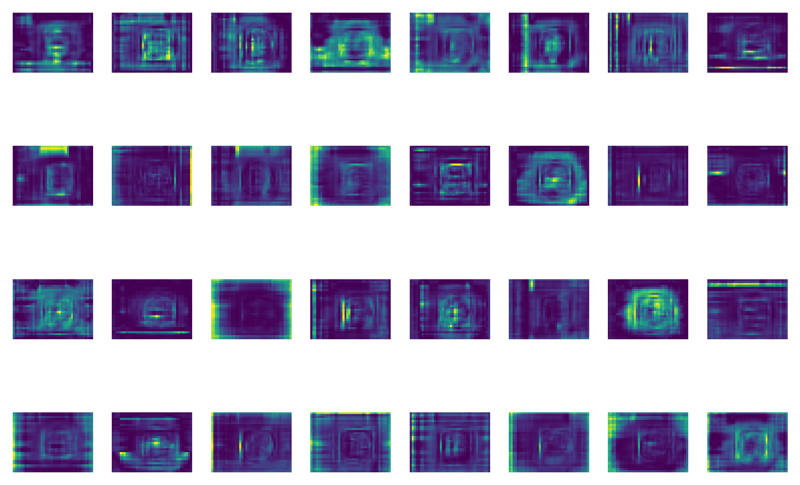

<header class="mb-3 text-left">
  <h1 class="mt-0 text-xl font-bold leading-tight tracking-tight text-unal-gray sm:text-2xl">Resultados: base de datos sintética</h1>
  

</header>

  

    <figure class="m-0 min-w-0">
      
      <figcaption lang="es" class="mt-1 text-center text-[10px] leading-snug text-gray-600 sm:text-[11px]">
        Sintético — imagen generada en MATLAB
      </figcaption>
    </figure>
    <figure class="m-0 min-w-0">
      
      <figcaption lang="es" class="mt-1 text-center text-[10px] leading-snug text-gray-600 sm:text-[11px]">
        Real — imagen PLM de literatura
      </figcaption>
    </figure>
  

  

    <ul class="list-none space-y-2 text-[0.8rem] leading-snug text-unal-gray sm:text-[0.84rem]">
      <li class="flex gap-2">
        ▸
        526 392 imágenes generadas · subconjunto de 21 600 usado para entrenamiento (15 120 / 3 240 / 3 240)
      </li>
      <li class="flex gap-2">
        ▸
        4 clases modeladas: huso meiótico, ZP, límite citoplasmático, cuerpo polar · etiquetado 100% automático
      </li>
      <li class="flex gap-2">
        ▸
        Las imágenes sintéticas reproducen las características morfológicas y de contraste observadas en PLM real, validando la consistencia física del modelo
      </li>
      <li class="flex gap-2">
        ▸
        OocytePaperImages: 200 imágenes PLM reales recopiladas de publicaciones científicas, curadas y anotadas manualmente para transfer learning
      </li>
    </ul>
    

      

        Aporte: primera base de datos de imágenes PLM de ovocitos con anotación multi-clase — no existe ninguna pública equivalente
      

    

  

  
  

---
transition: slide-up
deckSection: resultados
---

<header class="mb-3 text-left">
  <h1 class="mt-0 text-xl font-bold leading-tight tracking-tight text-unal-gray sm:text-2xl">Preentrenamiento sintético y experimento control</h1>
  

</header>

  <!-- Panel izquierdo: preentrenamiento sintético -->
  

    
Etapa 1 — Preentrenamiento sintético

    <ul class="list-none space-y-1.5 text-[0.76rem] leading-snug text-unal-gray">
      <li class="flex gap-2">
        ▸
        Todos los modelos YOLO: mAP50 ≈ 0.995 · mAP50-95 ≈ 0.995
      </li>
      <li class="flex gap-2">
        ▸
        RT-DETR: mAP50 = 0.986–0.992
      </li>
      <li class="flex gap-2">
        ▸
        Convergencia: 61–80 épocas (YOLO) · 86–136 (RT-DETR)
      </li>
      <li class="flex gap-2">
        ▸
        Precisión y recall ≈ 1.0 en todos los modelos sobre datos sintéticos
      </li>
    </ul>
    

      ✓ El pipeline de síntesis produce datos de entrenamiento de alta calidad
    

  

  <!-- Panel derecho: experimento control -->
  

    
Experimento control — Sin transfer learning

    <ul class="list-none space-y-1.5 text-[0.76rem] leading-snug text-unal-gray">
      <li class="flex gap-2">
        ▸
        mAP50 sobre imágenes reales: 0.241 – 0.698
      </li>
      <li class="flex gap-2">
        ▸
        mAP50-95: 0.036 – 0.340 — caída severa respecto al dominio sintético
      </li>
      <li class="flex gap-2">
        ▸
        Mejor control: YOLOv9m-Triple Attention (mAP50 = 0.499 vs 0.328 baseline) — los modelos con atención transfieren mejor
      </li>
    </ul>
    

      ✗ El gap sintético–real es significativo → el transfer learning es indispensable
    

  

  
  

---
transition: slide-up
deckSection: resultados
---

<header class="mb-3 text-left">
  <h1 class="mt-0 text-xl font-bold leading-tight tracking-tight text-unal-gray sm:text-2xl">Comparativa cuantitativa — Transfer learning</h1>
  

</header>

  

    <table class="w-full border-collapse text-[0.7rem] leading-snug text-unal-gray sm:text-[0.73rem]">
      <thead>
        <tr class="border-b-2 border-unal-gray">
          <th class="py-1 pr-3 text-left font-semibold">Modelo</th>
          <th class="px-2 py-1 text-center font-semibold">P</th>
          <th class="px-2 py-1 text-center font-semibold">R</th>
          <th class="px-2 py-1 text-center font-semibold">mAP50</th>
          <th class="px-2 py-1 text-center font-semibold">mAP50-95</th>
          <th class="px-2 py-1 text-center font-semibold text-gray-500">Control mAP50</th>
          <th class="px-2 py-1 text-center font-semibold">Inferencia</th>
        </tr>
      </thead>
      <tbody>
        <tr class="border-b border-unal-blue/30 bg-unal-blue/5 font-semibold">
          <td class="py-1 pr-3 text-unal-blue">YOLOv9m</td>
          <td class="px-2 py-1 text-center">0.957</td>
          <td class="px-2 py-1 text-center">0.857</td>
          <td class="px-2 py-1 text-center font-bold text-unal-blue">0.902</td>
          <td class="px-2 py-1 text-center font-bold text-unal-blue">0.627</td>
          <td class="px-2 py-1 text-center text-gray-500">0.328</td>
          <td class="px-2 py-1 text-center">7.4 ms</td>
        </tr>
        <tr class="border-b border-unal-green/30 bg-unal-green/5 font-semibold">
          <td class="py-1 pr-3 text-[#3a6a18]">RT-DETR-R101</td>
          <td class="px-2 py-1 text-center">0.922</td>
          <td class="px-2 py-1 text-center">0.868</td>
          <td class="px-2 py-1 text-center font-bold text-[#3a6a18]">0.902</td>
          <td class="px-2 py-1 text-center">0.612</td>
          <td class="px-2 py-1 text-center text-gray-500">0.448</td>
          <td class="px-2 py-1 text-center">14.8 ms</td>
        </tr>
        <tr class="border-b border-gray-200">
          <td class="py-1 pr-3">YOLOv12s</td>
          <td class="px-2 py-1 text-center">0.906</td>
          <td class="px-2 py-1 text-center">0.844</td>
          <td class="px-2 py-1 text-center">0.855</td>
          <td class="px-2 py-1 text-center">0.622</td>
          <td class="px-2 py-1 text-center text-gray-500">0.195</td>
          <td class="px-2 py-1 text-center">4.0 ms</td>
        </tr>
        <tr class="border-b border-gray-200">
          <td class="py-1 pr-3">YOLOv11m</td>
          <td class="px-2 py-1 text-center">0.925</td>
          <td class="px-2 py-1 text-center">0.813</td>
          <td class="px-2 py-1 text-center">0.849</td>
          <td class="px-2 py-1 text-center">0.624</td>
          <td class="px-2 py-1 text-center text-gray-500">0.501</td>
          <td class="px-2 py-1 text-center">5.9 ms</td>
        </tr>
        <tr class="border-b border-gray-200">
          <td class="py-1 pr-3">RT-DETR-L</td>
          <td class="px-2 py-1 text-center">0.878</td>
          <td class="px-2 py-1 text-center">0.862</td>
          <td class="px-2 py-1 text-center">0.857</td>
          <td class="px-2 py-1 text-center">0.615</td>
          <td class="px-2 py-1 text-center text-gray-500">0.503</td>
          <td class="px-2 py-1 text-center">9.1 ms</td>
        </tr>
      </tbody>
    </table>
  

  

    

      

        YOLOv9m: mayor mAP50-95 (0.627) · mejor balance precisión-velocidad (7.4 ms) · mayor mejora mAP50-95 tras TL (+0.444)
      

    

    

      

        YOLOv12s: mayor salto absoluto por transfer learning +0.660 mAP50 — el que más se beneficia de la estrategia
      

    

  

  
  

---
transition: slide-up
deckSection: resultados
---

<header class="mb-3 text-left">
  <h1 class="mt-0 text-xl font-bold leading-tight tracking-tight text-unal-gray sm:text-2xl">Integración CBAM en YOLOv9m</h1>
  

</header>

  

    

      <table class="w-full border-collapse text-[0.7rem] leading-snug text-unal-gray sm:text-[0.73rem]">
        <thead>
          <tr class="border-b-2 border-unal-gray">
            <th class="py-1 pr-3 text-left font-semibold">Modelo</th>
            <th class="px-2 py-1 text-center font-semibold">mAP50</th>
            <th class="px-2 py-1 text-center font-semibold">mAP50-95</th>
            <th class="px-2 py-1 text-center font-semibold">Citolimit</th>
            <th class="px-2 py-1 text-center font-semibold">Inf. (ms)</th>
          </tr>
        </thead>
        <tbody>
          <tr class="border-b border-gray-200">
            <td class="py-1 pr-3 font-medium">YOLOv9m</td>
            <td class="px-2 py-1 text-center font-semibold text-unal-blue">0.902</td>
            <td class="px-2 py-1 text-center font-semibold text-unal-blue">0.627</td>
            <td class="px-2 py-1 text-center">0.979</td>
            <td class="px-2 py-1 text-center">7.4</td>
          </tr>
          <tr class="border-b border-unal-blue/20 bg-unal-blue/5">
            <td class="py-1 pr-3 font-semibold text-unal-blue">YOLOv9m-CBAM</td>
            <td class="px-2 py-1 text-center">0.868</td>
            <td class="px-2 py-1 text-center">0.623</td>
            <td class="px-2 py-1 text-center font-bold text-unal-blue">0.986</td>
            <td class="px-2 py-1 text-center">7.0</td>
          </tr>
          <tr class="border-b border-gray-200">
            <td class="py-1 pr-3 font-medium">YOLOv9m-Triple Att.</td>
            <td class="px-2 py-1 text-center">0.878</td>
            <td class="px-2 py-1 text-center">0.618</td>
            <td class="px-2 py-1 text-center">0.980</td>
            <td class="px-2 py-1 text-center">7.5</td>
          </tr>
        </tbody>
      </table>
    

    <ul class="list-none space-y-1.5 text-[0.76rem] leading-snug text-unal-gray">
      <li class="flex gap-2">
        ▸
        CBAM insertado en backbone de YOLOv9m (P2/4, 128 canales) · overhead mínimo: +0.1 GFLOPs
      </li>
      <li class="flex gap-2">
        ▸
        Mejora citolimit: 0.979 → 0.986 — estructura de bajo contraste, la más difícil de detectar
      </li>
      <li class="flex gap-2">
        ▸
        Ventaja cualitativa en video: CBAM elimina falsos positivos sobre aguja de inyección y detecta citolimit en secuencias donde YOLOv9m falla completamente (→ ver videos)
      </li>
    </ul>
  

  

    <figure class="m-0 min-w-0">
      
      <figcaption lang="es" class="mt-1.5 text-left text-[10px] leading-snug text-gray-600 sm:text-[11px]">
        Fig. 10.
        Mapas de características (stage 18) — YOLOv9m-CBAM muestra activaciones más localizadas en ZP y límite citoplasmático.
      </figcaption>
    </figure>
  

  
  

---
transition: slide-up
deckSection: resultados
---

<header class="mb-2 text-left">
  <h1 class="mt-0 text-xl font-bold leading-tight tracking-tight text-unal-gray sm:text-2xl">Secuencia 1: OpenPolScope — meiosis I</h1>
  

</header>

  

    <figure class="m-0 min-w-0">
      

        <iframe
          class="h-full w-full border-0"
          width="560" height="315"
          src="https://www.youtube.com/embed/lKPqXQZH1k0?si=8EwhGaEoiE1JphMS&autoplay=1&mute=1&playsinline=1&loop=1&playlist=lKPqXQZH1k0"
          title="YOLOv9m-CBAM — Secuencia 1 OpenPolScope meiosis I"
          allow="accelerometer; autoplay; clipboard-write; encrypted-media; gyroscope; picture-in-picture; web-share"
          referrerpolicy="strict-origin-when-cross-origin"
          allowfullscreen
        />
      

      <figcaption lang="es" class="mt-1 text-left text-[10px] leading-snug text-gray-600 sm:text-[11px]">
        Video 1.
        YOLOv9m-CBAM — detección en secuencia 1 (OpenPolScope, meiosis I).
      </figcaption>
    </figure>
    <figure class="m-0 min-w-0">
      

        <iframe
          class="h-full w-full border-0"
          width="560" height="315"
          src="https://www.youtube.com/embed/a1OraXCZyKk?si=vNbHO_YAyjI98A__&autoplay=1&mute=1&playsinline=1&loop=1&playlist=a1OraXCZyKk"
          title="YOLOv9m — Secuencia 1 OpenPolScope meiosis I"
          allow="accelerometer; autoplay; clipboard-write; encrypted-media; gyroscope; picture-in-picture; web-share"
          referrerpolicy="strict-origin-when-cross-origin"
          allowfullscreen
        />
      

      <figcaption lang="es" class="mt-1 text-left text-[10px] leading-snug text-gray-600 sm:text-[11px]">
        Video 2.
        YOLOv9m — detección en secuencia 1 (OpenPolScope, meiosis I).
      </figcaption>
    </figure>
  

  

    <table class="w-full border-collapse text-[0.65rem] leading-snug text-unal-gray sm:text-[0.68rem]">
      <thead>
        <tr class="border-b-2 border-unal-gray">
          <th class="py-1 pr-3 text-left font-semibold">Clase</th>
          <th class="px-2 py-1 text-center font-semibold" colspan="3">YOLOv9m (100 fotogr.)</th>
          <th class="px-2 py-1 text-center font-semibold" colspan="3">YOLOv9m-CBAM (100 fotogr.)</th>
        </tr>
        <tr class="border-b border-gray-300 text-[0.62rem] text-gray-500">
          <th class="py-0.5 pr-3 text-left font-normal"></th>
          <th class="px-2 py-0.5 text-center font-medium">Detecc.</th>
          <th class="px-2 py-0.5 text-center font-medium">Fotogr.</th>
          <th class="px-2 py-0.5 text-center font-medium">Confianza</th>
          <th class="px-2 py-0.5 text-center font-medium">Detecc.</th>
          <th class="px-2 py-0.5 text-center font-medium">Fotogr.</th>
          <th class="px-2 py-0.5 text-center font-medium">Confianza</th>
        </tr>
      </thead>
      <tbody>
        <tr class="border-b border-gray-200">
          <td class="py-0.5 pr-3 font-medium">Zona pelúcida (zp)</td>
          <td class="px-2 py-0.5 text-center">100</td>
          <td class="px-2 py-0.5 text-center">100</td>
          <td class="px-2 py-0.5 text-center">[0,48; 0,92]</td>
          <td class="px-2 py-0.5 text-center">100</td>
          <td class="px-2 py-0.5 text-center">100</td>
          <td class="px-2 py-0.5 text-center font-semibold text-unal-blue">[0,94; 0,95]</td>
        </tr>
        <tr class="border-b border-gray-200 bg-unal-blue/5">
          <td class="py-0.5 pr-3 font-semibold text-unal-blue">Límite citopl. (citolimit)</td>
          <td class="px-2 py-0.5 text-center text-red-500 font-semibold">4</td>
          <td class="px-2 py-0.5 text-center text-red-500 font-semibold">4</td>
          <td class="px-2 py-0.5 text-center">[0,51; 0,89]</td>
          <td class="px-2 py-0.5 text-center font-semibold text-unal-blue">100</td>
          <td class="px-2 py-0.5 text-center font-semibold text-unal-blue">100</td>
          <td class="px-2 py-0.5 text-center font-semibold text-unal-blue">[0,90; 0,96]</td>
        </tr>
        <tr class="border-b border-gray-200">
          <td class="py-0.5 pr-3 font-medium">Huso meiótico (spindle)</td>
          <td class="px-2 py-0.5 text-center">74</td>
          <td class="px-2 py-0.5 text-center">73</td>
          <td class="px-2 py-0.5 text-center">[0,58; 0,95]</td>
          <td class="px-2 py-0.5 text-center">74</td>
          <td class="px-2 py-0.5 text-center">74</td>
          <td class="px-2 py-0.5 text-center">[0,45; 0,89]</td>
        </tr>
        <tr>
          <td class="py-0.5 pr-3 font-medium">Cuerpo polar (pb)</td>
          <td class="px-2 py-0.5 text-center">5</td>
          <td class="px-2 py-0.5 text-center">5</td>
          <td class="px-2 py-0.5 text-center">[0,46; 0,82]</td>
          <td class="px-2 py-0.5 text-center">6</td>
          <td class="px-2 py-0.5 text-center">6</td>
          <td class="px-2 py-0.5 text-center">[0,46; 0,58]</td>
        </tr>
      </tbody>
    </table>
  

  

    

      Diferencia más marcada: Citolimit: YOLOv9m lo detecta en solo 4 fotogramas; YOLOv9m-CBAM lo detecta en todos los 100 con confianza estable [0,90; 0,96].
    

  

  
  

---
transition: slide-up
deckSection: resultados
---

<header class="mb-2 text-left">
  <h1 class="mt-0 text-xl font-bold leading-tight tracking-tight text-unal-gray sm:text-2xl">Secuencia 2: OOSIGHT-Spindle View — ICSI</h1>
  

</header>

  

    <figure class="m-0 min-w-0">
      

        <iframe
          class="h-full w-full border-0"
          width="560" height="315"
          src="https://www.youtube.com/embed/mO-GYGNMnw8?autoplay=1&mute=1&playsinline=1&loop=1&playlist=mO-GYGNMnw8"
          title="YOLOv9m-CBAM — Secuencia 2 OOSIGHT-Spindle View ICSI"
          allow="accelerometer; autoplay; clipboard-write; encrypted-media; gyroscope; picture-in-picture; web-share"
          referrerpolicy="strict-origin-when-cross-origin"
          allowfullscreen
        />
      

      <figcaption lang="es" class="mt-1 text-left text-[10px] leading-snug text-gray-600 sm:text-[11px]">
        Video 3.
        YOLOv9m-CBAM — detección en secuencia 2 (OOSIGHT-Spindle View, ICSI).
      </figcaption>
    </figure>
    <figure class="m-0 min-w-0">
      

        <iframe
          class="h-full w-full border-0"
          width="560" height="315"
          src="https://www.youtube.com/embed/01CZ1IEIHjI?autoplay=1&mute=1&playsinline=1&loop=1&playlist=01CZ1IEIHjI"
          title="YOLOv9m — Secuencia 2 OOSIGHT-Spindle View ICSI"
          allow="accelerometer; autoplay; clipboard-write; encrypted-media; gyroscope; picture-in-picture; web-share"
          referrerpolicy="strict-origin-when-cross-origin"
          allowfullscreen
        />
      

      <figcaption lang="es" class="mt-1 text-left text-[10px] leading-snug text-gray-600 sm:text-[11px]">
        Video 4.
        YOLOv9m — detección en secuencia 2 (OOSIGHT-Spindle View, ICSI).
      </figcaption>
    </figure>
  

  

    <table class="w-full border-collapse text-[0.65rem] leading-snug text-unal-gray sm:text-[0.68rem]">
      <thead>
        <tr class="border-b-2 border-unal-gray">
          <th class="py-1 pr-3 text-left font-semibold">Clase</th>
          <th class="px-2 py-1 text-center font-semibold" colspan="3">YOLOv9m (146 fotogr.)</th>
          <th class="px-2 py-1 text-center font-semibold" colspan="3">YOLOv9m-CBAM (150 fotogr.)</th>
        </tr>
        <tr class="border-b border-gray-300 text-[0.62rem] text-gray-500">
          <th class="py-0.5 pr-3 text-left font-normal"></th>
          <th class="px-2 py-0.5 text-center font-medium">Detecc.</th>
          <th class="px-2 py-0.5 text-center font-medium">Fotogr.</th>
          <th class="px-2 py-0.5 text-center font-medium">Confianza</th>
          <th class="px-2 py-0.5 text-center font-medium">Detecc.</th>
          <th class="px-2 py-0.5 text-center font-medium">Fotogr.</th>
          <th class="px-2 py-0.5 text-center font-medium">Confianza</th>
        </tr>
      </thead>
      <tbody>
        <tr class="border-b border-gray-200">
          <td class="py-0.5 pr-3 font-medium">Zona pelúcida (zp)</td>
          <td class="px-2 py-0.5 text-center text-red-500 font-semibold">18</td>
          <td class="px-2 py-0.5 text-center text-red-500 font-semibold">17</td>
          <td class="px-2 py-0.5 text-center">[0,41; 0,80]</td>
          <td class="px-2 py-0.5 text-center font-semibold text-unal-blue">150</td>
          <td class="px-2 py-0.5 text-center font-semibold text-unal-blue">150</td>
          <td class="px-2 py-0.5 text-center font-semibold text-unal-blue">[0,81; 0,96]</td>
        </tr>
        <tr class="border-b border-gray-200 bg-unal-blue/5">
          <td class="py-0.5 pr-3 font-semibold text-unal-blue">Límite citopl. (citolimit)</td>
          <td class="px-2 py-0.5 text-center text-red-500 font-semibold">1</td>
          <td class="px-2 py-0.5 text-center text-red-500 font-semibold">1</td>
          <td class="px-2 py-0.5 text-center">0,44</td>
          <td class="px-2 py-0.5 text-center font-semibold text-unal-blue">148</td>
          <td class="px-2 py-0.5 text-center font-semibold text-unal-blue">148</td>
          <td class="px-2 py-0.5 text-center font-semibold text-unal-blue">[0,67; 0,95]</td>
        </tr>
        <tr class="border-b border-gray-200">
          <td class="py-0.5 pr-3 font-medium">Huso meiótico (spindle)</td>
          <td class="px-2 py-0.5 text-center text-red-500 font-semibold">538*</td>
          <td class="px-2 py-0.5 text-center">144</td>
          <td class="px-2 py-0.5 text-center">[0,40; 0,94]</td>
          <td class="px-2 py-0.5 text-center">151†</td>
          <td class="px-2 py-0.5 text-center">146</td>
          <td class="px-2 py-0.5 text-center">[0,42; 0,87]</td>
        </tr>
        <tr>
          <td class="py-0.5 pr-3 font-medium">Cuerpo polar (pb)</td>
          <td class="px-2 py-0.5 text-center text-red-500 font-semibold">61*</td>
          <td class="px-2 py-0.5 text-center text-red-500">44</td>
          <td class="px-2 py-0.5 text-center">[0,40; 0,87]</td>
          <td class="px-2 py-0.5 text-center">3</td>
          <td class="px-2 py-0.5 text-center">3</td>
          <td class="px-2 py-0.5 text-center">[0,55; 0,75]</td>
        </tr>
      </tbody>
      <tfoot>
        <tr>
          <td colspan="7" class="pt-1 text-[0.6rem] text-gray-500 leading-snug">* YOLOv9m: numerosos falsos positivos sobre la herramienta de inyección. † YOLOv9m-CBAM: 7 falsos positivos de spindle.</td>
        </tr>
      </tfoot>
    </table>
  

  

    

      Diferencia más marcada: YOLOv9m confunde la aguja de inyección con huso meiótico (538 detecc., ~FP masivos) y detecta zp solo en 17 fotogramas. YOLOv9m-CBAM detecta zp y citolimit en toda la secuencia, incluidos los tramos de inyección y deformación, con solo 7 FP de spindle.
    

  

  
  

---
transition: slide-left
deckSection: resultados
---

<header class="mb-2 text-left">
  <h1 class="mt-0 text-xl font-bold leading-tight tracking-tight text-unal-gray sm:text-2xl">Secuencia 3: OptimFert — Prague IVF</h1>
  

</header>

  

    <figure class="m-0 min-w-0">
      

        <iframe
          class="h-full w-full border-0"
          width="560" height="315"
          src="https://www.youtube.com/embed/HsXPM1nb5y4?autoplay=1&mute=1&playsinline=1&loop=1&playlist=HsXPM1nb5y4"
          title="YOLOv9m-CBAM — Secuencia 3 OptimFert Prague IVF"
          allow="accelerometer; autoplay; clipboard-write; encrypted-media; gyroscope; picture-in-picture; web-share"
          referrerpolicy="strict-origin-when-cross-origin"
          allowfullscreen
        />
      

      <figcaption lang="es" class="mt-1 text-left text-[10px] leading-snug text-gray-600 sm:text-[11px]">
        Video 5.
        YOLOv9m-CBAM — detección en secuencia 3 (OptimFert, Prague IVF).
      </figcaption>
    </figure>
    <figure class="m-0 min-w-0">
      

        <iframe
          class="h-full w-full border-0"
          width="560" height="315"
          src="https://www.youtube.com/embed/f007H86yr2A?autoplay=1&mute=1&playsinline=1&loop=1&playlist=f007H86yr2A"
          title="YOLOv9m — Secuencia 3 OptimFert Prague IVF"
          allow="accelerometer; autoplay; clipboard-write; encrypted-media; gyroscope; picture-in-picture; web-share"
          referrerpolicy="strict-origin-when-cross-origin"
          allowfullscreen
        />
      

      <figcaption lang="es" class="mt-1 text-left text-[10px] leading-snug text-gray-600 sm:text-[11px]">
        Video 6.
        YOLOv9m — detección en secuencia 3 (OptimFert, Prague IVF).
      </figcaption>
    </figure>
  

  

    <table class="w-full border-collapse text-[0.65rem] leading-snug text-unal-gray sm:text-[0.68rem]">
      <thead>
        <tr class="border-b-2 border-unal-gray">
          <th class="py-1 pr-3 text-left font-semibold">Clase</th>
          <th class="px-2 py-1 text-center font-semibold" colspan="3">YOLOv9m (660 fotogr.)</th>
          <th class="px-2 py-1 text-center font-semibold" colspan="3">YOLOv9m-CBAM (660 fotogr.)</th>
        </tr>
        <tr class="border-b border-gray-300 text-[0.62rem] text-gray-500">
          <th class="py-0.5 pr-3 text-left font-normal"></th>
          <th class="px-2 py-0.5 text-center font-medium">Detecc.</th>
          <th class="px-2 py-0.5 text-center font-medium">Fotogr.</th>
          <th class="px-2 py-0.5 text-center font-medium">Confianza</th>
          <th class="px-2 py-0.5 text-center font-medium">Detecc.</th>
          <th class="px-2 py-0.5 text-center font-medium">Fotogr.</th>
          <th class="px-2 py-0.5 text-center font-medium">Confianza</th>
        </tr>
      </thead>
      <tbody>
        <tr class="border-b border-gray-200">
          <td class="py-0.5 pr-3 font-medium">Zona pelúcida (zp)</td>
          <td class="px-2 py-0.5 text-center">660</td>
          <td class="px-2 py-0.5 text-center">660</td>
          <td class="px-2 py-0.5 text-center">[0,48; 0,95]</td>
          <td class="px-2 py-0.5 text-center font-semibold text-unal-blue">660</td>
          <td class="px-2 py-0.5 text-center font-semibold text-unal-blue">660</td>
          <td class="px-2 py-0.5 text-center font-semibold text-unal-blue">[0,95; 0,97]</td>
        </tr>
        <tr class="border-b border-gray-200 bg-unal-blue/5">
          <td class="py-0.5 pr-3 font-semibold text-unal-blue">Límite citopl. (citolimit)</td>
          <td class="px-2 py-0.5 text-center text-red-500 font-semibold">0</td>
          <td class="px-2 py-0.5 text-center text-red-500 font-semibold">0</td>
          <td class="px-2 py-0.5 text-center text-gray-400">—</td>
          <td class="px-2 py-0.5 text-center font-semibold text-unal-blue">660</td>
          <td class="px-2 py-0.5 text-center font-semibold text-unal-blue">660</td>
          <td class="px-2 py-0.5 text-center font-semibold text-unal-blue">[0,94; 0,96]</td>
        </tr>
        <tr class="border-b border-gray-200">
          <td class="py-0.5 pr-3 font-medium">Huso meiótico (spindle)</td>
          <td class="px-2 py-0.5 text-center text-red-500 font-semibold">1710*</td>
          <td class="px-2 py-0.5 text-center">660</td>
          <td class="px-2 py-0.5 text-center">[0,40; 0,95]</td>
          <td class="px-2 py-0.5 text-center">570</td>
          <td class="px-2 py-0.5 text-center">570</td>
          <td class="px-2 py-0.5 text-center">[0,50; 0,90]</td>
        </tr>
        <tr>
          <td class="py-0.5 pr-3 font-medium">Cuerpo polar (pb)</td>
          <td class="px-2 py-0.5 text-center text-red-500 font-semibold">238*</td>
          <td class="px-2 py-0.5 text-center text-red-500">208</td>
          <td class="px-2 py-0.5 text-center">[0,40; 0,65]</td>
          <td class="px-2 py-0.5 text-center font-semibold text-unal-blue">510</td>
          <td class="px-2 py-0.5 text-center font-semibold text-unal-blue">510</td>
          <td class="px-2 py-0.5 text-center font-semibold text-unal-blue">[0,61; 0,82]</td>
        </tr>
      </tbody>
      <tfoot>
        <tr>
          <td colspan="7" class="pt-1 text-[0.6rem] text-gray-500 leading-snug">* YOLOv9m: numerosos falsos positivos (logotipo superpuesto y herramienta de micromanipulación).</td>
        </tr>
      </tfoot>
    </table>
  

  

    

      Diferencia más marcada: YOLOv9m nunca detecta citolimit, genera 1710 detecc. de spindle (FP masivos por logotipo y herramienta) y pierde el huso real desde el fotograma 300. YOLOv9m-CBAM detecta las cuatro clases en toda la secuencia con confianzas altas y estables.
    

  

  
  

