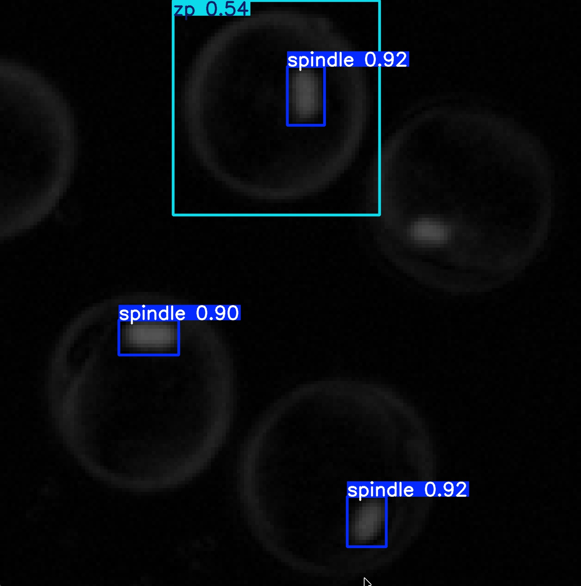

<header class="mb-5 text-left">
  <h1 class="mt-0 text-xl font-bold leading-tight tracking-tight text-unal-gray sm:text-2xl">Base de datos sintética</h1>
  

</header>

  <!-- Texto arriba -->
  

    <ul class="list-none space-y-1 text-[0.75rem] leading-snug text-unal-gray">
      <li class="flex gap-2">
        ▸
        
          526 392 imágenes generadas · subconjunto de 21 600 para entrenamiento
          
            train 15 120
            val 3 240
            test 3 240
          
        
      </li>
      <li class="flex gap-2">
        ▸
        4 clases: huso meiótico, ZP, límite citoplasmático, cuerpo polar · etiquetado 100% automático
      </li>
      <li class="flex gap-2">
        ▸
        Imágenes sintéticas reproducen características morfológicas y de contraste de PLM real, validando la consistencia física del modelo
      </li>
    </ul>
    

      

        Aporte: primera base de datos de imágenes PLM de ovocitos con anotación multi-clase — no existe ninguna pública equivalente
      

    

  

  <!-- Imágenes abajo en paralelo -->
  

    <figure class="m-0 min-w-0">
      
      <figcaption lang="es" class="plm-figcaption text-center">
        Sintético — generado en MATLAB
      </figcaption>
    </figure>
    <figure class="m-0 min-w-0">
      
      <figcaption lang="es" class="plm-figcaption text-center">
        Real — imagen PLM de literatura
      </figcaption>
    </figure>
  

  
  

<!--
Con eso claro, pasemos a los resultados. El primer resultado es la base de datos sintética en sí misma, porque sin datos no hay modelo.

Generamos 526.392 imágenes en MATLAB usando el modelo físico de retardo óptico — y de esas seleccionamos 21.600 para entrenamiento. La ventaja fundamental: el etiquetado es 100% automático por definición paramétrica. No hubo ninguna intervención manual. Como vemos en la figura de la izquierda, las imágenes sintéticas reproducen visualmente las características que veríamos en PLM real: la zona pelúcida como un anillo birrefringente, el huso como una elipse de bajo contraste, el cuerpo polar y el límite citoplasmático.

El complemento real es OocytePaperImages: 200 imágenes PLM recopiladas de publicaciones científicas, curadas y anotadas manualmente, que actúan como el puente hacia el dominio real. Esta combinación — 21.600 sintéticas para escala, 200 reales para dominio — es lo que hace viable el enfoque con datos tan limitados.
-->

---
transition: slide-up
deckSection: resultados
---

<header class="mb-3 text-left">
  <h1 class="mt-0 text-xl font-bold leading-tight tracking-tight text-unal-gray sm:text-2xl">Preentrenamiento sintético</h1>
  

</header>

  <!-- Panel izquierdo: preentrenamiento sintético -->
  

    
Etapa 1 — Preentrenamiento sintético

    <ul class="list-none space-y-1.5 text-[0.8rem] leading-snug text-unal-gray">
      <li class="flex gap-2">
        ▸
        Todos los modelos YOLO: mAP50 ≈ 0,995 · mAP50-95 ≈ 0,995
      </li>
      <li class="flex gap-2">
        ▸
        RT-DETR: mAP50 = 0,986–0,992
      </li>
      <li class="flex gap-2">
        ▸
        Convergencia: 61–80 épocas (YOLO) · 86–136 (RT-DETR)
      </li>
      <li class="flex gap-2">
        ▸
        Precisión y recall ≈ 1,0 en todos los modelos sobre datos sintéticos
      </li>
    </ul>
    

      ✓ El flujo de síntesis produce datos de entrenamiento de alta calidad
    

  

  <!-- Panel derecho: experimento control -->
  

    
Experimento control — Sin transferencia de aprendizaje

    <ul class="list-none space-y-1.5 text-[0.8rem] leading-snug text-unal-gray">
      <li class="flex gap-2">
        ▸
        mAP50 redes estándar (13 config.): 0,195 – 0,521
      </li>
      <li class="flex gap-2">
        ▸
        mAP50 redes personalizadas (4 config.): 0,319 – 0,499
      </li>
      <li class="flex gap-2">
        ▸
        mAP50-95: 0,079 – 0,346 — caída severa respecto al dominio sintético
      </li>
      <li class="flex gap-2">
        ▸
        Mejor control estándar: YOLOv9s (mAP50 = 0,521) · mejor personalizado: YOLOv9m-Triple Attention (0,499 vs 0,328 de YOLOv9m base)
      </li>
    </ul>
    

      ✗ La brecha sintético–real es significativa → la transferencia de aprendizaje es indispensable
    

  

  
  

<!--
El primer experimento fue preentrenar todos los modelos en la base sintética. El resultado fue el esperado: todos los modelos YOLO alcanzaron mAP50 de 0,995 con precisión y recall de 1,0. RT-DETR llegó a 0,986–0,992. El flujo de síntesis produce datos de entrenamiento de alta consistencia.

Pero ahí viene el problema que justifica todo lo demás. Cuando tomamos esos modelos — con métricas cercanas al máximo en datos sintéticos — y los evaluamos directamente sobre las 40 imágenes reales sin ningún ajuste adicional, el mAP50 colapsa a un rango de 0,241 a 0,698. Eso es la brecha sintético-real.

Este resultado es esperado y es una confirmación positiva: el conjunto sintético funciona para aprender morfología, pero el dominio visual difiere suficientemente del real como para requerir una segunda etapa de ajuste. Los modelos con módulos de atención transfieren mejor: YOLOv9m-Triple Attention alcanzó 0,499 sin ningún dato real de ajuste — más del doble que el modelo estándar en el mismo escenario.
-->

---
transition: slide-up
deckSection: resultados
---

<header class="mb-2 text-left">
  <h1 class="mt-0 text-xl font-bold leading-tight tracking-tight text-unal-gray sm:text-2xl">Transferencia de aprendizaje en imágenes reales</h1>
  

</header>

  

    

      

        Métricas estáticas (TL): YOLOv9m y RT-DETR-R101 empatan en mAP50 = 0,902 · YOLOv9m: mAP50-95 = 0,627, latencia = 7,4 ms, 20 M params vs. 60,9 M de RT-DETR
      

    

    

      

        Referencia clínica: YOLOv9m-CBAM — criterio multidimensional: generalización sin TL +14,2 pp, video sin FP, confianza estable 0,95–0,97 → ver slides siguientes
      

    

    

      

        Sin TL: rango 0,195–0,521 mAP50 · la brecha sintético-real requiere adaptación en todos los casos
      

    

  

  

    <DumbbellPlot
      :rows="dumbbell1Rows"
      leftLabel="Control (sin TL)"
      rightLabel="Con transferencia de aprendizaje"
      :compact="true"
      caption="mAP50 por modelo: control vs. transferencia de aprendizaje"
    />
  

  
  

<!--
Con la transferencia de aprendizaje, el rendimiento cambia completamente. Este gráfico muestra los 13 modelos evaluados. El punto gris es el mAP50 en el experimento de control — solo con preentrenamiento sintético, sin datos reales. El punto azul es el mAP50 después de la transferencia de aprendizaje. La línea que los conecta es la mancuerna: su longitud muestra el salto.

El patrón es consistente en los 13 modelos: todos mejoran. El rango de control va de 0,195 a 0,521. Después de la transferencia, el rango sube a 0,833 a 0,902. Quiero detenerme en la selección del modelo de referencia, porque merece un análisis cuidadoso. En métricas de imagen estática, YOLOv9m y RT-DETR-ResNet101 empatan en mAP50 con 0,902. Pero RT-DETR requiere 60,9 millones de parámetros frente a 20 de YOLOv9m, y una latencia de 14,8 milisegundos frente a 7,4 — el doble. Para integración con cámara PLM en entorno clínico con recursos computacionales limitados, RT-DETR es inviable. Ahora bien: la evaluación integral que presentaré en los próximos slides — generalización sin transferencia y comportamiento en video — establece que YOLOv9m-CBAM es el modelo de referencia para el escenario de aplicación clínica real. No YOLOv9m. Vamos a ver por qué.
-->

---
transition: slide-up
deckSection: resultados
---

<header class="mb-2 text-left">
  <h1 class="mt-0 text-xl font-bold leading-tight tracking-tight text-unal-gray sm:text-2xl">Análisis de rendimiento por clase</h1>
  

</header>

  <!-- Tarjetas arriba — sin cambios -->
  

    

      Clínicamente relevante: ZP (0,995) y huso meiótico (0,993) — los marcadores de madurez nuclear — alcanzan detección casi perfecta.
    

    

      Cuerpo polar — el salto más dramático
      

        

          
0,007

          
control

        

        →
        

          
0,642

          
con TL

        

      

      Morfología variable impide sintetizarlo — la TL en datos reales es indispensable.
      P = 0,69 · R = 0,44 — la detección aún es imperfecta
    

  

  <!-- Fila inferior: dos curvas P-R (imágenes reales recortadas) -->
  

    <!-- Control -->
    

      <!-- Recorte: oculta leyenda derecha (~30%) y título superior (~7%) -->
      

        
      

      

        Control (sin TL) · mAP50 
        ZP 0,457 ·
        Huso 0,504 ·
        Citolimit 0,344 ·
        PB 0,007
      

    

    <!-- Con TL -->
    

      

        
      

      

        Con transferencia de aprendizaje · mAP50 
        ZP 0,995 ·
        Huso 0,993 ·
        Citolimit 0,979 ·
        PB 0,642
      

    

  

  <!--
  

    

      <DumbbellPlot
        :rows="dumbbell2Rows"
        leftLabel="Control (sin TL)"
        rightLabel="Con transferencia de aprendizaje"
        :compact="false"
        leftColor="#9ca3af"
        chartWidth="100%"
        caption="mAP50 por clase · YOLOv9m: control vs. transferencia de aprendizaje"
      />
    

  

  -->

  
  

<!--
Hasta ahora hemos visto métricas globales. Ahora veamos qué ocurre estructura por estructura, porque eso es lo que tiene significado clínico.

Estas son las curvas de precisión y recall reales del experimento. La gráfica de la izquierda corresponde al experimento de control — solo con preentrenamiento sintético, sin datos reales. La de la derecha es después de la transferencia de aprendizaje.

El contraste es inmediato. En control, todas las curvas degradan gradualmente: la precisión cae a medida que aumenta el recall, y el cuerpo polar — en rojo — colapsa prácticamente a cero desde el inicio, con un AP de apenas 0,007. Eso confirma que los datos sintéticos no capturan su morfología variable.

Con transferencia de aprendizaje, el panorama cambia completamente. Zona pelúcida, huso meiótico y límite citoplasmático alcanzan AP de 0,995, 0,993 y 0,979 respectivamente — curvas que se mantienen cerca de precisión 1 a lo largo de todo el rango de recall antes de caer bruscamente al final. Ese es el patrón de un detector robusto y bien calibrado. El cuerpo polar mejora sustancialmente a 0,642, pero su curva sigue siendo más irregular — lo que refleja que con P=0,69 y R=0,44 la detección aún no es robusta.

Clínicamente, lo que importa son el huso meiótico a 0,993 y la zona pelúcida a 0,995. Con esos dos valores, la evaluación de madurez en tiempo real es viable.
-->

---
transition: slide-up
deckSection: resultados
---

<header class="mb-2 text-left">
  

    <h1 class="mt-0 text-xl font-bold leading-tight tracking-tight text-unal-gray sm:text-2xl">Arquitecturas con módulos de atención</h1>
    ★ Aporte
  

  

</header>

  

    

      Control (sin TL):
       CBAM (+0,095) y Triple Att. (+0,126) superan al baseline en mAP50-95 — la atención mejora la transferencia sintético→real.
    

    

      Con TL:
       brecha &lt;2 puntos — todos convergen en 0,605–0,627 · CBAM mantiene ventaja en citolimit (0,986 vs 0,979).
    

    

      Video (Seq. 3 · 660 fotogramas): CBAM detecta citolimit en 660/660 fotogramas (confianza 0,94–0,96) — YOLOv9m: 0/660.
    

  

  

    <DumbbellPlot
      :rows="dumbbell3Rows"
      leftLabel="Control"
      rightLabel="Con TL (azul = estándar · verde = atención)"
      :compact="false"
      chartWidth="85%"
      xLabel="mAP50-95"
      :xMax="0.75"
      caption="mAP50-95 global: modelos con atención vs. baseline — control y con transferencia de aprendizaje"
    />
  

  
  

<!--
Con el modelo base establecido, evaluamos si los módulos de atención podían mejorar el rendimiento. Desarrollamos cuatro variantes: CBAM y Triple Attention sobre YOLOv9m, y Conservative Attention y Transformer Enhanced sobre YOLO11m.

El hallazgo más claro emerge en el escenario de control, donde los modelos son evaluados en imágenes reales sin haber visto ninguna imagen real durante el entrenamiento. Aquí los módulos de atención marcan una diferencia sustancial: YOLOv9m-CBAM sube a 0,278 frente al 0,183 del baseline en mAP50-95 — nueve punto cinco puntos porcentuales. YOLOv9m-Triple Attention llega a 0,309. ¿Por qué? Los módulos de atención enseñan a la red dónde mirar — específicamente, en las regiones de bajo contraste y pequeño tamaño que caracterizan las imágenes PLM. La atención de canal suprime los canales con poca información; la atención espacial de CBAM refuerza las regiones espacialmente relevantes. Eso significa que cuando el modelo ve su primera imagen real, ya tiene un mecanismo para focalizarse en las estructuras correctas, aunque nunca las haya visto.

Con la transferencia de aprendizaje la ventaja se reduce — todos convergen entre 0,605 y 0,627 en mAP50-95 — pero en video es donde CBAM demuestra que esa diferencia es real y no un artefacto de las métricas estáticas. Los mapas de activación de la siguiente diapositiva muestran exactamente por qué.
-->

---
transition: slide-up
deckSection: resultados
---

<header class="mb-2 text-left">
  

    <h1 class="mt-0 text-xl font-bold leading-tight tracking-tight text-unal-gray sm:text-2xl">Módulos de atención — mapas de activación (P4)</h1>
    ★ Aporte
  

  

</header>

  <!-- YOLOv9m base (sin atención) -->
  <figure class="relative m-0 min-h-0 flex-1">
    
    <v-click :at="1">
      

    </v-click>
    <figcaption lang="es" class="mt-1 shrink-0 text-center text-[0.65rem] italic text-gray-500">
      (a) YOLOv9m — activaciones difusas, sin foco en ZP ni citolimit.
    </figcaption>
  </figure>
  <!-- YOLOv9m-CBAM activation map -->
  <figure class="relative m-0 min-h-0 flex-1">
    
    <v-click :at="1">
      

    </v-click>
    <figcaption lang="es" class="mt-1 shrink-0 text-center text-[0.65rem] italic text-gray-500">
      (b) YOLOv9m-CBAM — activaciones localizadas en ZP y citolimit.
    </figcaption>
  </figure>

  
  

<!--
Estos son mapas de activación Grad-CAM en el nivel P4 del backbone — submuestreo 1/16 — donde las características tienen mayor contenido semántico.

En YOLOv9m, izquierda, observen que la activación está distribuida de forma difusa por toda la imagen: el modelo está respondiendo a regiones que no corresponden a ninguna estructura relevante. En YOLOv9m-CBAM, derecha, las activaciones están concentradas sobre la zona pelúcida y el límite citoplasmático. Eso no es casualidad. CBAM opera en dos pasos: primero aplica atención de canal, que calcula la importancia global de cada mapa de características y suprime los canales de bajo valor informativo. Luego aplica atención espacial, que genera un mapa de relevancia posición a posición y enfatiza las regiones estructuralmente significativas. El resultado visible es que el modelo sabe dónde buscar antes de hacer la predicción final.

Eso es lo que se traduce directamente en el comportamiento en video que vamos a ver ahora: CBAM detecta el límite citoplasmático en 660 de 660 fotogramas con confianza de 0,94 a 0,96; YOLOv9m no lo detecta en ninguno de los 660.
-->

---
transition: slide-up
deckSection: resultados
---

<header class="mb-2 text-left">
  <h1 class="mt-0 text-xl font-bold leading-tight tracking-tight text-unal-gray sm:text-2xl">Evaluación en secuencias de video</h1>
  

</header>

  
Las métricas sobre imágenes estáticas no capturan el comportamiento temporal. Evaluamos YOLOv9m vs. YOLOv9m-CBAM en 3 secuencias PLM reales.

  

    <!-- Secuencia 1 -->
    

      

        Sec. 1
        OpenPolScope
      

      Meiosis I · 100 fotogramas
      

        Reto — El huso cambia de posición — visibilidad variable entre fotogramas
      

      

        Hallazgo — Citolimit: YOLOv9m 4/100 → CBAM 100/100 fotogramas
      

    

    <!-- Secuencia 2 -->
    

      

        Sec. 2
        OOSIGHT
      

      ICSI · 150 fotogramas
      

        Reto — Aguja de inyección en campo — artefacto de alto contraste que confunde al modelo
      

      

        Hallazgo — YOLOv9m: 538 FP de huso · CBAM: solo 7 FP
      

    

    <!-- Secuencia 3 -->
    

      

        Sec. 3
        OptimFert
      

      Prague IVF · 660 fotogramas
      

        Reto — Logotipo superpuesto + herramienta de micromanipulación — múltiples fuentes de falsos positivos
      

      

        Hallazgo — YOLOv9m: 1.710 FP · CBAM: 4 clases en todos los 660 fotogramas
      

    

  

  
  

<!--
Hasta aquí hemos visto los resultados cuantitativos. Vamos ahora a la evaluación en video — que es, en última instancia, el escenario más cercano al uso clínico real.

Vamos a ver tres secuencias PLM reales. En cada una se comparan dos modelos en paralelo: YOLOv9m estándar a la izquierda y YOLOv9m-CBAM a la derecha. Los videos requieren conexión a internet.
-->

---
transition: slide-up
deckSection: resultados
---

<header class="mb-2 text-left">
  <h1 class="mt-0 text-xl font-bold leading-tight tracking-tight text-unal-gray sm:text-2xl">Secuencia 1: OpenPolScope (meiosis I)</h1>
  

</header>

  

    <figure class="m-0 min-w-0">
      

        <iframe
          class="h-full w-full border-0"
          width="560" height="315"
          src="https://www.youtube.com/embed/a1OraXCZyKk?si=vNbHO_YAyjI98A__&autoplay=1&mute=1&playsinline=1&loop=1&playlist=a1OraXCZyKk"
          title="YOLOv9m — Secuencia 1 OpenPolScope meiosis I"
          allow="accelerometer; autoplay; clipboard-write; encrypted-media; gyroscope; picture-in-picture; web-share"
          referrerpolicy="strict-origin-when-cross-origin"
          allowfullscreen
        />
      

      <figcaption lang="es" class="plm-figcaption">
        Video 1.
        YOLOv9m — detección en secuencia 1 (OpenPolScope, meiosis I).
      </figcaption>
    </figure>
    <figure class="m-0 min-w-0">
      

        <iframe
          class="h-full w-full border-0"
          width="560" height="315"
          src="https://www.youtube.com/embed/lKPqXQZH1k0?si=8EwhGaEoiE1JphMS&autoplay=1&mute=1&playsinline=1&loop=1&playlist=lKPqXQZH1k0"
          title="YOLOv9m-CBAM — Secuencia 1 OpenPolScope meiosis I"
          allow="accelerometer; autoplay; clipboard-write; encrypted-media; gyroscope; picture-in-picture; web-share"
          referrerpolicy="strict-origin-when-cross-origin"
          allowfullscreen
        />
      

      <figcaption lang="es" class="plm-figcaption">
        Video 2.
        YOLOv9m-CBAM — detección en secuencia 1 (OpenPolScope, meiosis I).
      </figcaption>
    </figure>
  

  <!-- TABLA SEQ 1 — referencia sin renderizar -->
  

    <table class="w-full border-collapse text-[0.65rem] leading-snug text-unal-gray sm:text-[0.68rem]">
      <thead>
        <tr class="border-b-2 border-unal-gray">
          <th class="py-1 pr-3 text-left font-semibold">Clase</th>
          <th class="px-2 py-1 text-center font-semibold" colspan="3">YOLOv9m (100 fotogr.)</th>
          <th class="px-2 py-1 text-center font-semibold" colspan="3">YOLOv9m-CBAM (100 fotogr.)</th>
        </tr>
        <tr class="border-b border-gray-300 text-[0.62rem] text-gray-500">
          <th class="py-0.5 pr-3 text-left font-normal"></th>
          <th class="px-2 py-0.5 text-center font-medium">Detecc.</th>
          <th class="px-2 py-0.5 text-center font-medium">Fotogr.</th>
          <th class="px-2 py-0.5 text-center font-medium">Confianza</th>
          <th class="px-2 py-0.5 text-center font-medium">Detecc.</th>
          <th class="px-2 py-0.5 text-center font-medium">Fotogr.</th>
          <th class="px-2 py-0.5 text-center font-medium">Confianza</th>
        </tr>
      </thead>
      <tbody>
        <tr class="border-b border-gray-200">
          <td class="py-0.5 pr-3 font-medium">Zona pelúcida (zp)</td>
          <td class="px-2 py-0.5 text-center">100</td>
          <td class="px-2 py-0.5 text-center">100</td>
          <td class="px-2 py-0.5 text-center">[0,48; 0,92]</td>
          <td class="px-2 py-0.5 text-center">100</td>
          <td class="px-2 py-0.5 text-center">100</td>
          <td class="px-2 py-0.5 text-center font-semibold text-unal-blue">[0,94; 0,95]</td>
        </tr>
        <tr class="border-b border-gray-200 bg-unal-blue/5">
          <td class="py-0.5 pr-3 font-semibold text-unal-blue">Límite citopl. (citolimit)</td>
          <td class="px-2 py-0.5 text-center text-red-500 font-semibold">4</td>
          <td class="px-2 py-0.5 text-center text-red-500 font-semibold">4</td>
          <td class="px-2 py-0.5 text-center">[0,51; 0,89]</td>
          <td class="px-2 py-0.5 text-center font-semibold text-unal-blue">100</td>
          <td class="px-2 py-0.5 text-center font-semibold text-unal-blue">100</td>
          <td class="px-2 py-0.5 text-center font-semibold text-unal-blue">[0,90; 0,96]</td>
        </tr>
        <tr class="border-b border-gray-200">
          <td class="py-0.5 pr-3 font-medium">Huso meiótico (spindle)</td>
          <td class="px-2 py-0.5 text-center">74</td>
          <td class="px-2 py-0.5 text-center">73</td>
          <td class="px-2 py-0.5 text-center">[0,58; 0,95]</td>
          <td class="px-2 py-0.5 text-center">74</td>
          <td class="px-2 py-0.5 text-center">74</td>
          <td class="px-2 py-0.5 text-center">[0,45; 0,89]</td>
        </tr>
        <tr>
          <td class="py-0.5 pr-3 font-medium">Cuerpo polar (pb)</td>
          <td class="px-2 py-0.5 text-center">5</td>
          <td class="px-2 py-0.5 text-center">5</td>
          <td class="px-2 py-0.5 text-center">[0,46; 0,82]</td>
          <td class="px-2 py-0.5 text-center">6</td>
          <td class="px-2 py-0.5 text-center">6</td>
          <td class="px-2 py-0.5 text-center">[0,46; 0,58]</td>
        </tr>
      </tbody>
    </table>
  

  

    

      Clase
      YOLOv9m
      YOLOv9m-CBAM
      Zona pelúcida
      100/100
      100/100 [0,94;0,95]
      Citolimit
      4/100
      100/100 [0,90;0,96]
      Huso meiótico
      74/100
      74/100
      Cuerpo polar
      5/100
      6/100
    

  

  

    Diferencia más marcada: Citolimit: YOLOv9m lo detecta en solo 4 fotogramas; YOLOv9m-CBAM lo detecta en todos los 100 con confianza estable [0,90; 0,96].
  

  
  

<!--
Pasemos a la primera secuencia. Estos dos videos muestran el mismo segmento — una grabación OpenPolScope del proceso de meiosis — procesado con YOLOv9m estándar a la izquierda y con YOLOv9m-CBAM a la derecha.

La diferencia más llamativa está en el límite citoplasmático, marcado en la tabla. YOLOv9m lo detecta en apenas 4 de los 100 fotogramas. YOLOv9m-CBAM lo detecta en todos los 100, con una confianza alta y estable entre 0,90 y 0,96. No es una diferencia marginal: es la diferencia entre detectar o no detectar esa estructura en prácticamente toda la secuencia.

En zona pelúcida, ambos modelos detectan en todos los fotogramas, pero la confianza de YOLOv9m varía entre 0,48 y 0,92 — inestable — mientras que CBAM mantiene entre 0,94 y 0,95 de forma consistente. Para el huso meiótico, ambos coinciden: lo pierden en el tramo de fotogramas 21 a 46, donde el huso cambia de posición durante la meiosis y su visibilidad disminuye incluso para el ojo experto.
-->

---
transition: slide-up
deckSection: resultados
---

<header class="mb-2 text-left">
  <h1 class="mt-0 text-xl font-bold leading-tight tracking-tight text-unal-gray sm:text-2xl">Secuencia 2: OOSIGHT-Spindle View (ICSI)</h1>
  

</header>

  

    <figure class="m-0 min-w-0">
      

        <iframe
          class="h-full w-full border-0"
          width="560" height="315"
          src="https://www.youtube.com/embed/01CZ1IEIHjI?autoplay=1&mute=1&playsinline=1&loop=1&playlist=01CZ1IEIHjI"
          title="YOLOv9m — Secuencia 2 OOSIGHT-Spindle View ICSI"
          allow="accelerometer; autoplay; clipboard-write; encrypted-media; gyroscope; picture-in-picture; web-share"
          referrerpolicy="strict-origin-when-cross-origin"
          allowfullscreen
        />
      

      <figcaption lang="es" class="plm-figcaption">
        Video 3.
        YOLOv9m — detección en secuencia 2 (OOSIGHT-Spindle View, ICSI).
      </figcaption>
    </figure>
    <figure class="m-0 min-w-0">
      

        <iframe
          class="h-full w-full border-0"
          width="560" height="315"
          src="https://www.youtube.com/embed/mO-GYGNMnw8?autoplay=1&mute=1&playsinline=1&loop=1&playlist=mO-GYGNMnw8"
          title="YOLOv9m-CBAM — Secuencia 2 OOSIGHT-Spindle View ICSI"
          allow="accelerometer; autoplay; clipboard-write; encrypted-media; gyroscope; picture-in-picture; web-share"
          referrerpolicy="strict-origin-when-cross-origin"
          allowfullscreen
        />
      

      <figcaption lang="es" class="plm-figcaption">
        Video 4.
        YOLOv9m-CBAM — detección en secuencia 2 (OOSIGHT-Spindle View, ICSI).
      </figcaption>
    </figure>
  

  <!-- TABLA SEQ 2 — referencia sin renderizar -->
  

    <table class="w-full border-collapse text-[0.65rem] leading-snug text-unal-gray sm:text-[0.68rem]">
      <thead>
        <tr class="border-b-2 border-unal-gray">
          <th class="py-1 pr-3 text-left font-semibold">Clase</th>
          <th class="px-2 py-1 text-center font-semibold" colspan="3">YOLOv9m (146 fotogr.)</th>
          <th class="px-2 py-1 text-center font-semibold" colspan="3">YOLOv9m-CBAM (150 fotogr.)</th>
        </tr>
        <tr class="border-b border-gray-300 text-[0.62rem] text-gray-500">
          <th class="py-0.5 pr-3 text-left font-normal"></th>
          <th class="px-2 py-0.5 text-center font-medium">Detecc.</th>
          <th class="px-2 py-0.5 text-center font-medium">Fotogr.</th>
          <th class="px-2 py-0.5 text-center font-medium">Confianza</th>
          <th class="px-2 py-0.5 text-center font-medium">Detecc.</th>
          <th class="px-2 py-0.5 text-center font-medium">Fotogr.</th>
          <th class="px-2 py-0.5 text-center font-medium">Confianza</th>
        </tr>
      </thead>
      <tbody>
        <tr class="border-b border-gray-200">
          <td class="py-0.5 pr-3 font-medium">Zona pelúcida (zp)</td>
          <td class="px-2 py-0.5 text-center text-red-500 font-semibold">18</td>
          <td class="px-2 py-0.5 text-center text-red-500 font-semibold">17</td>
          <td class="px-2 py-0.5 text-center">[0,41; 0,80]</td>
          <td class="px-2 py-0.5 text-center font-semibold text-unal-blue">150</td>
          <td class="px-2 py-0.5 text-center font-semibold text-unal-blue">150</td>
          <td class="px-2 py-0.5 text-center font-semibold text-unal-blue">[0,81; 0,96]</td>
        </tr>
        <tr class="border-b border-gray-200 bg-unal-blue/5">
          <td class="py-0.5 pr-3 font-semibold text-unal-blue">Límite citopl. (citolimit)</td>
          <td class="px-2 py-0.5 text-center text-red-500 font-semibold">1</td>
          <td class="px-2 py-0.5 text-center text-red-500 font-semibold">1</td>
          <td class="px-2 py-0.5 text-center">0,44</td>
          <td class="px-2 py-0.5 text-center font-semibold text-unal-blue">148</td>
          <td class="px-2 py-0.5 text-center font-semibold text-unal-blue">148</td>
          <td class="px-2 py-0.5 text-center font-semibold text-unal-blue">[0,67; 0,95]</td>
        </tr>
        <tr class="border-b border-gray-200">
          <td class="py-0.5 pr-3 font-medium">Huso meiótico (spindle)</td>
          <td class="px-2 py-0.5 text-center text-red-500 font-semibold">538*</td>
          <td class="px-2 py-0.5 text-center">144</td>
          <td class="px-2 py-0.5 text-center">[0,40; 0,94]</td>
          <td class="px-2 py-0.5 text-center">151†</td>
          <td class="px-2 py-0.5 text-center">146</td>
          <td class="px-2 py-0.5 text-center">[0,42; 0,87]</td>
        </tr>
        <tr>
          <td class="py-0.5 pr-3 font-medium">Cuerpo polar (pb)</td>
          <td class="px-2 py-0.5 text-center text-red-500 font-semibold">61*</td>
          <td class="px-2 py-0.5 text-center text-red-500">44</td>
          <td class="px-2 py-0.5 text-center">[0,40; 0,87]</td>
          <td class="px-2 py-0.5 text-center">3</td>
          <td class="px-2 py-0.5 text-center">3</td>
          <td class="px-2 py-0.5 text-center">[0,55; 0,75]</td>
        </tr>
      </tbody>
      <tfoot>
        <tr>
          <td colspan="7" class="pt-1 text-[0.6rem] text-gray-500 leading-snug">* YOLOv9m: numerosos falsos positivos sobre la herramienta de inyección. † YOLOv9m-CBAM: 7 falsos positivos de spindle.</td>
        </tr>
      </tfoot>
    </table>
  

  

    

      Clase
      YOLOv9m (146 f.)
      YOLOv9m-CBAM (150 f.)
      Zona pelúcida
      17/146
      150/150 [0,81;0,96]
      Citolimit
      1/146
      148/150 [0,67;0,95]
      Huso meiótico
      538 detecc.*
      151 detecc. (7 FP)
      Cuerpo polar
      61*
      3/150
    

  

  

    Diferencia más marcada: YOLOv9m confunde la aguja de inyección con huso meiótico (538 detecc., ~FP masivos) y detecta zp solo en 17 fotogramas. YOLOv9m-CBAM detecta zp y citolimit en toda la secuencia, incluidos los tramos de inyección y deformación, con solo 7 FP de spindle.
  

  
  

<!--
Esta secuencia muestra algo más exigente: un procedimiento de ICSI real, con aguja de inyección dentro del campo visual. La aguja introduce un artefacto de alto contraste que confunde al modelo.

YOLOv9m genera 538 detecciones de huso meiótico en 146 fotogramas — la mayoría son falsos positivos sobre la herramienta. La zona pelúcida solo la detecta en 17 fotogramas. El modelo estándar básicamente se pierde en presencia de la aguja.

YOLOv9m-CBAM detecta zona pelúcida en todos los 150 fotogramas con confianza entre 0,81 y 0,96. Detecta el límite citoplasmático en 148 de los 150. El huso meiótico presenta solo 7 falsos positivos en toda la secuencia — nada comparado con los 538 del baseline. Incluso durante los fotogramas de deformación — cuando la aguja está en contacto y el ovocito se deforma visiblemente — CBAM mantiene las detecciones correctas.
-->

---
transition: slide-left
deckSection: resultados
---

<header class="mb-2 text-left">
  <h1 class="mt-0 text-xl font-bold leading-tight tracking-tight text-unal-gray sm:text-2xl">Secuencia 3: OptimFert · Prague IVF</h1>
  

</header>

  

    <figure class="m-0 min-w-0">
      

        <iframe
          class="h-full w-full border-0"
          width="560" height="315"
          src="https://www.youtube.com/embed/f007H86yr2A?autoplay=1&mute=1&playsinline=1&loop=1&playlist=f007H86yr2A"
          title="YOLOv9m — Secuencia 3 OptimFert Prague IVF"
          allow="accelerometer; autoplay; clipboard-write; encrypted-media; gyroscope; picture-in-picture; web-share"
          referrerpolicy="strict-origin-when-cross-origin"
          allowfullscreen
        />
      

      <figcaption lang="es" class="plm-figcaption">
        Video 5.
        YOLOv9m — detección en secuencia 3 (OptimFert, Prague IVF).
      </figcaption>
    </figure>
    <figure class="m-0 min-w-0">
      

        <iframe
          class="h-full w-full border-0"
          width="560" height="315"
          src="https://www.youtube.com/embed/HsXPM1nb5y4?autoplay=1&mute=1&playsinline=1&loop=1&playlist=HsXPM1nb5y4"
          title="YOLOv9m-CBAM — Secuencia 3 OptimFert Prague IVF"
          allow="accelerometer; autoplay; clipboard-write; encrypted-media; gyroscope; picture-in-picture; web-share"
          referrerpolicy="strict-origin-when-cross-origin"
          allowfullscreen
        />
      

      <figcaption lang="es" class="plm-figcaption">
        Video 6.
        YOLOv9m-CBAM — detección en secuencia 3 (OptimFert, Prague IVF).
      </figcaption>
    </figure>
  

  <!-- TABLA SEQ 3 — referencia sin renderizar -->
  

    <table class="w-full border-collapse text-[0.65rem] leading-snug text-unal-gray sm:text-[0.68rem]">
      <thead>
        <tr class="border-b-2 border-unal-gray">
          <th class="py-1 pr-3 text-left font-semibold">Clase</th>
          <th class="px-2 py-1 text-center font-semibold" colspan="3">YOLOv9m (660 fotogr.)</th>
          <th class="px-2 py-1 text-center font-semibold" colspan="3">YOLOv9m-CBAM (660 fotogr.)</th>
        </tr>
        <tr class="border-b border-gray-300 text-[0.62rem] text-gray-500">
          <th class="py-0.5 pr-3 text-left font-normal"></th>
          <th class="px-2 py-0.5 text-center font-medium">Detecc.</th>
          <th class="px-2 py-0.5 text-center font-medium">Fotogr.</th>
          <th class="px-2 py-0.5 text-center font-medium">Confianza</th>
          <th class="px-2 py-0.5 text-center font-medium">Detecc.</th>
          <th class="px-2 py-0.5 text-center font-medium">Fotogr.</th>
          <th class="px-2 py-0.5 text-center font-medium">Confianza</th>
        </tr>
      </thead>
      <tbody>
        <tr class="border-b border-gray-200">
          <td class="py-0.5 pr-3 font-medium">Zona pelúcida (zp)</td>
          <td class="px-2 py-0.5 text-center">660</td>
          <td class="px-2 py-0.5 text-center">660</td>
          <td class="px-2 py-0.5 text-center">[0,48; 0,95]</td>
          <td class="px-2 py-0.5 text-center font-semibold text-unal-blue">660</td>
          <td class="px-2 py-0.5 text-center font-semibold text-unal-blue">660</td>
          <td class="px-2 py-0.5 text-center font-semibold text-unal-blue">[0,95; 0,97]</td>
        </tr>
        <tr class="border-b border-gray-200 bg-unal-blue/5">
          <td class="py-0.5 pr-3 font-semibold text-unal-blue">Límite citopl. (citolimit)</td>
          <td class="px-2 py-0.5 text-center text-red-500 font-semibold">0</td>
          <td class="px-2 py-0.5 text-center text-red-500 font-semibold">0</td>
          <td class="px-2 py-0.5 text-center text-gray-400">—</td>
          <td class="px-2 py-0.5 text-center font-semibold text-unal-blue">660</td>
          <td class="px-2 py-0.5 text-center font-semibold text-unal-blue">660</td>
          <td class="px-2 py-0.5 text-center font-semibold text-unal-blue">[0,94; 0,96]</td>
        </tr>
        <tr class="border-b border-gray-200">
          <td class="py-0.5 pr-3 font-medium">Huso meiótico (spindle)</td>
          <td class="px-2 py-0.5 text-center text-red-500 font-semibold">1710*</td>
          <td class="px-2 py-0.5 text-center">660</td>
          <td class="px-2 py-0.5 text-center">[0,40; 0,95]</td>
          <td class="px-2 py-0.5 text-center">570</td>
          <td class="px-2 py-0.5 text-center">570</td>
          <td class="px-2 py-0.5 text-center">[0,50; 0,90]</td>
        </tr>
        <tr>
          <td class="py-0.5 pr-3 font-medium">Cuerpo polar (pb)</td>
          <td class="px-2 py-0.5 text-center text-red-500 font-semibold">238*</td>
          <td class="px-2 py-0.5 text-center text-red-500">208</td>
          <td class="px-2 py-0.5 text-center">[0,40; 0,65]</td>
          <td class="px-2 py-0.5 text-center font-semibold text-unal-blue">510</td>
          <td class="px-2 py-0.5 text-center font-semibold text-unal-blue">510</td>
          <td class="px-2 py-0.5 text-center font-semibold text-unal-blue">[0,61; 0,82]</td>
        </tr>
      </tbody>
      <tfoot>
        <tr>
          <td colspan="7" class="pt-1 text-[0.6rem] text-gray-500 leading-snug">* YOLOv9m: numerosos falsos positivos (logotipo superpuesto y herramienta de micromanipulación).</td>
        </tr>
      </tfoot>
    </table>
  

  

    

      Clase
      YOLOv9m (660 f.)
      YOLOv9m-CBAM (660 f.)
      Zona pelúcida
      660/660 [0,48;0,95]
      660/660 [0,95;0,97]
      Citolimit
      0/660
      660/660 [0,94;0,96]
      Huso meiótico
      1710 detecc.*
      570/570
      Cuerpo polar
      238*
      510/660 [0,61;0,82]
    

  

  

    Diferencia más marcada: YOLOv9m nunca detecta citolimit, genera 1710 detecc. de spindle (FP masivos por logotipo y herramienta) y pierde el huso real desde el fotograma 300. YOLOv9m-CBAM detecta las cuatro clases en toda la secuencia con confianzas altas y estables.
  

  
  

<!--
La tercera secuencia es la más larga: 660 fotogramas de un proceso completo de fecundación in vitro, con cambios morfológicos significativos. Hay un logotipo superpuesto en la imagen, una herramienta de micromanipulación, y el huso cambia de forma cuando el cuerpo polar se separa.

YOLOv9m detecta zona pelúcida correctamente en toda la secuencia, pero confunde sistemáticamente el logotipo con huso meiótico, la herramienta con huso en múltiples tramos, y pierde el huso real a partir del fotograma 300. 1.710 detecciones de huso meiótico en 660 fotogramas — un número que por sí solo dice que algo va mal.

YOLOv9m-CBAM detecta zona pelúcida y límite citoplasmático en todos los 660 fotogramas, con confianza estable. El huso meiótico se pierde temporalmente hacia el fotograma 390 — que es exactamente cuando está cambiando de forma durante la división — y se recupera hacia el 479. El fotograma 374, que vemos en la tabla, es especialmente ilustrativo: YOLOv9m no detecta ni huso ni cuerpo polar; CBAM detecta las cuatro estructuras correctamente.
-->

---
transition: slide-up
deckSection: resultados
---

<header class="mb-1 text-left">
  

    <h1 class="mt-0 text-xl font-bold leading-tight tracking-tight text-unal-gray sm:text-2xl">Imagen ampliada Zenodo</h1>
    ★ Aporte
  

  

</header>

  <!-- Normal (izquierda) -->
  <figure class="m-0 flex flex-col gap-0.5 min-h-0">
    
YOLOv9m (estándar)

    
    

      2 clases detectadas:
      zp · huso ×3 — confianzas 0,54–0,92 · zrpb y citolimit no detectados
    

  </figure>
  <!-- CBAM (derecha) -->
  <figure class="m-0 flex flex-col gap-0.5 min-h-0">
    
YOLOv9m-CBAM (personalizado)

    
    

      4 clases detectadas:
      zp · zrpb · huso ×4 · citolimit — confianzas 0,63–0,85
    

  </figure>

  
  

<!--
Esta imagen resume visualmente todo lo que las métricas cuantitativas ya mostraron. Es una imagen real con múltiples ovocitos, tomada bajo las mismas condiciones de microscopía polarizada.

A la izquierda, YOLOv9m estándar detecta únicamente zona pelúcida y huso meiótico. Las estructuras zrpb y citolimit son completamente invisibles para el modelo sin atención. A la derecha, YOLOv9m-CBAM identifica cuatro clases estructurales: zona pelúcida, zona radiopaca, huso meiótico —en cuatro instancias distintas dentro del campo— y límite citoplasmático.

Noten que el modelo estándar tiene confianzas de huso más altas —hasta 0,92— pero detecta menos clases. CBAM cubre más el espacio estructural a costa de confianzas ligeramente menores, lo que en un contexto clínico es la decisión correcta: más información, no menos.
-->

