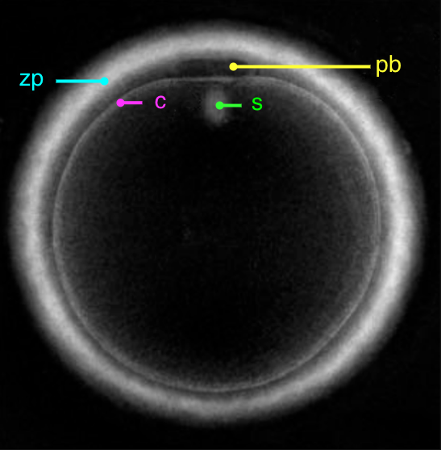
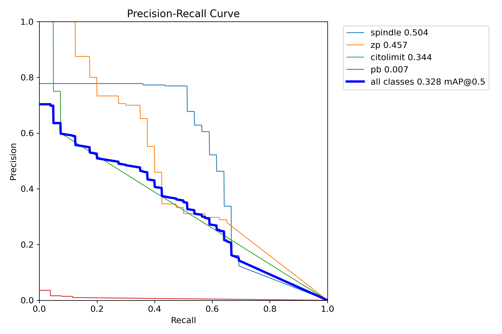
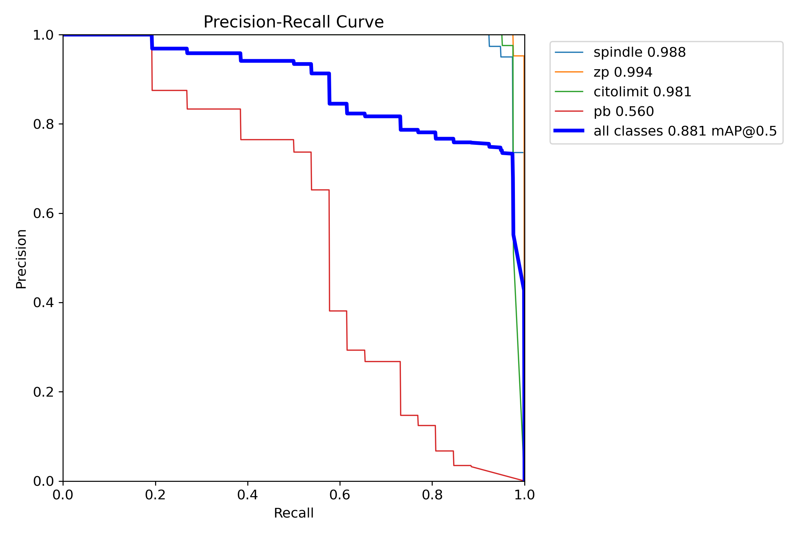
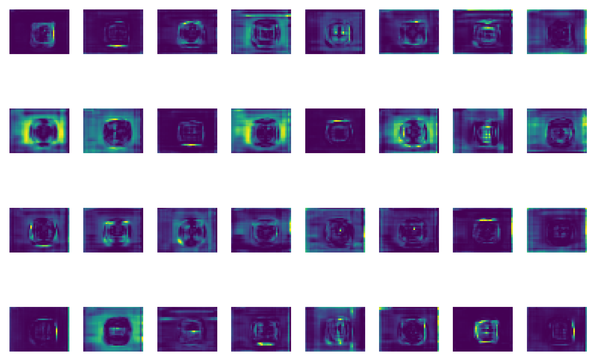
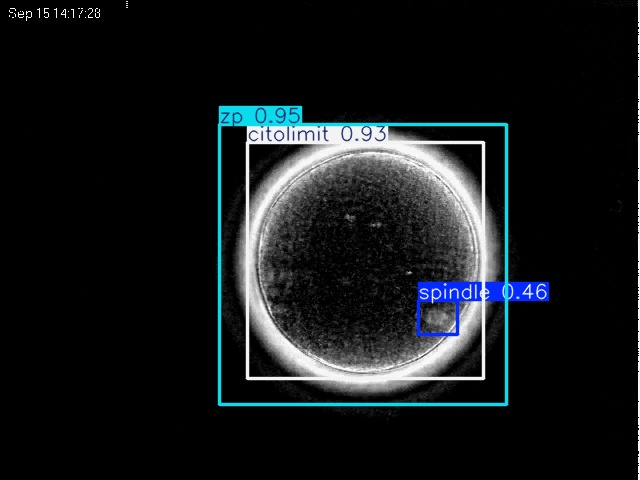
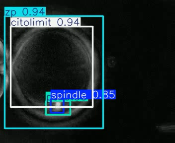
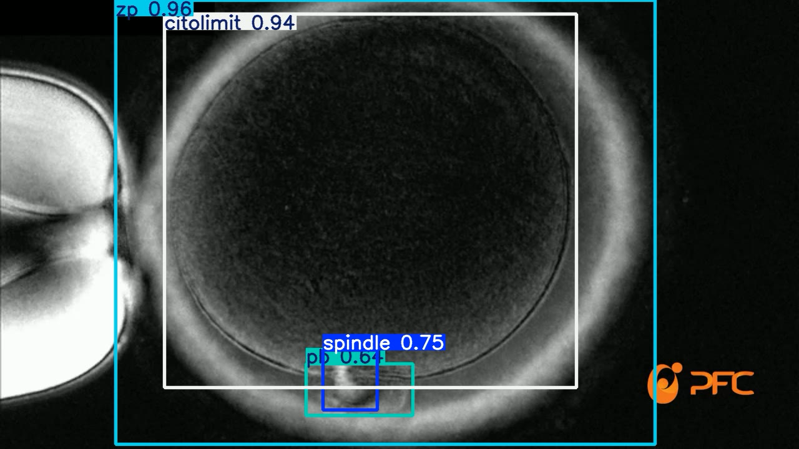
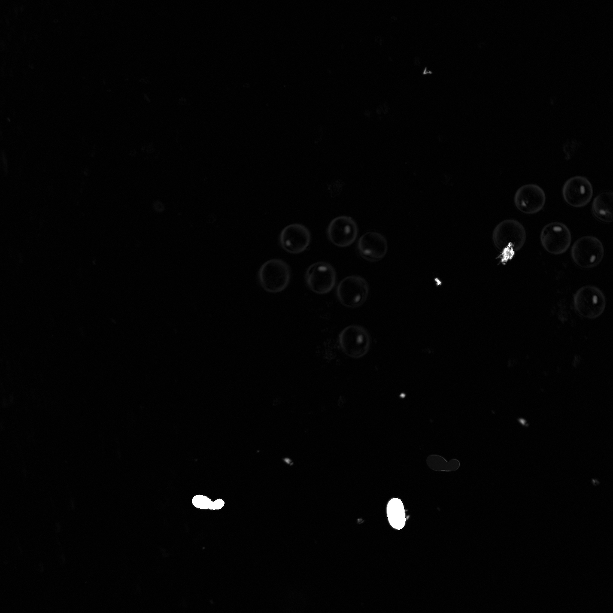
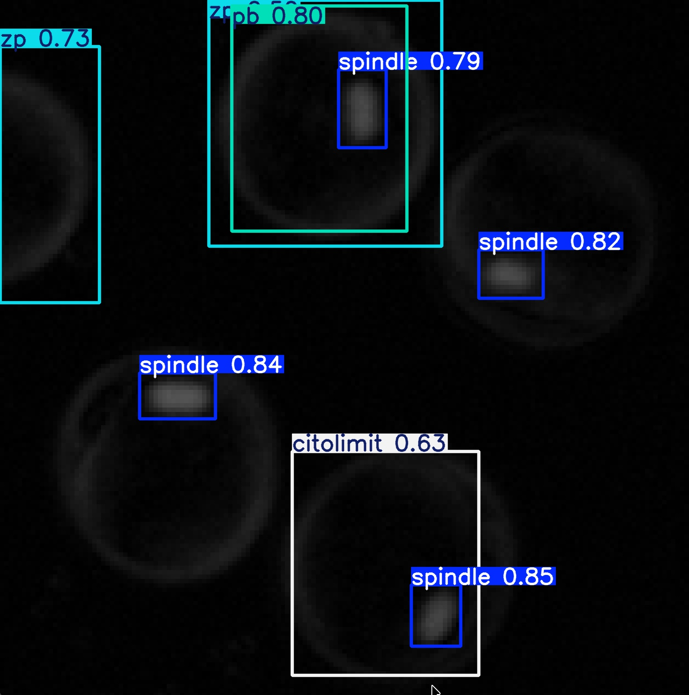

<header class="mb-2 text-left">
  <h1 class="mt-0 text-xl font-bold leading-tight tracking-tight text-unal-gray sm:text-2xl">Base de datos sintética</h1>
  

</header>

  <!-- Texto arriba -->
  

    <ul class="list-none space-y-1 text-[0.82rem] leading-snug text-unal-gray">
      <li class="flex gap-2">
        ▸
        
          526 392 imágenes generadas · subconjunto de 21 600 para entrenamiento
          
            train 15 120
            val 3 240
            test 3 240
          
        
      </li>
      <li class="flex gap-2">
        ▸
        4 clases: huso meiótico, ZP, límite citoplasmático, cuerpo polar · etiquetado 100% automático
      </li>
      <li class="flex gap-2">
        ▸
        La co-detección de ZP + huso meiótico cumple funcionalmente el rol de identificación del ovocito — no se requiere clase adicional
      </li>
    </ul>
    

      

        Aporte: primera base de datos de imágenes PLM de ovocitos con anotación multi-clase — no existe ninguna pública equivalente
      

    

  

  <!-- Imágenes abajo en paralelo -->
  

    <figure class="m-0 min-w-0">
      
      <figcaption lang="es" class="plm-figcaption text-center">
        Sintético
      </figcaption>
    </figure>
    <figure class="m-0 min-w-0">
      
      <figcaption lang="es" class="plm-figcaption text-center">
        Real — imagen PLM de literatura
      </figcaption>
    </figure>
  

  
  

<!--
Con eso claro, pasemos a los resultados. El primer resultado es la base de datos sintética en sí misma, porque sin datos no hay modelo.

Generamos 526.392 imágenes en MATLAB usando el modelo físico de retardo óptico — y de esas seleccionamos 21.600 para entrenamiento. La ventaja fundamental: el etiquetado es 100% automático por definición paramétrica. No hubo ninguna intervención manual. Como vemos en la figura de la izquierda, las imágenes sintéticas reproducen visualmente las características que veríamos en PLM real: la zona pelúcida como un anillo birrefringente, el huso como una elipse de bajo contraste, el cuerpo polar y el límite citoplasmático.

El complemento real es OocytePaperImages: 200 imágenes PLM recopiladas de publicaciones científicas, curadas y anotadas manualmente, que actúan como el puente hacia el dominio real. Esta combinación — 21.600 sintéticas para escala, 200 reales para dominio — es lo que hace viable el enfoque con datos tan limitados.
-->

---
transition: slide-up
deckSection: resultados
---

<header class="mb-3 text-left">
  <h1 class="mt-0 text-xl font-bold leading-tight tracking-tight text-unal-gray sm:text-2xl">Preentrenamiento sintético</h1>
  

</header>

  
Todos los modelos convergieron sobre datos sintéticos (mAP50 ≈ 0,995). El experimento control evalúa generalización directa a imágenes reales sin transferencia de aprendizaje.

  

    <table class="w-full border-collapse text-[0.82rem] text-unal-gray">
      <thead>
        <tr class="bg-unal-blue/10 text-left">
          <th class="px-3 py-2 font-semibold text-unal-blue">Grupo</th>
          <th class="px-3 py-2 text-center font-semibold text-unal-blue">N</th>
          <th class="px-3 py-2 text-center font-semibold text-unal-blue">mAP50 Sintético</th>
          <th class="px-3 py-2 text-center font-semibold text-unal-blue">mAP50 Control</th>
          <th class="px-3 py-2 text-center font-semibold text-unal-blue">mAP50-95 Control</th>
        </tr>
      </thead>
      <tbody>
        <tr class="border-t border-gray-100 bg-white">
          <td class="px-3 py-2.5 font-medium">YOLO estándar</td>
          <td class="px-3 py-2.5 text-center text-unal-gray/70">10</td>
          <td class="px-3 py-2.5 text-center font-semibold text-unal-green">0,995</td>
          <td class="px-3 py-2.5 text-center text-orange-600">0,195–0,521</td>
          <td class="px-3 py-2.5 text-center text-unal-gray/80">0,079–0,346</td>
        </tr>
        <tr class="border-t border-gray-100 bg-gray-50/50">
          <td class="px-3 py-2.5 font-medium">RT-DETR</td>
          <td class="px-3 py-2.5 text-center text-unal-gray/70">3</td>
          <td class="px-3 py-2.5 text-center font-semibold text-unal-green">0,995</td>
          <td class="px-3 py-2.5 text-center text-orange-600">0,348–0,503</td>
          <td class="px-3 py-2.5 text-center text-unal-gray/80">0,191–0,267</td>
        </tr>
        <tr class="border-t border-gray-100 bg-white">
          <td class="px-3 py-2.5 font-medium">Redes con atención</td>
          <td class="px-3 py-2.5 text-center text-unal-gray/70">4</td>
          <td class="px-3 py-2.5 text-center font-semibold text-unal-green">0,995</td>
          <td class="px-3 py-2.5 text-center text-orange-600">0,319–0,499</td>
          <td class="px-3 py-2.5 text-center text-unal-gray/80">0,183–0,309</td>
        </tr>
      </tbody>
    </table>
  

  

    Mejor resultado en control: YOLOv9m-Triple Attention alcanzó mAP50 = 0,499 — frente a mAP50 = 0,328 del YOLOv9m estándar — sin ningún dato real de ajuste. Los módulos de atención transfieren mejor entre dominios.
  

  
  

<!--
El primer experimento fue preentrenar todos los modelos en la base sintética. El resultado fue el esperado: todos los modelos YOLO alcanzaron mAP50 de 0,995 con P y R de 1,0. RT-DETR también llegó a mAP50 de 0,995, con mAP50-95 en rango de 0,986 a 0,992. El dominio sintético produce datos de entrenamiento de alta consistencia.

Pero ahí viene el problema que justifica todo lo demás. Cuando tomamos esos modelos — con métricas cercanas al máximo en datos sintéticos — y los evaluamos directamente sobre las 40 imágenes reales sin ningún ajuste adicional, el mAP50 colapsa: las redes estándar caen al rango 0,195–0,521, y las redes desarrolladas al rango 0,319–0,499. Eso es la brecha sintético-real.

Este resultado es esperado y es una confirmación positiva: el conjunto sintético funciona para aprender morfología, pero el dominio visual difiere suficientemente del real como para requerir una segunda etapa de ajuste. Las redes desarrolladas con módulos de atención transfieren mejor: YOLOv9m-Triple Attention alcanzó 0,499 sin ningún dato real de ajuste — más del doble que el modelo estándar en el mismo escenario.
-->

---
transition: slide-up
deckSection: resultados
---

<header class="mb-2 text-left">
  <h1 class="mt-0 text-xl font-bold leading-tight tracking-tight text-unal-gray sm:text-2xl">Transferencia de aprendizaje en imágenes reales</h1>
  

</header>

  

    <DumbbellPlot
      :rows="dumbbell1Rows"
      leftLabel="Control (sin TL)"
      rightLabel="Con transferencia de aprendizaje"
      :compact="true"
      chartWidth="100%"
      caption="mAP50 por modelo: control vs. transferencia de aprendizaje"
    />
  

  

    <table class="border-collapse text-[0.60rem] text-unal-gray">
      <thead>
        <tr class="bg-unal-blue/10 text-left">
          <th class="px-1.5 py-0.5 font-semibold text-unal-blue">Métrica</th>
          <th class="px-1.5 py-0.5 text-center font-semibold text-unal-blue">YOLOv9m</th>
          <th class="px-1.5 py-0.5 text-center font-semibold text-unal-blue">RT-DETR-R101</th>
        </tr>
      </thead>
      <tbody>
        <tr class="border-t border-gray-100 bg-white">
          <td class="px-1.5 py-0.5 text-unal-gray/70">P</td>
          <td class="px-1.5 py-0.5 text-center">0,957</td>
          <td class="px-1.5 py-0.5 text-center">0,922</td>
        </tr>
        <tr class="border-t border-gray-100 bg-gray-50/50">
          <td class="px-1.5 py-0.5 text-unal-gray/70">R</td>
          <td class="px-1.5 py-0.5 text-center">0,857</td>
          <td class="px-1.5 py-0.5 text-center">0,868</td>
        </tr>
        <tr class="border-t border-gray-100 bg-white">
          <td class="px-1.5 py-0.5 text-unal-gray/70">mAP50</td>
          <td class="px-1.5 py-0.5 text-center font-semibold">0,902</td>
          <td class="px-1.5 py-0.5 text-center font-semibold">0,902</td>
        </tr>
        <tr class="border-t border-gray-100 bg-gray-50/50">
          <td class="px-1.5 py-0.5 text-unal-gray/70">mAP50-95</td>
          <td class="px-1.5 py-0.5 text-center">0,627</td>
          <td class="px-1.5 py-0.5 text-center">0,612</td>
        </tr>
        <tr class="border-t border-gray-100 bg-white">
          <td class="px-1.5 py-0.5 text-unal-gray/70">Inferencia</td>
          <td class="px-1.5 py-0.5 text-center font-semibold text-unal-green">7,4 ms</td>
          <td class="px-1.5 py-0.5 text-center text-orange-600">14,8 ms</td>
        </tr>
        <tr class="border-t border-gray-100 bg-gray-50/50">
          <td class="px-1.5 py-0.5 text-unal-gray/70">Parámetros</td>
          <td class="px-1.5 py-0.5 text-center text-unal-gray/70">20 M</td>
          <td class="px-1.5 py-0.5 text-center text-unal-gray/70">60,9 M</td>
        </tr>
      </tbody>
    </table>
  

  
  

<!--
Con la transferencia de aprendizaje, el rendimiento cambia completamente. Este gráfico muestra los 13 modelos evaluados. El punto gris es el mAP50 en el experimento de control — solo con preentrenamiento sintético, sin datos reales. El punto azul es el mAP50 después de la transferencia de aprendizaje. La línea que los conecta es la mancuerna: su longitud muestra el salto.

El patrón es consistente en los 13 modelos: todos mejoran. El rango de control va de 0,195 a 0,521. Después de la transferencia, el rango sube a 0,833 a 0,902. Quiero detenerme en la selección del modelo de referencia, porque merece un análisis cuidadoso. En métricas de imagen estática, YOLOv9m y RT-DETR-ResNet101 empatan en mAP50 con 0,902. Pero RT-DETR requiere 60,9 millones de parámetros frente a 20 de YOLOv9m, y una latencia de 14,8 milisegundos frente a 7,4 — el doble. Para integración con cámara PLM en entorno clínico con recursos computacionales limitados, RT-DETR es inviable. Ahora bien: la evaluación integral que presentaré en los próximos slides — generalización sin transferencia y comportamiento en video — establece que YOLOv9m-CBAM es el modelo de referencia para el escenario de aplicación clínica real. No YOLOv9m. Vamos a ver por qué.
-->

---
transition: slide-up
deckSection: resultados
---

<header class="mb-2 text-left">
  <h1 class="mt-0 text-xl font-bold leading-tight tracking-tight text-unal-gray sm:text-2xl">Análisis de rendimiento por clase</h1>
  

</header>

  
Curvas Precisión-Recall · modelo YOLOv9m · evaluación sobre 40 imágenes reales (OocytePaperImages)

  

    

      

        Sin transferencia de aprendizaje
        Control
      

      

        

          
        

        

          
mAP50 por clase

          
Zona pelúcida0,457

          
Huso meiótico0,504

          
Lím. citoplasmático0,344

          
Cuerpo polar0,007

        

      

    

    

      

        Con transferencia de aprendizaje
        TL
      

      

        

          
        

        

          
mAP50 por clase

          
Zona pelúcida0,995

          
Huso meiótico0,993

          
Lím. citoplasmático0,979

          

            

              
Cuerpo polar0,642

              
P = 0,69 · R = 0,44

            

          

        

      

    

  

  <!--
  

    

      <DumbbellPlot
        :rows="dumbbell2Rows"
        leftLabel="Control (sin TL)"
        rightLabel="Con transferencia de aprendizaje"
        :compact="false"
        leftColor="#9ca3af"
        chartWidth="100%"
        caption="mAP50 por clase · YOLOv9m: control vs. transferencia de aprendizaje"
      />
    

  

  -->

  
  

<!--
Hasta ahora hemos visto métricas globales. Ahora veamos qué ocurre estructura por estructura, porque eso es lo que tiene significado clínico.

Estas son las curvas de precisión y recall reales del experimento. La gráfica de la izquierda corresponde al experimento de control — solo con preentrenamiento sintético, sin datos reales. La de la derecha es después de la transferencia de aprendizaje.

El contraste es inmediato. En control, todas las curvas degradan gradualmente: la precisión cae a medida que aumenta el recall, y el cuerpo polar — en rojo — colapsa prácticamente a cero desde el inicio, con un AP de apenas 0,007. Eso confirma que los datos sintéticos no capturan su morfología variable.

Con transferencia de aprendizaje, el panorama cambia completamente. Zona pelúcida, huso meiótico y límite citoplasmático alcanzan AP de 0,995, 0,993 y 0,979 respectivamente — curvas que se mantienen cerca de precisión 1 a lo largo de todo el rango de recall antes de caer bruscamente al final. Ese es el patrón de un detector robusto y bien calibrado. El cuerpo polar mejora sustancialmente a 0,642, pero su curva sigue siendo más irregular — lo que refleja que con P=0,69 y R=0,44 la detección aún no es robusta.

Clínicamente, lo que importa son el huso meiótico a 0,993 y la zona pelúcida a 0,995. Con esos dos valores, la evaluación de madurez en tiempo real es viable.
-->

---
transition: slide-up
deckSection: resultados
---

<header class="mb-0 text-left">
  

    <h1 class="mt-0 text-xl font-bold leading-tight tracking-tight text-unal-gray sm:text-2xl">Arquitecturas con módulos de atención</h1>
    ★ Aporte
  

  

</header>

  
Los modelos desarrollados generalizan mejor al dominio real sin haberlo visto — con TL, todas las redes presentan resultados competitivos.

  

    <DumbbellPlot
      :rows="dumbbell3Rows"
      leftLabel="Control"
      rightLabel="Con TL"
      :compact="true"
      chartWidth="80%"
      xLabel="mAP50 — Zona Pelúcida (ZP)"
      :xMax="1.0"
    />
  

  

    <DumbbellPlot
      :rows="recallRows"
      leftLabel="Control"
      rightLabel="Con TL"
      :compact="true"
      chartWidth="80%"
      xLabel="Recall global (todas las clases)"
      :xMax="1.0"
    />
  

  
  

<!--
Con el modelo base establecido, evaluamos si los módulos de atención podían mejorar el rendimiento. Desarrollamos cuatro variantes: CBAM y Triple Attention sobre YOLOv9m, y Conservative Attention y Transformer Enhanced sobre YOLO11m.

El hallazgo más revelador está en el escenario de control — modelos evaluados en imágenes reales sin haber visto ninguna durante el entrenamiento. Aquí la zona pelúcida es nuestra prueba de fuego: YOLOv9m-Triple Attention alcanza un mAP50 de 0,925, frente a 0,457 del baseline YOLOv9m — más del doble. CBAM llega a 0,765. ¿Por qué la zona pelúcida? Es la estructura de mayor tamaño y contraste relativo, pero en imágenes PLM su detección depende de capturar correctamente los gradientes de birrefringencia en los bordes. Los módulos de atención — que recalibran canales e inhiben activaciones espurias — permiten que la red transfiera ese patrón desde las imágenes sintéticas a las reales con mucha más fidelidad.

El recall global confirma el mismo patrón: en control, CBAM recupera el 48,8% de las instancias y Triple el 46,9%, frente al 26,5% del baseline YOLOv9m. La red con atención detecta casi el doble de estructuras en imágenes que nunca había visto.

Con la transferencia de aprendizaje la brecha desaparece — todos los modelos convergen a mAP50 = 0,995 en ZP — lo que confirma que la zona pelúcida no es difícil en sí misma: es difícil sin datos reales. Los módulos de atención son exactamente el mecanismo que cierra esa brecha. La siguiente diapositiva muestra en los mapas de activación por qué ocurre esto.
-->

---
transition: slide-up
deckSection: resultados
---

<header class="mb-2 text-left">
  

    <h1 class="mt-0 text-xl font-bold leading-tight tracking-tight text-unal-gray sm:text-2xl">Arquitecturas con módulos de atención</h1>
    ★ Aporte
  

  

</header>

CBAM aprende a mirar en el lugar correcto: sus activaciones se concentran en ZP y citolimit donde YOLOv9m responde de forma difusa.

  <!-- YOLOv9m base (sin atención) -->
  <figure class="relative m-0 min-h-0 flex-1">
    
    

    <figcaption lang="es" class="mt-1 shrink-0 text-center text-[0.65rem] italic text-gray-500">
      (a) YOLOv9m — activaciones difusas, sin foco en ZP ni citolimit.
    </figcaption>
  </figure>
  <!-- YOLOv9m-CBAM activation map -->
  <figure class="relative m-0 min-h-0 flex-1">
    
    

    <figcaption lang="es" class="mt-1 shrink-0 text-center text-[0.65rem] italic text-gray-500">
      (b) YOLOv9m-CBAM — activaciones localizadas en ZP y citolimit.
    </figcaption>
  </figure>

  
  

<!--
Estos son mapas de activación Grad-CAM en el nivel P4 del backbone — submuestreo 1/16 — donde las características tienen mayor contenido semántico.

En YOLOv9m, izquierda, observen que la activación está distribuida de forma difusa por toda la imagen: el modelo está respondiendo a regiones que no corresponden a ninguna estructura relevante. En YOLOv9m-CBAM, derecha, las activaciones están concentradas sobre la zona pelúcida y el límite citoplasmático. Eso no es casualidad. CBAM opera en dos pasos: primero aplica atención de canal, que calcula la importancia global de cada mapa de características y suprime los canales de bajo valor informativo. Luego aplica atención espacial, que genera un mapa de relevancia posición a posición y enfatiza las regiones estructuralmente significativas. El resultado visible es que el modelo sabe dónde buscar antes de hacer la predicción final.

Eso es lo que se traduce directamente en el comportamiento en video que vamos a ver ahora: CBAM detecta el límite citoplasmático en 660 de 660 fotogramas con confianza de 0,94 a 0,96; YOLOv9m no lo detecta en ninguno de los 660.
-->

---
transition: slide-up
deckSection: resultados
---

<header class="mb-1 text-left">
  <h1 class="mt-0 text-xl font-bold leading-tight tracking-tight text-unal-gray sm:text-2xl">Evaluación en secuencias de video</h1>
  

</header>

  
CBAM supera al modelo base en los 3 escenarios · evaluación en video · comparación cuadro a cuadro

  

    <!-- Secuencia 1 -->
    

      

        Sec. 1
        OpenPolScope
      

      Meiosis I · 100 fotogramas
      

        ▸ Reto — Huso: posición y contraste variables
      

      
    

    <!-- Secuencia 2 -->
    

      

        Sec. 2
        OOSIGHT
      

      ICSI · 150 fotogramas
      

        ▸ Reto — Aguja ICSI: artefacto alto contraste
      

      
    

    <!-- Secuencia 3 -->
    

      

        Sec. 3
        OptimFert
      

      Prague IVF · 660 fotogramas
      

        ▸ Reto — Logo + herramienta: varios artefactos
      

      
    

  

  
  

<!--
Pasamos de las métricas cuantitativas a la evaluación en video — el escenario más cercano al uso clínico real. La comparación es cualitativa: sin anotaciones de referencia, evaluamos frame a frame. En cada video: YOLOv9m estándar a la izquierda, YOLOv9m-CBAM a la derecha.

Secuencia 1, OpenPolScope, meiosis I. El huso meiótico cambia de posición y el contraste varía fotograma a fotograma. Resultado clave: YOLOv9m detecta el límite del citoplasma en solo 4 de 100 fotogramas; CBAM lo hace en los 100, con confianza estable entre 0,90 y 0,96. En la zona pelúcida ambos modelos detectan los 100, pero la confianza de CBAM es constante (0,94–0,95) mientras que en YOLOv9m oscila entre 0,48 y 0,92.

Secuencia 2, OOSIGHT, procedimiento ICSI. La aguja de inyección introduce un artefacto de alto contraste que confunde al modelo base: YOLOv9m acumula 538 falsos positivos de huso meiótico sobre la herramienta. CBAM solo genera 7, y mantiene detección estable de las cuatro clases a lo largo de toda la secuencia, incluyendo los tramos de deformación del ovocito.

Secuencia 3, OptimFert, Prague IVF, 660 fotogramas. Aquí se suman dos artefactos: el logotipo superpuesto y la herramienta de micromanipulación. YOLOv9m confunde ambos con estructuras reales y acumula 1.710 falsos positivos. CBAM detecta las cuatro clases de forma estable en toda la secuencia.

El patrón es el mismo en los tres casos: CBAM es más robusto ante artefactos visuales y condiciones de bajo contraste, coherente con lo que vimos en las métricas estáticas.
-->

---
transition: slide-up
deckSection: resultados
---

<header class="mb-1 text-left">
  <h1 class="mt-0 text-xl font-bold leading-tight tracking-tight text-unal-gray sm:text-2xl">Secuencia 1: OpenPolScope (meiosis I)</h1>
  

</header>

  

    <figure class="m-0 flex min-w-0 flex-col gap-0.5">
      

        YOLOv9m
        modelo base
      

      

        <video class="h-full w-full" autoplay muted loop playsinline>
          <source src="/videos/seq1_std.mp4" type="video/mp4" />
        </video>
      

    </figure>
    <figure class="m-0 flex min-w-0 flex-col gap-0.5">
      

        YOLOv9m-CBAM
        con módulo de atención
      

      

        <video class="h-full w-full" autoplay muted loop playsinline>
          <source src="/videos/seq1_cbam.mp4" type="video/mp4" />
        </video>
      

    </figure>
  

  <!-- TABLA SEQ 1 — referencia sin renderizar -->
  

    <table class="w-full border-collapse text-[0.65rem] leading-snug text-unal-gray sm:text-[0.68rem]">
      <thead>
        <tr class="border-b-2 border-unal-gray">
          <th class="py-1 pr-3 text-left font-semibold">Clase</th>
          <th class="px-2 py-1 text-center font-semibold" colspan="3">YOLOv9m (100 fotogr.)</th>
          <th class="px-2 py-1 text-center font-semibold" colspan="3">YOLOv9m-CBAM (100 fotogr.)</th>
        </tr>
        <tr class="border-b border-gray-300 text-[0.62rem] text-gray-500">
          <th class="py-0.5 pr-3 text-left font-normal"></th>
          <th class="px-2 py-0.5 text-center font-medium">Detecc.</th>
          <th class="px-2 py-0.5 text-center font-medium">Fotogr.</th>
          <th class="px-2 py-0.5 text-center font-medium">Confianza</th>
          <th class="px-2 py-0.5 text-center font-medium">Detecc.</th>
          <th class="px-2 py-0.5 text-center font-medium">Fotogr.</th>
          <th class="px-2 py-0.5 text-center font-medium">Confianza</th>
        </tr>
      </thead>
      <tbody>
        <tr class="border-b border-gray-200">
          <td class="py-0.5 pr-3 font-medium">Zona pelúcida (zp)</td>
          <td class="px-2 py-0.5 text-center">100</td>
          <td class="px-2 py-0.5 text-center">100</td>
          <td class="px-2 py-0.5 text-center">[0,48; 0,92]</td>
          <td class="px-2 py-0.5 text-center">100</td>
          <td class="px-2 py-0.5 text-center">100</td>
          <td class="px-2 py-0.5 text-center font-semibold text-unal-blue">[0,94; 0,95]</td>
        </tr>
        <tr class="border-b border-gray-200 bg-unal-blue/5">
          <td class="py-0.5 pr-3 font-semibold text-unal-blue">Límite citopl. (citolimit)</td>
          <td class="px-2 py-0.5 text-center text-red-500 font-semibold">4</td>
          <td class="px-2 py-0.5 text-center text-red-500 font-semibold">4</td>
          <td class="px-2 py-0.5 text-center">[0,51; 0,89]</td>
          <td class="px-2 py-0.5 text-center font-semibold text-unal-blue">100</td>
          <td class="px-2 py-0.5 text-center font-semibold text-unal-blue">100</td>
          <td class="px-2 py-0.5 text-center font-semibold text-unal-blue">[0,90; 0,96]</td>
        </tr>
        <tr class="border-b border-gray-200">
          <td class="py-0.5 pr-3 font-medium">Huso meiótico (spindle)</td>
          <td class="px-2 py-0.5 text-center">74</td>
          <td class="px-2 py-0.5 text-center">73</td>
          <td class="px-2 py-0.5 text-center">[0,58; 0,95]</td>
          <td class="px-2 py-0.5 text-center">74</td>
          <td class="px-2 py-0.5 text-center">74</td>
          <td class="px-2 py-0.5 text-center">[0,45; 0,89]</td>
        </tr>
        <tr>
          <td class="py-0.5 pr-3 font-medium">Cuerpo polar (pb)</td>
          <td class="px-2 py-0.5 text-center">5</td>
          <td class="px-2 py-0.5 text-center">5</td>
          <td class="px-2 py-0.5 text-center">[0,46; 0,82]</td>
          <td class="px-2 py-0.5 text-center">6</td>
          <td class="px-2 py-0.5 text-center">6</td>
          <td class="px-2 py-0.5 text-center">[0,46; 0,58]</td>
        </tr>
      </tbody>
    </table>
  

  

    <table class="w-full border-collapse text-[0.68rem]" style="line-height:1.2; border-spacing:0">
      <thead>
        <tr style="border-bottom: 2px solid rgba(38,38,38,0.2)">
          <th class="text-left font-semibold text-unal-gray/50" style="padding:1px 14px 2px 0">Clase</th>
          <th class="text-center font-bold text-unal-gray" style="padding:1px 10px 2px">YOLOv9m · n/100</th>
          <th class="text-center font-bold text-unal-gray" style="padding:1px 10px 2px">YOLOv9m · conf.</th>
          <th class="text-center font-bold text-unal-blue" style="padding:1px 10px 2px">CBAM · n/100</th>
          <th class="text-center font-bold text-unal-blue" style="padding:1px 10px 2px">CBAM · conf.</th>
        </tr>
      </thead>
      <tbody>
        <tr style="border-bottom: 1px solid rgba(209,213,219,0.6)">
          <td class="text-unal-gray" style="padding:3px 14px 3px 0">Zona pelúcida</td>
          <td class="text-center text-unal-gray" style="padding:3px 10px">100</td>
          <td class="text-center font-semibold text-amber-600" style="padding:3px 10px">[0,48; 0,92]</td>
          <td class="text-center font-semibold text-unal-blue" style="padding:3px 10px">100</td>
          <td class="text-center font-semibold text-unal-blue" style="padding:3px 10px">[0,94; 0,95]</td>
        </tr>
        <tr class="bg-unal-blue/5" style="border-bottom: 1px solid rgba(209,213,219,0.6)">
          <td class="font-semibold text-unal-blue" style="padding:3px 14px 3px 0">Citolimit</td>
          <td class="text-center font-bold text-red-500" style="padding:3px 10px">4</td>
          <td class="text-center font-medium text-red-400" style="padding:3px 10px">[0,51; 0,89]</td>
          <td class="text-center font-bold text-unal-blue" style="padding:3px 10px">100</td>
          <td class="text-center font-semibold text-unal-blue" style="padding:3px 10px">[0,90; 0,96]</td>
        </tr>
        <tr style="border-bottom: 1px solid rgba(209,213,219,0.6)">
          <td class="text-unal-gray" style="padding:3px 14px 3px 0">Huso meiótico</td>
          <td class="text-center text-unal-gray" style="padding:3px 10px">74</td>
          <td class="text-center text-unal-gray/60" style="padding:3px 10px">[0,58; 0,95]</td>
          <td class="text-center text-unal-gray" style="padding:3px 10px">74</td>
          <td class="text-center text-unal-gray/60" style="padding:3px 10px">[0,45; 0,89]</td>
        </tr>
        <tr>
          <td class="text-unal-gray" style="padding:3px 14px 3px 0">Cuerpo polar</td>
          <td class="text-center text-unal-gray" style="padding:3px 10px">5</td>
          <td class="text-center text-unal-gray/60" style="padding:3px 10px">[0,46; 0,82]</td>
          <td class="text-center text-unal-gray" style="padding:3px 10px">6</td>
          <td class="text-center text-unal-gray/60" style="padding:3px 10px">[0,46; 0,58]</td>
        </tr>
      </tbody>
    </table>
  

  
  

<!--
Pasemos a la primera secuencia. Estos dos videos muestran el mismo segmento — una grabación OpenPolScope del proceso de meiosis — procesado con YOLOv9m estándar a la izquierda y con YOLOv9m-CBAM a la derecha.

La diferencia más llamativa está en el límite citoplasmático, marcado en la tabla. YOLOv9m lo detecta en apenas 4 de los 100 fotogramas. YOLOv9m-CBAM lo detecta en todos los 100, con una confianza alta y estable entre 0,90 y 0,96. No es una diferencia marginal: es la diferencia entre detectar o no detectar esa estructura en prácticamente toda la secuencia.

En zona pelúcida, ambos modelos detectan en todos los fotogramas, pero la confianza de YOLOv9m varía entre 0,48 y 0,92 — inestable — mientras que CBAM mantiene entre 0,94 y 0,95 de forma consistente. Para el huso meiótico, ambos coinciden: lo pierden en el tramo de fotogramas 21 a 46, donde el huso cambia de posición durante la meiosis y su visibilidad disminuye incluso para el ojo experto.
-->

---
transition: slide-up
deckSection: resultados
---

<header class="mb-1 text-left">
  <h1 class="mt-0 text-xl font-bold leading-tight tracking-tight text-unal-gray sm:text-2xl">Secuencia 2: OOSIGHT-Spindle View (ICSI)</h1>
  

</header>

  

    <figure class="m-0 flex min-w-0 flex-col gap-0.5">
      

        YOLOv9m
        modelo base
      

      

        <video class="h-full w-full" autoplay muted loop playsinline>
          <source src="/videos/seq2_std.mp4" type="video/mp4" />
        </video>
      

    </figure>
    <figure class="m-0 flex min-w-0 flex-col gap-0.5">
      

        YOLOv9m-CBAM
        con módulo de atención
      

      

        <video class="h-full w-full" autoplay muted loop playsinline>
          <source src="/videos/seq2_cbam.mp4" type="video/mp4" />
        </video>
      

    </figure>
  

  <!-- TABLA SEQ 2 — referencia sin renderizar -->
  

  

    <table class="w-full border-collapse text-[0.68rem]" style="line-height:1.2; border-spacing:0">
      <thead>
        <tr style="border-bottom: 2px solid rgba(38,38,38,0.2)">
          <th class="text-left font-semibold text-unal-gray/50" style="padding:2px 14px 3px 0">Clase</th>
          <th class="text-center font-bold text-unal-gray" style="padding:2px 10px 3px">YOLOv9m · n/146</th>
          <th class="text-center font-bold text-unal-gray" style="padding:2px 10px 3px">YOLOv9m · conf.</th>
          <th class="text-center font-bold text-unal-blue" style="padding:2px 10px 3px">CBAM · n/150</th>
          <th class="text-center font-bold text-unal-blue" style="padding:2px 10px 3px">CBAM · conf.</th>
        </tr>
      </thead>
      <tbody>
        <tr class="bg-unal-blue/5" style="border-bottom: 1px solid rgba(209,213,219,0.6)">
          <td class="font-semibold text-unal-blue" style="padding:3px 14px 3px 0">Zona pelúcida</td>
          <td class="text-center font-bold text-red-500" style="padding:3px 10px">17</td>
          <td class="text-center font-semibold text-amber-600" style="padding:3px 10px">[0,41; 0,80]</td>
          <td class="text-center font-bold text-unal-blue" style="padding:3px 10px">150</td>
          <td class="text-center font-semibold text-unal-blue" style="padding:3px 10px">[0,81; 0,96]</td>
        </tr>
        <tr class="bg-unal-blue/5" style="border-bottom: 1px solid rgba(209,213,219,0.6)">
          <td class="font-semibold text-unal-blue" style="padding:3px 14px 3px 0">Citolimit</td>
          <td class="text-center font-bold text-red-500" style="padding:3px 10px">1</td>
          <td class="text-center text-unal-gray/60" style="padding:3px 10px">0,44</td>
          <td class="text-center font-bold text-unal-blue" style="padding:3px 10px">148</td>
          <td class="text-center font-semibold text-unal-blue" style="padding:3px 10px">[0,67; 0,95]</td>
        </tr>
        <tr style="border-bottom: 1px solid rgba(209,213,219,0.6)">
          <td class="text-unal-gray" style="padding:3px 14px 3px 0">Huso meiótico†</td>
          <td class="text-center font-bold text-red-500" style="padding:3px 10px">538</td>
          <td class="text-center text-unal-gray/60" style="padding:3px 10px">[0,40; 0,94]</td>
          <td class="text-center text-unal-gray" style="padding:3px 10px">151 (7 FP)</td>
          <td class="text-center text-unal-gray/60" style="padding:3px 10px">[0,42; 0,87]</td>
        </tr>
        <tr>
          <td class="text-unal-gray" style="padding:3px 14px 3px 0">Cuerpo polar†</td>
          <td class="text-center font-bold text-red-500" style="padding:3px 10px">61</td>
          <td class="text-center text-unal-gray/60" style="padding:3px 10px">[0,40; 0,87]</td>
          <td class="text-center text-unal-gray" style="padding:3px 10px">3</td>
          <td class="text-center text-unal-gray/60" style="padding:3px 10px">[0,55; 0,75]</td>
        </tr>
      </tbody>
    </table>
  

  
† YOLOv9m: falsos positivos sobre aguja de inyección

  
  

<!--
Esta secuencia muestra algo más exigente: un procedimiento de ICSI real, con aguja de inyección dentro del campo visual. La aguja introduce un artefacto de alto contraste que confunde al modelo.

YOLOv9m genera 538 detecciones de huso meiótico en 146 fotogramas — la mayoría son falsos positivos sobre la herramienta. La zona pelúcida solo la detecta en 17 fotogramas. El modelo estándar básicamente se pierde en presencia de la aguja.

YOLOv9m-CBAM detecta zona pelúcida en todos los 150 fotogramas con confianza entre 0,81 y 0,96. Detecta el límite citoplasmático en 148 de los 150. El huso meiótico presenta solo 7 falsos positivos en toda la secuencia — nada comparado con los 538 del baseline. Incluso durante los fotogramas de deformación — cuando la aguja está en contacto y el ovocito se deforma visiblemente — CBAM mantiene las detecciones correctas.
-->

---
transition: slide-left
deckSection: resultados
---

<header class="mb-1 text-left">
  <h1 class="mt-0 text-xl font-bold leading-tight tracking-tight text-unal-gray sm:text-2xl">Secuencia 3: OptimFert · Prague IVF</h1>
  

</header>

  

    <figure class="m-0 flex min-w-0 flex-col gap-0.5">
      

        YOLOv9m
        modelo base
      

      

        <video class="h-full w-full" autoplay muted loop playsinline>
          <source src="/videos/seq3_std.mp4" type="video/mp4" />
        </video>
      

    </figure>
    <figure class="m-0 flex min-w-0 flex-col gap-0.5">
      

        YOLOv9m-CBAM
        con módulo de atención
      

      

        <video class="h-full w-full" autoplay muted loop playsinline>
          <source src="/videos/seq3_cbam.mp4" type="video/mp4" />
        </video>
      

    </figure>
  

  <!-- TABLA SEQ 3 — referencia sin renderizar -->
  

  

    <table class="w-full border-collapse text-[0.68rem]" style="line-height:1.2; border-spacing:0">
      <thead>
        <tr style="border-bottom: 2px solid rgba(38,38,38,0.2)">
          <th class="text-left font-semibold text-unal-gray/50" style="padding:2px 14px 3px 0">Clase</th>
          <th class="text-center font-bold text-unal-gray" style="padding:2px 10px 3px">YOLOv9m · n/660</th>
          <th class="text-center font-bold text-unal-gray" style="padding:2px 10px 3px">YOLOv9m · conf.</th>
          <th class="text-center font-bold text-unal-blue" style="padding:2px 10px 3px">CBAM · n/660</th>
          <th class="text-center font-bold text-unal-blue" style="padding:2px 10px 3px">CBAM · conf.</th>
        </tr>
      </thead>
      <tbody>
        <tr style="border-bottom: 1px solid rgba(209,213,219,0.6)">
          <td class="text-unal-gray" style="padding:3px 14px 3px 0">Zona pelúcida</td>
          <td class="text-center text-unal-gray" style="padding:3px 10px">660</td>
          <td class="text-center text-unal-gray/60" style="padding:3px 10px">[0,48; 0,95]</td>
          <td class="text-center font-semibold text-unal-blue" style="padding:3px 10px">660</td>
          <td class="text-center font-semibold text-unal-blue" style="padding:3px 10px">[0,95; 0,97]</td>
        </tr>
        <tr class="bg-unal-blue/5" style="border-bottom: 1px solid rgba(209,213,219,0.6)">
          <td class="font-semibold text-unal-blue" style="padding:3px 14px 3px 0">Citolimit</td>
          <td class="text-center font-bold text-red-500" style="padding:3px 10px">0</td>
          <td class="text-center text-gray-400" style="padding:3px 10px">—</td>
          <td class="text-center font-bold text-unal-blue" style="padding:3px 10px">660</td>
          <td class="text-center font-semibold text-unal-blue" style="padding:3px 10px">[0,94; 0,96]</td>
        </tr>
        <tr style="border-bottom: 1px solid rgba(209,213,219,0.6)">
          <td class="text-unal-gray" style="padding:3px 14px 3px 0">Huso meiótico†</td>
          <td class="text-center font-bold text-red-500" style="padding:3px 10px">1 710</td>
          <td class="text-center text-unal-gray/60" style="padding:3px 10px">[0,40; 0,95]</td>
          <td class="text-center text-unal-gray" style="padding:3px 10px">570</td>
          <td class="text-center text-unal-gray/60" style="padding:3px 10px">[0,50; 0,90]</td>
        </tr>
        <tr>
          <td class="text-unal-gray" style="padding:3px 14px 3px 0">Cuerpo polar†</td>
          <td class="text-center font-bold text-red-500" style="padding:3px 10px">238</td>
          <td class="text-center text-unal-gray/60" style="padding:3px 10px">[0,40; 0,65]</td>
          <td class="text-center font-semibold text-unal-blue" style="padding:3px 10px">510</td>
          <td class="text-center font-semibold text-unal-blue" style="padding:3px 10px">[0,61; 0,82]</td>
        </tr>
      </tbody>
    </table>
  

  
† YOLOv9m: falsos positivos por logotipo superpuesto y herramienta de micromanipulación

  
  

<!--
La tercera secuencia es la más larga: 660 fotogramas de un proceso completo de fecundación in vitro, con cambios morfológicos significativos. Hay un logotipo superpuesto en la imagen, una herramienta de micromanipulación, y el huso cambia de forma cuando el cuerpo polar se separa.

YOLOv9m detecta zona pelúcida correctamente en toda la secuencia, pero confunde sistemáticamente el logotipo con huso meiótico, la herramienta con huso en múltiples tramos, y pierde el huso real a partir del fotograma 300. 1.710 detecciones de huso meiótico en 660 fotogramas — un número que por sí solo dice que algo va mal.

YOLOv9m-CBAM detecta zona pelúcida y límite citoplasmático en todos los 660 fotogramas, con confianza estable. El huso meiótico se pierde temporalmente hacia el fotograma 390 — que es exactamente cuando está cambiando de forma durante la división — y se recupera hacia el 479. El fotograma 374, que vemos en la tabla, es especialmente ilustrativo: YOLOv9m no detecta ni huso ni cuerpo polar; CBAM detecta las cuatro estructuras correctamente.
-->

---
transition: slide-up
deckSection: resultados
---

<header class="mb-1 text-left">
  

    <h1 class="mt-0 text-xl font-bold leading-tight tracking-tight text-unal-gray sm:text-2xl">YOLOv9m-CBAM — imagen completa vs. ampliada</h1>
    ★ Aporte
  

  

</header>

  <!-- Sin zoom (izquierda) -->
  <figure class="m-0 flex h-full flex-col gap-0.5 overflow-hidden">
    

      YOLOv9m-CBAM
      imagen completa (sin zoom)
    

    

      
    

    <figcaption class="plm-figcaption mt-1">
      Sin zoom — campo completo · múltiples ovocitos · imagen Zenodo original.
    </figcaption>
  </figure>
  <!-- Con zoom (derecha) -->
  <figure class="m-0 flex h-full flex-col gap-0.5 overflow-hidden">
    

      YOLOv9m-CBAM
      imagen ampliada (con zoom)
    

    

      
    

    <figcaption class="plm-figcaption mt-1">
      Con zoom — 4 clases detectadas: zp · zrpb · huso ×4 · citolimit · conf. 0,63–0,85.
    </figcaption>
  </figure>

  
  

<!--
Esta imagen resume visualmente todo lo que las métricas cuantitativas ya mostraron. Es una imagen real con múltiples ovocitos, tomada bajo las mismas condiciones de microscopía polarizada.

A la izquierda, YOLOv9m estándar detecta únicamente zona pelúcida y huso meiótico. Las estructuras zrpb y citolimit son completamente invisibles para el modelo sin atención. A la derecha, YOLOv9m-CBAM identifica cuatro clases estructurales: zona pelúcida, zona radiopaca, huso meiótico —en cuatro instancias distintas dentro del campo— y límite citoplasmático.

Noten que el modelo estándar tiene confianzas de huso más altas —hasta 0,92— pero detecta menos clases. CBAM cubre más el espacio estructural a costa de confianzas ligeramente menores, lo que en un contexto clínico es la decisión correcta: más información, no menos.
-->

