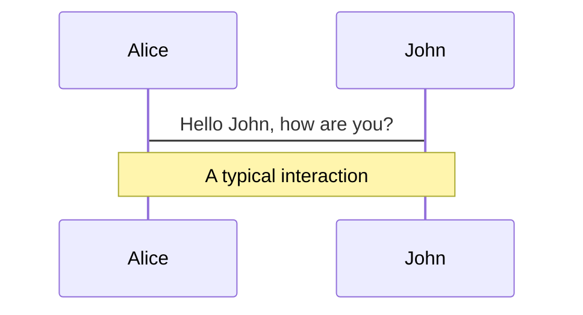
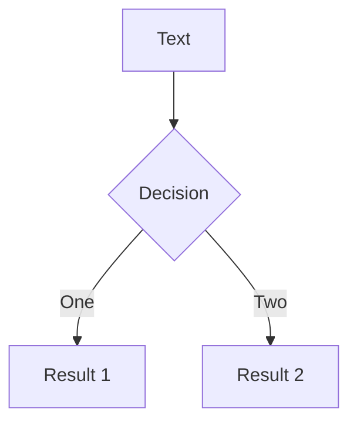
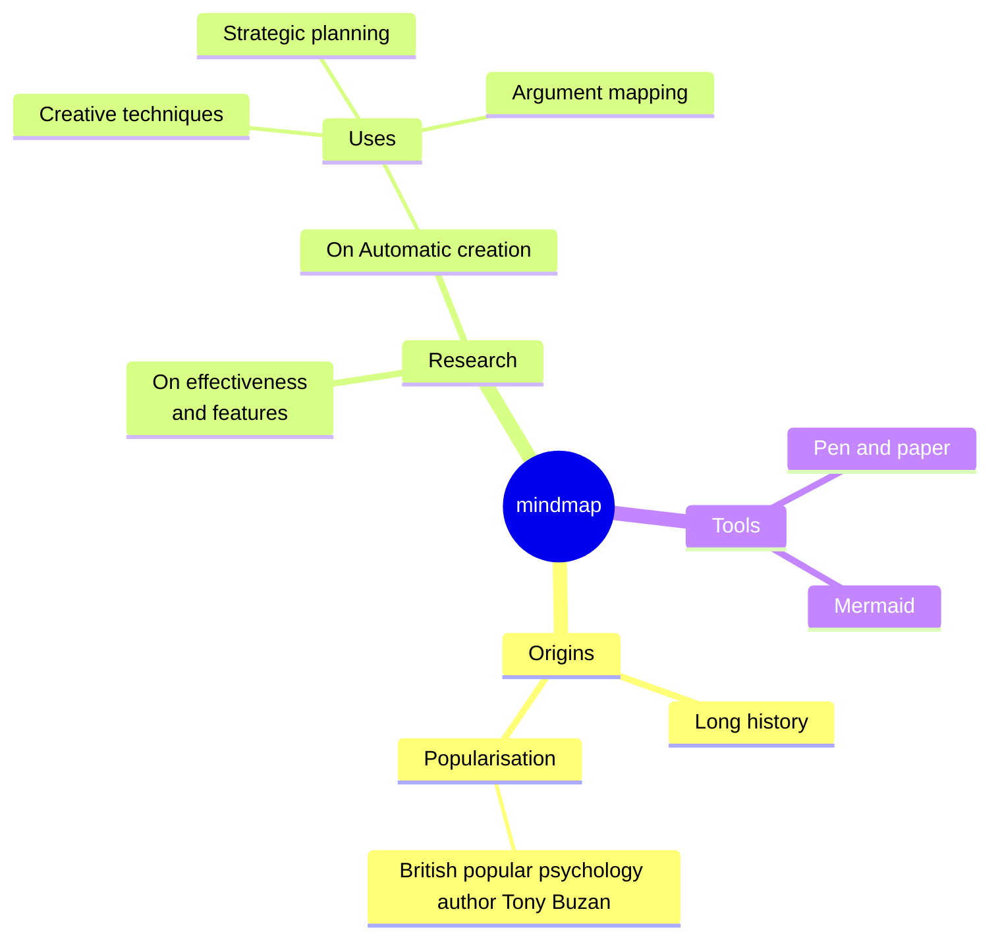
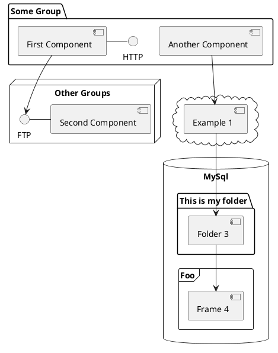

---
# try also 'default' to start simple
theme: seriph
colorSchema: light
# random image from a curated Unsplash collection by Anthony
# like them? see https://unsplash.com/collections/94734566/slidev
# background: https://cover.sli.dev
background: #F2F2F2
# some information about your slides (markdown enabled)
title: Desarrollo de un modelo de red neuronal profunda para la identificación de ovocitos y sus características a través de microscopía polarizada
# Pie de página (diapositivas 2 en adelante; la portada no muestra pie)
shortAuthor: Salomon Pérez Atencia
shortInstitute: Facultad de Minas
shortTitle: Sustentación de Tesis de Maestría
info: |
  ## Slidev Starter Template
  Presentation slides for developers.

  Learn more at [Sli.dev](https://sli.dev)
# (sin class global text-center: la portada va centrada con div; el resto alinea mejor a la izquierda)
# https://sli.dev/features/drawing
drawings:
  persist: false
# slide transition: https://sli.dev/guide/animations.html#slide-transitions
transition: slide-left
# enable Comark Syntax: https://comark.dev/syntax/markdown
comark: true
# duration of the presentation
duration: 45min
---

<div class="flex h-full flex-col text-center">

<div class="text-3xl leading-tight tracking-tight max-w-5xl mx-auto text-[#3981BF]">
<div class="font-semibold">
  Desarrollo de un modelo de red neuronal profunda para la identificación de ovocitos y sus características a través de microscopía polarizada
  </div>
</div>

<script setup lang="ts">
const formattedDate = new Intl.DateTimeFormat('es-CO', {
  day: 'numeric',
  month: 'long',
  year: 'numeric'
}).format(new Date())
</script>

<div class="mt-6 text-2xl leading-relaxed">
  <div>
    <div class="font-semibold leading-snug">
      Salomon Perez Atencia
    </div>
    <div class="text-xl leading-snug">
      Ingeniero Mecánico
    </div>
  </div>

  <div class="mt-4 text-base">
    <div class="font-semibold leading-snug">
      Alejandro Restrepo Martínez, Ph. D.
    </div>
    <div class="leading-snug">
      Director de tesis
    </div>
  </div>

  <div class="mt-4 text-base">
    {{ formattedDate }}
  </div>

  <div class="mt-6 text-base">
    Grupo de Promoción e Investigación en Mecánica Aplicada<br/>
    Departamento de Ciencias de la Computación<br/>
    Facultad de Minas<br/>
    Universidad Nacional de Colombia Sede Medellín
  </div>
</div>

</div>

<div class="abs-bl ml-10 mb-14">
  
</div>

<div class="abs-br m-10">
  
</div>

<!-- <div @click="$slidev.nav.next" class="mt-12 py-1" hover:bg="white op-10">
  Press Space for next page <carbon:arrow-right />
</div> -->
<!-- 
<div class="abs-br m-6 text-xl">
  <button @click="$slidev.nav.openInEditor()" title="Open in Editor" class="slidev-icon-btn">
    <carbon:edit />
  </button>
  <a href="https://github.com/slidevjs/slidev" target="_blank" class="slidev-icon-btn">
    <carbon:logo-github />
  </a>
</div> -->

<!--
The last comment block of each slide will be treated as slide notes. It will be visible and editable in Presenter Mode along with the slide. [Read more in the docs](https://sli.dev/guide/syntax.html#notes)
-->

---
transition: slide-left
class: text-left
---

<div class="mx-auto flex h-full max-w-6xl -translate-y-6 flex-col justify-center px-10 pb-10 md:-translate-y-10">

<header class="mb-6">
  <h1 class="text-3xl font-bold tracking-tight text-[#262626] sm:text-4xl">Agenda</h1>
  <div class="mt-3 h-1 w-28 max-w-full rounded-full bg-[#A0BF5E]" />
</header>

<div class="grid grid-cols-1 gap-6 md:grid-cols-2 md:gap-8">

<div class="rounded-xl border border-gray-300/60 border-l-4 border-l-[#3981BF] bg-white/95 px-6 py-5 shadow-md ring-1 ring-gray-900/5 backdrop-blur-sm">
  <p class="mb-3 border-b border-gray-200/90 pb-2.5 text-[11px] font-bold uppercase tracking-wider text-[#3981BF]">Secciones 1–5</p>
  <ol class="list-decimal space-y-2.5 pl-5 text-sm leading-relaxed text-[#262626] marker:font-semibold marker:text-[#3981BF] sm:text-[0.95rem]">
    <li><span class="font-semibold">Justificación</span></li>
    <li><span class="font-semibold">Marco teórico</span></li>
    <li><span class="font-semibold">Estado del arte</span></li>
    <li><span class="font-semibold">Pregunta de investigación e hipótesis</span></li>
    <li><span class="font-semibold">Objetivos</span></li>
  </ol>
</div>

<div class="rounded-xl border border-gray-300/60 border-l-4 border-l-[#A0BF5E] bg-white/95 px-6 py-5 shadow-md ring-1 ring-gray-900/5 backdrop-blur-sm">
  <p class="mb-3 border-b border-gray-200/90 pb-2.5 text-[11px] font-bold uppercase tracking-wider text-[#3981BF]">Secciones 6–10</p>
  <ol class="list-decimal space-y-2.5 pl-5 text-sm leading-relaxed text-[#262626] marker:font-semibold marker:text-[#3981BF] sm:text-[0.95rem]" start="6">
    <li><span class="font-semibold">Metodología</span></li>
    <li><span class="font-semibold">Resultados</span></li>
    <li><span class="font-semibold">Conclusiones</span></li>
    <li><span class="font-semibold">Trabajo futuro</span></li>
    <li><span class="font-semibold">Referencias</span></li>
  </ol>
</div>

</div>

</div>

<div class="absolute bottom-10 right-38">
  
</div>

<div class="abs-br ml-10 mb-5">
  
</div>

<!--
Here is another comment.
-->

---
transition: slide-left
level: 2
src: ./pages/01_justificacion.md
---

---
# transition: slide-up
level: 2
src: ./pages/02_marco_teorico.md
---

---
# transition: slide-left
level: 2
src: ./pages/03_estado_del_arte.md
---

---
# transition: slide-left
level: 2
src: ./pages/04_pregunta_hipotesis.md
---

---
# transition: slide-left
level: 2
src: ./pages/05_objetivos.md
---

---
# transition: slide-left
level: 2
src: ./pages/06_metodologia.md
---

---
# transition: slide-left
level: 2
src: ./pages/07_resultados.md
---

---
# transition: slide-left
level: 2
src: ./pages/08_conclusiones.md
---

---
# transition: slide-left
level: 2
src: ./pages/09_trabajo_futuro.md
---

---
# transition: slide-up
level: 2
---

# Navigation

Hover on the bottom-left corner to see the navigation's controls panel, [learn more](https://sli.dev/guide/ui#navigation-bar)

## Keyboard Shortcuts

|                                                     |                             |
| --------------------------------------------------- | --------------------------- |
| <kbd>right</kbd> / <kbd>space</kbd>                 | next animation or slide     |
| <kbd>left</kbd>  / <kbd>shift</kbd><kbd>space</kbd> | previous animation or slide |
| <kbd>up</kbd>                                       | previous slide              |
| <kbd>down</kbd>                                     | next slide                  |

<!-- https://sli.dev/guide/animations.html#click-animation -->

<p v-after class="absolute bottom-23 left-45 opacity-30 transform -rotate-10">Here!</p>

---
layout: two-cols
layoutClass: gap-16
---

# Table of contents

You can use the `Toc` component to generate a table of contents for your slides:

```html
<Toc minDepth="1" maxDepth="1" />
```

The title will be inferred from your slide content, or you can override it with `title` and `level` in your frontmatter.

::right::

<Toc text-sm minDepth="1" maxDepth="2" />

---
layout: image-right
image: https://cover.sli.dev
---

# Code

Use code snippets and get the highlighting directly, and even types hover!

```ts [filename-example.ts] {all|4|6|6-7|9|all} twoslash
// TwoSlash enables TypeScript hover information
// and errors in markdown code blocks
// More at https://shiki.style/packages/twoslash
import { computed, ref } from 'vue'

const count = ref(0)
const doubled = computed(() => count.value * 2)

doubled.value = 2
```

<arrow v-click="[4, 5]" x1="350" y1="310" x2="195" y2="342" color="#953" width="2" arrowSize="1" />

<!-- This allow you to embed external code blocks -->
<<< @/snippets/external.ts#snippet

<!-- Footer -->

[Learn more](https://sli.dev/features/line-highlighting)

<!-- Inline style -->
<style>
.footnotes-sep {
  @apply mt-5 opacity-10;
}
.footnotes {
  @apply text-sm opacity-75;
}
.footnote-backref {
  display: none;
}
</style>

<!--
Notes can also sync with clicks

[click] This will be highlighted after the first click

[click] Highlighted with `count = ref(0)`

[click:3] Last click (skip two clicks)
-->

---
level: 2
---

# Shiki Magic Move

Powered by [shiki-magic-move](https://shiki-magic-move.netlify.app/), Slidev supports animations across multiple code snippets.

Add multiple code blocks and wrap them with <code>````md magic-move</code> (four backticks) to enable the magic move. For example:

````md magic-move {lines: true}
```ts {*|2|*}
// step 1
const author = reactive({
  name: 'John Doe',
  books: [
    'Vue 2 - Advanced Guide',
    'Vue 3 - Basic Guide',
    'Vue 4 - The Mystery'
  ]
})
```

```ts {*|1-2|3-4|3-4,8}
// step 2
export default {
  data() {
    return {
      author: {
        name: 'John Doe',
        books: [
          'Vue 2 - Advanced Guide',
          'Vue 3 - Basic Guide',
          'Vue 4 - The Mystery'
        ]
      }
    }
  }
}
```

```ts
// step 3
export default {
  data: () => ({
    author: {
      name: 'John Doe',
      books: [
        'Vue 2 - Advanced Guide',
        'Vue 3 - Basic Guide',
        'Vue 4 - The Mystery'
      ]
    }
  })
}
```

Non-code blocks are ignored.

```vue
<!-- step 4 -->
<script setup>
const author = {
  name: 'John Doe',
  books: [
    'Vue 2 - Advanced Guide',
    'Vue 3 - Basic Guide',
    'Vue 4 - The Mystery'
  ]
}
</script>
```
````

---

# Components

<div grid="~ cols-2 gap-4">
<div>

You can use Vue components directly inside your slides.

We have provided a few built-in components like `<Tweet/>` and `<Youtube/>` that you can use directly. And adding your custom components is also super easy.

```html
<Counter :count="10" />
```

<!-- ./components/Counter.vue -->
<Counter :count="10" m="t-4" />

Check out [the guides](https://sli.dev/builtin/components.html) for more.

</div>
<div>

```html
<Tweet id="1390115482657726468" />
```

<Tweet id="1390115482657726468" scale="0.65" />

</div>
</div>

<!--
Presenter note with **bold**, *italic*, and ~~striked~~ text.

Also, HTML elements are valid:
<div class="flex w-full">
  <span style="flex-grow: 1;">Left content</span>
  <span>Right content</span>
</div>
-->

---
class: px-20
---

# Themes

Slidev comes with powerful theming support. Themes can provide styles, layouts, components, or even configurations for tools. Switching between themes by just **one edit** in your frontmatter:

<div grid="~ cols-2 gap-2" m="t-2">

```yaml
---
theme: default
---
```

```yaml
---
theme: seriph
---
```


</div>

Read more about [How to use a theme](https://sli.dev/guide/theme-addon#use-theme) and
check out the [Awesome Themes Gallery](https://sli.dev/resources/theme-gallery).

---

# Clicks Animations

You can add `v-click` to elements to add a click animation.

<div v-click>

This shows up when you click the slide:

```html
<div v-click>This shows up when you click the slide.</div>
```

</div>

<br>

<v-click>

The <span v-mark.red="3"><code>v-mark</code> directive</span>
also allows you to add
<span v-mark.circle.orange="4">inline marks</span>
, powered by [Rough Notation](https://roughnotation.com/):

```html
<span v-mark.underline.orange>inline markers</span>
```

</v-click>

<div mt-20 v-click>

[Learn more](https://sli.dev/guide/animations#click-animation)

</div>

---

# Motions

Motion animations are powered by [@vueuse/motion](https://motion.vueuse.org/), triggered by `v-motion` directive.

```html
<div
  v-motion
  :initial="{ x: -80 }"
  :enter="{ x: 0 }"
  :click-3="{ x: 80 }"
  :leave="{ x: 1000 }"
>
  Slidev
</div>
```

<div class="w-60 relative">
  <div class="relative w-40 h-40">
    
    
    
  </div>

  <div
    class="text-5xl absolute top-14 left-40 text-[#2B90B6] -z-1"
    v-motion
    :initial="{ x: -80, opacity: 0}"
    :enter="{ x: 0, opacity: 1, transition: { delay: 2000, duration: 1000 } }">
    Slidev
  </div>
</div>

<!-- vue script setup scripts can be directly used in markdown, and will only affects current page -->
<script setup lang="ts">
const final = {
  x: 0,
  y: 0,
  rotate: 0,
  scale: 1,
  transition: {
    type: 'spring',
    damping: 10,
    stiffness: 20,
    mass: 2
  }
}
</script>

<div
  v-motion
  :initial="{ x:35, y: 30, opacity: 0}"
  :enter="{ y: 0, opacity: 1, transition: { delay: 3500 } }">

[Learn more](https://sli.dev/guide/animations.html#motion)

</div>

---

# $\LaTeX$

$\LaTeX$ is supported out-of-box. Powered by [$\KaTeX$](https://katex.org/).

<div h-3 />

Inline $\sqrt{3x-1}+(1+x)^2$

Block
$$ {1|3|all}
\begin{aligned}
\nabla \cdot \vec{E} &= \frac{\rho}{\varepsilon_0} \\
\nabla \cdot \vec{B} &= 0 \\
\nabla \times \vec{E} &= -\frac{\partial\vec{B}}{\partial t} \\
\nabla \times \vec{B} &= \mu_0\vec{J} + \mu_0\varepsilon_0\frac{\partial\vec{E}}{\partial t}
\end{aligned}
$$

[Learn more](https://sli.dev/features/latex)

---

# Diagrams

You can create diagrams / graphs from textual descriptions, directly in your Markdown.

<div class="grid grid-cols-4 gap-5 pt-4 -mb-6">









</div>

Learn more: [Mermaid Diagrams](https://sli.dev/features/mermaid) and [PlantUML Diagrams](https://sli.dev/features/plantuml)

---
foo: bar
dragPos:
  square: 691,32,167,_,-16
---

# Draggable Elements

Double-click on the draggable elements to edit their positions.

<br>

###### Directive Usage

```md

```

<br>

###### Component Usage

```md
<v-drag text-3xl>
  <div class="i-carbon:arrow-up" />
  Use the `v-drag` component to have a draggable container!
</v-drag>
```

<v-drag pos="663,206,261,_,-15">
  <div text-center text-3xl border border-main rounded>
    Double-click me!
  </div>
</v-drag>


###### Draggable Arrow

```md
<v-drag-arrow two-way />
```

<v-drag-arrow pos="67,452,253,46" two-way op70 />

---
src: ./pages/imported-slides.md
hide: false
---

---

# Monaco Editor

Slidev provides built-in Monaco Editor support.

Add `{monaco}` to the code block to turn it into an editor:

```ts {monaco}
import { ref } from 'vue'
import { emptyArray } from './external'

const arr = ref(emptyArray(10))
```

Use `{monaco-run}` to create an editor that can execute the code directly in the slide:

```ts {monaco-run}
import { version } from 'vue'
import { emptyArray, sayHello } from './external'

sayHello()
console.log(`vue ${version}`)
console.log(emptyArray<number>(10).reduce(fib => [...fib, fib.at(-1)! + fib.at(-2)!], [1, 1]))
```

---
layout: center
class: text-center
---

# Learn More

[Documentation](https://sli.dev) · [GitHub](https://github.com/slidevjs/slidev) · [Showcases](https://sli.dev/resources/showcases)

<PoweredBySlidev mt-10 />
